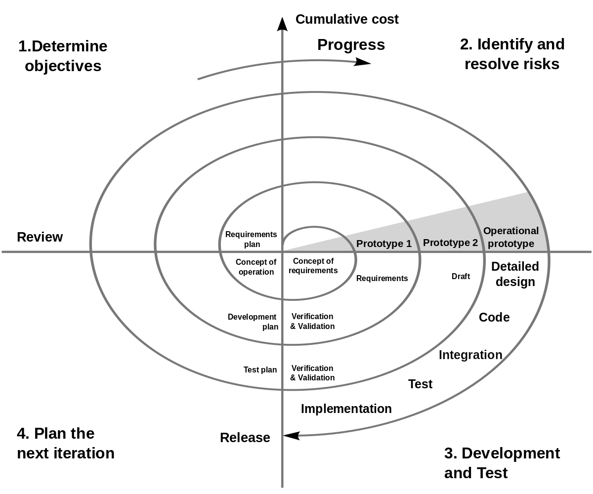
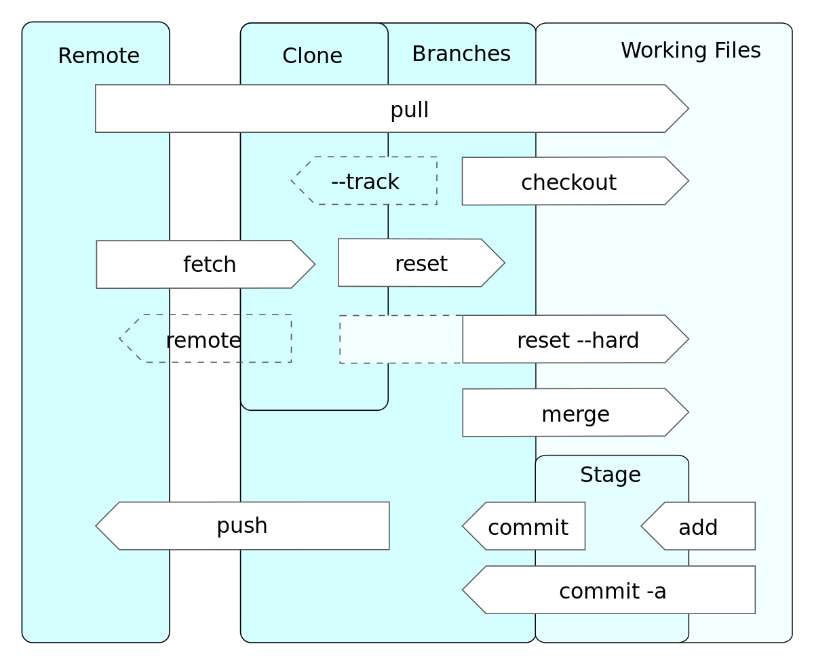
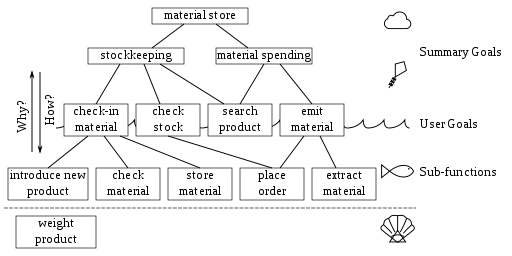
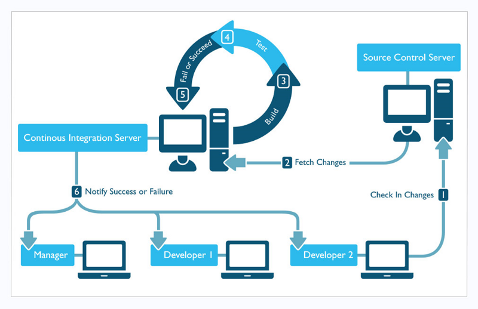
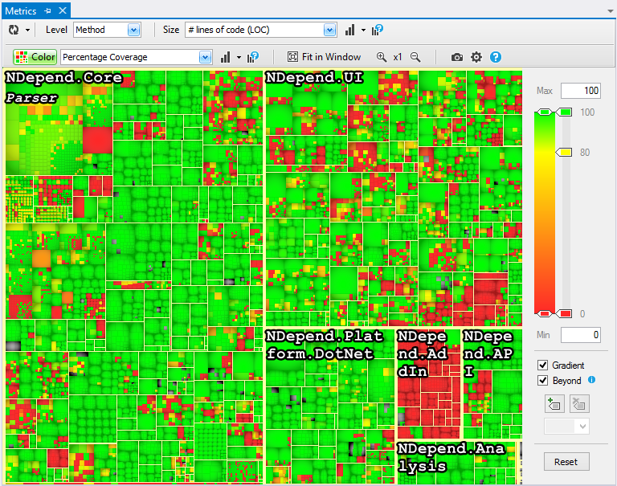
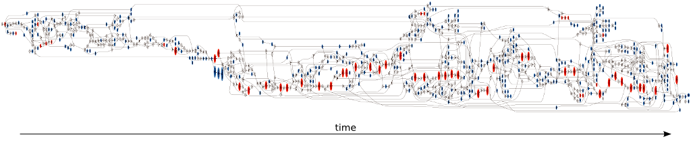
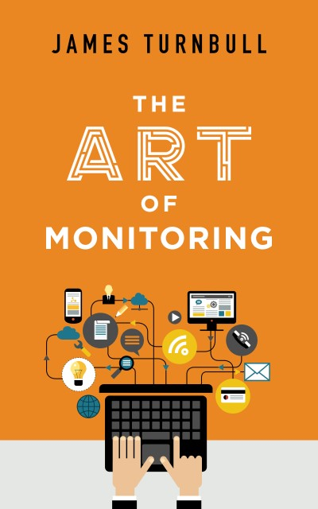

# Lecture 01: Introduction to the Module
## Creating a Cooperative Learning Community Environment for the Module
Before starting the module, I want to create a suitable learning environment for everyone in the module.  I will do this from four resources:

1. Toyota Improvement Kata.
1. Ideas from the book *A Mind for Numbers*.
1. An industry perspective - *Meeting Norms at Skyscanner*.
1. Ideas from Lean and Continuous Improvement.
### Toyota Improvement Kata
Toyota is given a lot of recognition for lean organisation development and creating learning environments in organisations.  The *Improvement Kata* is a routine to move from the current situation to a new situation in a *creative*, *directed*, and *meaningful* way.  It has four stages:

1. In consideration of a vision or direction...
1. Grasp the current condition.
1. Define the next target condition.
1. Move toward that target condition iteratively, which uncovers obstacles that need to be worked on.

**Consider learning as an improvement kata**:

1. In consideration of the outcomes of your education...
1. Grasp your current level of knowledge and understanding.
1. Define what you want to learn next - e.g. the ideas in this module.
1. Move toward that target level iteratively, which will uncover areas you don't know that need to be worked on.
### A Mind for Numbers
This is a book I recommend everyone reads to improve their learning.  One of the key messages is that our mind has two ways of thinking:

1. **Focused thinking** requires active attention, and is conscious, analytical, and serial.  It could be called the *hard* thinking your brain avoids doing unless necessary.
1. **Diffuse thinking** requires passive attention, and is subconscious, creative and parallel.  It is more like daydreaming, and is more *easy* in that your brain does it automatically.

You need to use both types of thinking to learn.  Learning helps us to problem-solve, which is the key element of being a software developer;

- **Learning** is joining *chunks* of information together into larger structures.
- **Problem-solving** is identifying the necessary chunks to apply to a problem.

**Focused** thinking is gathering new information and forming new chunks, while **diffuse** thinking is connecting chunks together.  We learn poorly when we don't use both modes of thinking:

- We let ourselves get too distracted or too engaged with multiple attentional things to think deeply (focused), for example using your phone or laptop during a lecture.
- We fool ourselves into thinking that following and copying is the same as understanding - related to *ego is the enemy*.
- We think focused attention is all we need and fail to use diffuse thinking
### An Industry Perspective

- **Be present** both physically and mentally.
- **Ask why** to me and yourself.
- **All voices are equal**.
- **Listen actively** which normally means close your laptop - take written notes instead.
- **Don't call people resources** which is more about the work place than studying, but keep it in mind when working in teams.
- And one addition from me - remember that **ego is the enemy**.
### Continuous Improvement
One final point comes from ideas of lean.  We have two objectives:

1. Have **respect for people**.
1. **Continuously improve**.

Education is a form of continuous improvement - you will never stop learning.  However, a key concept is this:

- **Respect for people** supports **continuous improvement**.
- **Continuous improvement** does not in itself support **respect for people**.

This module has you working in a team, and you need to have respect for your team members.  That means doing your share of work, supporting them in challenges, and see this as a team effort.  This can be expanded to the class - *respect* each other, and give each other support, and you can improve yourself and your class mates together.

Fundamentally, you should recognise that **education is not a competition**.  You will learn more through collaboration rather than competition.
## Behavioural Objectives
At the end of this lecture you will be able to:

- [ ] **Define** what a *software engineering method* is.
- [ ] **List** the *three Software Development Lifecycle* types.
- [ ] **List** the *four points of the Agile Manifesto*.
- [ ] **Define** what *DevOps* is and its *five goals*.
- [ ] **List** the *seven parts of a DevOps toolchain*.
- [ ] **Define** the metrics of *lead-time*, *process-time*, and *%C/A*.
## What is a Software Engineering Method?
What is a Software Engineering Method?  We have two terms we have to define here:

- **Software Engineering**
- **Method**
### What is Software Engineering?
From [Wikipedia](https://en.wikipedia.org/wiki/Software_engineering) (emphasis mine):
> Software engineering is the **application of engineering** to the **development of software** in a **systematic method**.
#### What is Software Development?
The development of software you are probably familiar with in principle, at least from a *programming* perspective.  Software Development is bigger than programming though.  Again from [Wikipedia](https://en.wikipedia.org/wiki/Software_development) (emphasis mine):
> Software development is the process of **conceiving**, **specifying**, **designing**, **programming**, **documenting**, **testing**, and **bug fixing** involved in creating and maintaining applications, frameworks, or other software components.

So we have seven areas defined for software development:

1. **Conceiving** or coming up with an idea.  This is an open-ended question based on personal choice and market need.
1. **Specifying** is coming up with requirements to build the software.  We will only skim across this idea with use case modelling.
1. **Designing** takes the specification to produce some form of model for the software.  We will do a bit of UML in this module.
1. **Programming** is the one most students are familiar with.
1. **Documenting** is the part most people dislike, but is fundamental for software reuse.  We will touch on areas of documenting.
1. **Testing** is another area people dislike.  We will look at unit testing and test automation in this module.
1. **Bug fixing** is an area that a lot of time is spent on.  This is not debugging your local code, but fixing bugs in production software.

As you can see, it is likely your software development education has only scratched the surface of software development.  The focus will have been on programming.  We will cover the other areas (except *conceiving*) through this module.
#### What is Engineering?
From [Wikipedia](https://en.wikipedia.org/wiki/Engineering) (emphasis mine):
> Engineering is the **creative application of science**, **mathematical methods**, and **empirical evidence** to the innovation, design, construction, operation and maintenance of structures, machines, materials, devices, systems, processes, and organizations.

Engineering has three strands:

1. The **application of science** - you could say engineering is applied science.  There are a collection of theories underpinning software (*computer science*) which we apply in our development process.
1. **Mathematical methods** really just means any mathematical approach involved in modelling.  We do not do mathematical modelling in the module.  These ideas come from *computer science*.
1. **Empirical evidence** means that we measure something to gain information.  We do this in the module through testing and build automation.
#### What is a Systematic Method?
Is the next main section.
#### So what is Software Engineering?
A collection of techniques (e.g. designing, programming, testing) to develop software using ideas from computer science in a manner that is systematic.  We require evidence about our software to determine if it is working as expected.
### What is a Method?
Put simply, a method is just an approach.  We effectively have a series of steps that we follow to get a result.  You may have heard of the *scientific method*.  Method as used in *Software Engineering Methods* is related - we build a process for the development of software.

Most of the ideas of *Software Engineering Methods* can be underpinned by something called the **Software Development Lifecycle**.
#### Software Development Lifecycle (SDLC)
This is the process of developing software from conception through to deployment and maintenance.  The term has been around since about the 1960s.  The following image illustrates the main phases:

 By US Department of Justice (redrawn by <a href="//commons.wikimedia.org/wiki/User:Mdd" title="User:Mdd">Eugene Vincent Tantog</a>) - <a rel="nofollow" class="external text" href="http://www.usdoj.gov/jmd/irm/lifecycle/ch1.htm">INFORMATION RESOURCES MANAGEMENT</a>, Public Domain, <a href="https://commons.wikimedia.org/w/index.php?curid=5530145">Link</a>

These stages are still used today, but how we use them has changed.  The software industry has produced three key approaches.
#### Three Key Methods in Software Development
1. **Waterfall** - original ideas from 1950s, formally defined in the 1970s.  Still common today.
1. **Spiral** or incremental development - originally from the late 1980s.
1. **Agile** is from the mid 1990s.
##### Waterfall
The waterfall model gets a lot of bad press, but is still successfully used in industry today.  The biggest criticism is the rigid format it uses, in that each stage must be completed before moving onto the next stage.  This means we cannot adapt to changing customer needs.  Below is a typical representation:

 By Peter Kemp / Paul Smith - Adapted from Paul Smith's work at <a href="https://en.wikipedia.org/wiki/File:Waterfall\_model.svg" class="extiw" title="en:File:Waterfall model.svg">wikipedia</a>, <a href="https://creativecommons.org/licenses/by/3.0" title="Creative Commons Attribution 3.0">CC BY 3.0</a>, <a href="https://commons.wikimedia.org/w/index.php?curid=10633070">Link</a>

The original phases are:

- **Requirements gathering** or defining what is needed in the software.
- **Analysis** of the requirements to define models and rules.
- **Design** to produce the software architecture.
- **Coding** to build the software.
- **Testing** to ensure the software is working as expected.
- **Operation** of the software where needed.
##### Spiral
The spiral model builds on some of the ideas of the waterfall model but provides ability to adapt due to its iterative nature.

 By Conny derivative work: <a href="//commons.wikimedia.org/wiki/File:Spiral\_model\_(Boehm,*1988).png" title="File:Spiral model (Boehm, 1988).png">Spiral\_model*(Boehm,*1988).png</a>: Marctroy
derivative work: <a href="//commons.wikimedia.org/wiki/User:Conan" title="User:Conan">Conan</a> (<a href="//commons.wikimedia.org/wiki/User\_talk:Conan" title="User talk:Conan">talk</a>) - <a href="//commons.wikimedia.org/wiki/File:Spiralmodel\_nach\_Boehm.png" title="File:Spiralmodel nach Boehm.png">File:Spiralmodel\_nach\_Boehm.png</a>, <a href="//commons.wikimedia.org/wiki/File:Spiral\_model*(Boehm,*1988).png" title="File:Spiral model (Boehm, 1988).png">Spiral\_model*(Boehm,\_1988).png</a>, Public Domain, <a href="https://commons.wikimedia.org/w/index.php?curid=9000950">Link</a>

Spiral works by iterating through the following four stages until software is released:

1. **Determine objectives** for this iteration.
2. **Identify and resolve risks** for this iteration.
3. **Development and test** for this iteration.
4. **Plan the next iteration**.
##### Agile
Agile methods build on the iterative approach, but focus on **human-centric** ideas where software is evolved by collaboration between teams and customers.  Teams are self-organising, and support multiple parts of the development process.  The point is that the teams can adapt (*be agile*) as requirements evolve with the client and the problems in development are discovered.
### Linking to Module Learning Outcomes
How does all this relate to the module.  The learning outcomes are:

1. Demonstrate understanding of a modern software development lifecycle.
2. Explain the different techniques supporting modern software engineering methods.
3. Define and analyse systems requirements and needs and specify a system design to deliver these requirements.
4. Apply modern software engineering methods and techniques to a software development project.
5. Explain the role of a computing professional in relation to social, ethical and legal issues surrounding projects.
6. Consider information security requirements in the development and delivery of software.

Our assessment strategy is:

|Learning Outcome|Assessment|
| :-: | :-: |
|Demonstrate understanding of a modern software development lifecycle|Coursework|
|Explain the different techniques supporting modern software engineering methods|Exam|
|Define and analyse systems requirements and needs and specify a system design to deliver these requirements|Coursework|
|Apply modern software engineering methods and techniques to a software development project|Coursework|
|Explain the role of a computing professional in relation to social, ethical and legal issues surrounding projects|Exam|
|Consider information security requirements in the development and delivery of software|Exam|

We are going to use a SDLC to deliver a software product.  Our SDLC will be agile in nature - that is our method.  For our software, we will define requirements and specify a system to deliver.  Finally, we will build a software development pipeline to automate our product delivery.  This is the coursework you will deliver.  See the [Assessment Brief](../../assessment/) for details.

The exam will look at the theoretical aspects of what we are doing.  We will look at the different techniques underpinning modern software development, understand the professional aspects of being a software developer, and consider how security requirements integrate into our SDLC.  This will form the exam part of the assessment.

Both the lectures and labs intertwine to support both the coursework and exam.  The labs provide the step-by-step instructions on how to undergo our development process.  The exam will go into more detail around this process and augment it with areas of working in teams, professionalism, ethics, and security.
## History of Software Engineering Approaches
The following is some of the highlights in software development:

- **Pre 1965** work on defining a discipline, but the term Software Engineering unused.
- **1965** various letters to the ACM, lectures, and advertisements mention the term Software Engineering.
- **1965** to **1985** the software crisis - software runs over budget, schedule, causes faults that lead to loss of life.  Software quality becomes a key idea (not the focus of this module).
- **1970s** structured programming - using `if`, functions, etc.
- **1980s** Structured Systems Analysis and Design Methodology (SSADM) - waterfall method of software development.
- **1985** to **1989** *'no silver bullet'* idea - no single technology or approach will solve the software crisis.
- **1990s** Object-Oriented Programming (OOP).
- **1990s** Internet becomes dominant technology.
- **1991** Rapid Application Development (RAD) - still common in user-interface design methods.
- **1994** Dynamic Systems Development Method (DSDM) - the first **agile** method.
- **1995** Scrum introduced - a common product management method.
- **1999** eXtreme Programming (XP).
- **2000 to today** rise of lightweight methods (the focus of this module).
- **2000s** various agile methods defined.
- **2001** [The Manifesto for Agile Software Development](http://agilemanifesto.org/).
- **2008** DevOps (Development Operations) coined.
## Agile Manifesto
Signatories state that as developers they value:

- **Individuals and Interactions** over *processes and tools*.
- **Working Software** over *comprehensive documentation*.
- **Customer Collaboration** over *contract negotiation*.
- **Responding to Change** over *following a plan*.

This is where the term agile came from.  It is worth considering what the signatories meant:

- [ ] Reflect on the [Agile Manifesto](http://agilemanifesto.org/) and analyse what the individual points mean to you.
- [ ] Read the [Wikipedia section](https://en.wikipedia.org/wiki/Agile_software_development#The_Agile_Manifesto) on the Agile Manifesto.  Reflect how your original analysis is similar and different to that presented on Wikipedia.
## Lean Software Development
Lean as a concept comes from manufacturing, but has been successfully applied to a number of industries.  In software development, a number of areas have been impacted by lean principles.  We will touch on these areas as we move through the module.

Lean software development can be summarised as seven principles:

1. **Eliminate waste** - do not do work that does not add value to the customer.
1. **Amplify learning** - usually by short iteration cycles with feedback from the client and the team.
1. **Decide as late as possible** - wait until all the facts are available before deciding how features are implemented.
1. **Deliver as fast as possible** - can be broken down into agreeing what will be delivered in this iteration using a pull-based approach.
1. **Empower the team** - let the team make decisions on the work to be done: *find good people and let them do their own job* (Lines and Ambler, *Disciplined Agile Delivery: A Practitioner's Guide to Agile Software Delivery in the Enterprise*, 2012).
1. **Build integrity in** - keep the system simple to update and modify, for example by applying *refactoring* techniques.
1. **See the whole** - see the system as a whole and work to ensure the component interactions work.  *Think big, act small, fail fast; learn rapidly* (Poppendieck and Poppendieck, *Lean Software Development: An Agile Toolkit*, 2003).
## DevOps
The combination of agile, lean, and modern build tools has lead to the DevOps (**Development** and **Operations**) culture.  Here, developers (e.g. software engineers) work closely with the operators (e.g. system deployment) to automate and monitor the entire software development lifecycle.  It can be seen as the intersection of three core software delivery ideas:

 By <a href="//commons.wikimedia.org/wiki/File:Devops.png" title="File:Devops.png">Devops.png</a>: <a href="//commons.wikimedia.org/w/index.php?title=User:Rajiv.Pant&amp;action=edit&amp;redlink=1" class="new" title="User:Rajiv.Pant (page does not exist)">Rajiv.Pant</a>
derivative work: <a href="//commons.wikimedia.org/wiki/User:Wylve" title="User:Wylve">Wylve</a> - This file was derived from:&nbsp;<a href="//commons.wikimedia.org/wiki/File:Devops.png" title="File:Devops.png">Devops.png</a>:&nbsp;, <a href="https://creativecommons.org/licenses/by/3.0" title="Creative Commons Attribution 3.0">CC BY 3.0</a>, <a href="https://commons.wikimedia.org/w/index.php?curid=20202905">Link</a>

1. **Development** is typically seen as the software engineer's role.  The focus of this module is software engineering so we will look at DevOps ideas through this lens.
1. **Operations** is the management of systems where software runs.  Software does not exist on a developers machine, but integrates with existing systems and on platforms managed by the business.
1. **Quality Assurance** is where testing typically resides, although software quality is a bigger area than just testing.  Ensuring *production* quality software is the key for a DevOps team.

DevOps is not just about tools and techniques - *DevOps is also a cultural idea in an organisation*.  It requires parts of the organisation traditionally seen as adversarial to work together in a trusting environment.

DevOps has five goals (taken from [Wikipedia](https://en.wikipedia.org/wiki/DevOps)):

1. Improved deployment frequency.
1. Faster time to market.
1. Lower failure rate of new releases.
1. Shortened lead time between fixes.
1. Faster mean time to recovery.

Notice that all these ideas are about speed and effectiveness.  **Flow of work** is a key idea in DevOps.  Ideas such as number of deployments per day are key concepts in DevOps that you should explore.

- [ ] Watch the video below about Flickr's adoption of DevOps.
- [ ] Reflect on what it would take to do multiple software deployments a day, and how your own software development practice should change to reflect this.
- [ ] Do some research (e.g. a web search) on other deployment frequency stories.  Google and Amazon are particularly frequent.

### DevOps-toolchain
A key concept in DevOps is the creation of a *DevOps-toolchain*: a series of tools and techniques that support the goals of DevOps.  There are different interpretations, but the image below illustrates one set of stages:

 By <a href="//commons.wikimedia.org/w/index.php?title=User:Kharnagy&amp;action=edit&amp;redlink=1" class="new" title="User:Kharnagy (page does not exist)">Kharnagy</a> - Own work, <a href="https://creativecommons.org/licenses/by-sa/4.0" title="Creative Commons Attribution-Share Alike 4.0">CC BY-SA 4.0</a>, <a href="https://commons.wikimedia.org/w/index.php?curid=51215412">Link</a>

There are seven stages here:

1. **Plan** the work to be done and its requirements from both the development and operation side.  We will do very minimal planning in the module only looking at **use cases** and **user stories** for software requirements.  We will use **Kanban**-style boards via **GitHub** to support planning.
1. **Create** the software - that is design and code the application with consideration of quality and performance requirements.  This is more the realm of software development covered in other modules, but we do add **UML** and **model-driven development** into the mix of techniques available to you.  Extensive use of version control with **Git** is also used to ensure different parts of the development are managed.
1. **Verify** is the testing of the software, including that the code is of production quality.  **Unit testing** vaguely falls into this category, although is arguably also a *create* task due to its granularity.  We do look at **configuration testing** and **continuous integration** to an extent via **Travis CI** and **Docker**.
1. **Package** the software ready for release/deployment.  We do a *very* light approach to packaging via **Maven** and the creation of a deployable JAR file.
1. **Release** the software into production in the target environment.  We will deploy our software to **GitHub** as a simulation of this idea.
1. **Configure** the IT infrastructure that the software runs in.  This falls under the operations side of DevOps, and we will only touch on basic concepts such as **Docker**
1. **Monitor** the running software on the target infrastructure.  Monitoring our system allows us to *plan* the next work.  We will do little on monitoring beyond  **bug-tracking** and **issue-tracking** via GitHub
## Metrics for Software Development
Our final section will be on three metrics we can use to discuss the work of software development:

- The **Lead Time** is the time from when the task is created to when it is completed.  This is what the customer experiences when you deliver software, or any other service or product delivery - it is the time we should aim to **reduce**.  Today you have been given the [coursework specification](../../assessment) which has created a lead time until the end-of-trimester.
- The **Process Time** is the time from when work on the task is started until when it is completed.  Our goal is to **increase the percentage** of process time in lead time while **minimising** process time.  In other words, we start work quickly, and get it done quickly.  We want work to **flow** rather than be held up waiting in queues.
- **%C/A** or **percentage complete and accurate** helps us measure the quality of the work produced.  We can do this by asking if the work produced was *usable as-is*.

Lead-time and process-time can be visualised as follows:

## Summary
The aim of this lecture is to cover the basic concepts underpinning the module.  We will examine several of these concepts in more detail as we continue through the module.  In summary, we have:

- Specified the learning environment for the module.
- Defined what a software engineering method is.
- Listed the three Software Development Lifecycle types.
- Listed the four points of the Agile Manifesto.
- Defined what DevOps is and its five goals.
- Listed the seven parts of a DevOps toolchain.
- Defined the metrics of lead-time, process-time, and %C/A.
# Lecture 02: Scrum and Team Forming
This lecture will be used to form the teams to undertake the assessment.  The material presented will focus on Scrum and how Scrum can be used in your project.
## Behavioural Objectives
- [ ] **Describe** what *Scrum is.*
- [ ] **Define** the *main components of Scrum.*
- [ ] **Describe** the *role of the Product Owner.*
- [ ] **Describe** the *role of the Scrum Master.*
- [ ] **Describe** the *main parts of the Scrum Framework.*
## What is Scrum?
Scrum is a project management and group working philosophy.  For project management, the idea is simple: check your project regularly to see if it is heading in the right direction.  It is that simple, but few people manage a project this way.  The idea has been around for a while:

- *"In preparing for battle I have always found that plans are useless, but planning is indispensable."* Dwight D. Eisenhower.
- *"Plans are of little importance, but planning is essential."* Winston Churchill.
- *"All human plans [are] subject to ruthless revision by Nature, or Fate, or whatever one preferred to call the powers behind the Universe."* Arthur C. Clarke.
- *"Planning is useful.  Blindly following plans is stupid."* Jeff Sutherland, co-creator of Scrum.

A plan is never right.  It will be wrong from the start.  So you need to constantly change the plan, so why not build that into your process by monitoring your current plan.

Scrum works in iterations, called **Sprints**.  A Sprint has a fixed length of time (typically a week) where a set of tasks will be completed.  The team decide how which tasks they will complete in a week and then analyse how well they did at the end of the week.  This allows a team to work towards a goal in increments.  The team need to *know the goal*, *see the goal*, and *work incrementally towards the goal.*  This is as far as you plan in detail.

And as a plan is always wrong, you will constantly analyse the work to be done.  Unforeseen circumstances will arise, so to quote Jeff Sutherland: *"Never forget: the map is not the terrain."*
### Changing How You Work
Scrum changes how we approach work.  It asks the questions:

1. What can we change about how we work?
1. What is our biggest sticking point?

**You should constantly ask these questions when working on a project.**

Scrum's core ethos of change is that we no longer look for blame and fault when projects go wrong.  It aims to get teams working towards the goal by rewarding the behaviour of collaboration and getting work done.

When selecting tasks to work on, the team prioritises by what returns the most value to the customer.  This requires constant communication with the customer.  If done well, the team deliver a product that delivers the majority of the value quickly.  The [*Pareto Principle*](https://en.wikipedia.org/wiki/Pareto_principle) tells us that 80% of the value comes from 20% of the features.  If we can deliver that 20% first, we provide the most value to the customer quickly.

Scrum defines an **Inspect and Adapt** cycle.  We are constantly *inspecting* how we work, and then *adapting* based on that observation.  We want to do work, try something, and check how we do.  We want to fail fast so we can fix our problems quickly - *spot a mistake and fix it straight away*.  Otherwise you you will pay for the mistake in the future when you have forgotten the details of the error or work done.  Failure is one of the best teachers.

Scrum also deals with waste.  Waste is a concept from lean, and we will look at *Lean Software Development* in [Lecture 4](../lecture04).  We will talk more about waste then.

Finally, work is changed by focusing on the team.  The job of management in the organisation is to free the team to increase the *flow of work through the system.*  Management need to remove obstructions from the team to improve their effectiveness.  A standard management approach - adding manpower - has been [shown](https://en.wikipedia.org/wiki/The_Mythical_Man-Month) to increase delivery time on software projects, and likely projects in general.
### Work as a Reward
Scrum rewards the team based on work, not on its completion.  Goals and results should be celebrated, but they are short-lived.  Work, and doing work, should be its own reward.  See the process as supporting how you work, making your life easier, and making you more effective.  That is the goal of Scrum.  The project will be delivered faster because you enjoy the work more.  And if you don't enjoy the work, Scrum has mechanisms built in to capture that and fix it.

It is a good point to repeat one of the mantras of the module: **education is not a competition.**  You will get far more out of the educational experience by working together and undertaking the learning.  Focusing just on grades will not make you as happy as enjoying the journey to get those good grades and learning from the experience working with others.
## Components of Scrum
In Scrum we use the following terminology:

- Product Backlog.
- Task Board (or Scrum Board, or Kanban Board).
- User Stories.
- Sprints.
- Spring Planning.
- Story Points.
- Planning Poker.
- Daily Standup.
- Sprint Review and Retrospective.
### Product Backlog
The Product Backlog is the list of all currently identified tasks.  You start by defining all the tasks you can think of at the start of the project.  We will look at defining tasks later.  The tasks are prioritised by the **Product Owner** to determine which provide the greatest amount of value quickly to the customer.
### Task Board
To keep track of your tasks we write them on sticky-notes and place them on a whiteboard, something as follows:

We will look at Kanban in [Lecture 8](../lecture08) to provide more detail.   To start with you will define four columns:

1. Backlog (or *Open Issues*).
1. Sprint.
1. In progress.
1. Done (or *Closed Issues*).

Tasks flow from the the Backlog to Done as they are completed.  There are many online tools to achieve this.  We will use the one built into GitHub.  [Trello](https://trello.com/) is another popular tool.
### User Stories
When defining a task it should be part of a *User Story*.  This allows the team to understand **why the task is needed.**  We will look at user stories in [Lecture 10](../lecture10).  As an example, we might write:

- As a student I want to submit a coursework.

This story has a number of tasks associated with it.  We need to upload a file.  That file needs to be associated with an assessment.  An assessment needs to associated with a module.  We need to login to the system.  And so on.
### Sprints
A Sprint is a period of time when a team does work.  The typical length of time is a week.  At the end of the Sprint the product must have moved forward and be usable by the customer.  That is, the customer has to see new features added and completed so they can judge them.  If the product is not usable at the end of the Sprint you have a problem.  If a task is not fully finished at the end of the Sprint then it is not done - the effort was wasted in this Sprint and something else could have been developed and shown to the customer instead.
### Sprint Planning
To plan a Sprint, the team selects tasks they believe they can complete during the Sprint.  These tasks are selected from the prioritised task list.
### Story Points
Each task is scored based on an estimated cost.  We don't talk about hours, days, or any other concept of time.  We are allocating points.  And points are a relative score.  For example, we could rate our tasks using animal sizes:

- Mouse.
- Dog.
- Deer.
- Hippo.
- Elephant.
- Blue Whale.

Humans cannot judge the time it will take to complete a task.  But they can compare sizes really well.  For example:

- Student can login (mouse).
- Student can upload a file (dog).
- Uploaded file is associated with an assessment (horse).
- etc.

Each of the sizes is given a value:

- Mouse (1).
- Dog (2).
- Deer (3).
- Hippo (5).
- Elephant (8).
- Blue Whale (13).

This is the Fibonacci sequence, and has been found to be the best approach to estimate relative task size.  And we use the entire team to estimate, because collectively you can come to a better estimate.  Estimation is done via Planning Poker.
### Planning Poker
Planning Poker doesn't use animals but numbers - you just need to remember what the numbers represent.  We are comparing task size, not determining days of work.  Planning Poker card decks are available:

The process is:

1. Select a task.
1. Everyone picks a card from their deck to score the task, but does not reveal it.
1. When everyone is ready, everyone reveals their card at the same time (so no groupthink comes in).
1. If the cards are within two of each other (e.g. a 2, 3, and 5 range) then sum the cards and divide by number of voters to get the average.  That is your estimated cost.
1. If the cards are not within two of each other, then the smallest and largest scorers describe why they gave the points they did.  Then a re-vote.  Repeat until the group are within two cards of each other, then average.

Remember - **this is an estimate**, and an estimate for a tiny part of the project.  You don't know.  But you need to constantly review your scores based on what you have learnt during the project.  You will get a better estimate of completion the longer you work on the project.
### Daily Stand-up
**At the same time every day** the team meets for up to 15 minutes.  Each person answers the following three questions:

- What did you do since the last stand-up?
- What are you going to do before the next stand-up?
- What is getting in your way?

The daily stand-up builds a routine, and people love routines.  It also allows the team to spot blockages.  **Question 3 is essential.**  If one of the team has a problem (e.g. *"I cannot connect to the SQL database."*) then someone might have their solution (e.g. *"I know how to do it, let me help."*).  **This is teamwork.**  Work will be completed faster as tasks will not be blocked.
### Sprint Review and Retrospective
After a Sprint and before the next Sprint the team undertakes a review and retrospective.  How fast are the team working?  What went well?  What went badly?  How can we increase our productivity?  In retrospective the team can spot problems and adjust.  Remember, *inspect and adapt.*

The team should ask the following questions:

1. Is there anything we can do differently to speed things up?
1. Can we offload some Backlog items (i.e. give them to other teams)?
1. Can we not do some things (i.e. remove items from the backlog)?

We are also interested in how the team is doing, both collectively and individually.  So each person answers the following questions:

1. On a scale from 1 to 5, how do you feel about your role in the company?
1. On the same scale, how do you feel about the company as a whole?
1. Why do you feel that way?
1. What one thing would make you happier in the next Sprint?

The team then vote on which improvement to make and execute it in the next Sprint.  It needs to be a task with a clear measure of whether it has been successfully done at the next retrospective.  Doing this, and doing it consistently Sprint-to-Sprint will mean the team learns, evolves and improves as it works.
## Scrum Team and Roles
A team must have the necessary skills to get the work done.  A team should contain all the members needed to deliver the project/product, but should be seven people (plus or minus two) in size.  Any larger will create too many communication channels.  Smaller teams (as you will have in the module) is fine for smaller projects.

By all skills, we mean everything.  Remember the DevOps intersection:

 By <a href="//commons.wikimedia.org/wiki/File:Devops.png" title="File:Devops.png">Devops.png</a>: <a href="//commons.wikimedia.org/w/index.php?title=User:Rajiv.Pant&amp;action=edit&amp;redlink=1" class="new" title="User:Rajiv.Pant (page does not exist)">Rajiv.Pant</a>
derivative work: <a href="//commons.wikimedia.org/wiki/User:Wylve" title="User:Wylve">Wylve</a> - This file was derived from:&nbsp;<a href="//commons.wikimedia.org/wiki/File:Devops.png" title="File:Devops.png">Devops.png</a>:&nbsp;, <a href="https://creativecommons.org/licenses/by/3.0" title="Creative Commons Attribution 3.0">CC BY 3.0</a>, <a href="https://commons.wikimedia.org/w/index.php?curid=20202905">Link</a>

IT Operations are part of your team.  They help you deliver your product.  Your team might include sales, admin, or other people.  The team needs all the skills for your product/project.

Also, a team member should only be a member of that one team.  No other.  If a team member is dividing their attention across multiple projects/products then they aren't committed to either.
### Being a Team Member
Key to successful Scrum is being a good member of the team.  It is working with others and seeing that as the goal, not your own outcomes.  The team also needs to be happy.  And plenty of research has been done on what it takes to make someone happy:

- **Autonomy** to make decisions on what to do and how to do it.
- **Mastery** of the what they are doing.
- **Purpose**, or a reason why they are doing something.

There are areas where actions taken are for individual and short-term benefit.  This is not a sustainable model as it does not consider what is beneficial for everyone.  It is harmful - individuals crashed the global economy in 2008 for personal, individual, short-term gain.  Having no thought for others is not good.

Carlo M. Cipolla, an economic historian, defined the [Laws of Stupidity](https://en.wikipedia.org/wiki/Carlo_M._Cipolla#Essays).  Cipolla defined the following taxonomy:

Don't be a bandit.  If you are only working for yourself you are not a team member.  Remember, *education is not a competition.*  Work together and you will learn more and get better results in the long-term.  Industry wants team players, not individuals.

Also, don't be a passive team member.  Passive means not engaging with the team and the work being undertaken.  It is not only lazy, but also hurts the rest of the team as they get annoyed and become less productive.  As a team, if passivity is spotted **it needs to be stopped immediately.**

However, do not get caught in blaming others for perceived character traits.  Doing so is the [**Fundamental Attribution Error**](https://en.wikipedia.org/wiki/Fundamental_attribution_error) and we all suffer from it.  If you make a mistake, you can provide external reasons for why it happened.  When others make mistakes, you will likely blame some characteristic of the person.  This is the Fundamental Attribution Error in action.  Be aware of it and be supportive of others in the team.

However, do not let a team member cause *emotional waste* generated by a team member acting in a way that winds up others and to make them upset.  To quote Jeff Sutherland from *Scrum: The Art of Doing Twice the Work in Half the Time*:
> "Don't be an asshole - and don't allow, abet, or accept that behaviour in others."
### Work-Life Balance
There has been enough research done to show a good work-life balance is more beneficial for individual productivity than the amount of time they spend on a task.  It goes back to the idea of a happy worker.  Happiness is a precursor to productivity and success, not vice-versa.

While you are working (including planning) you are making decisions, and decisions take energy.  Again, research has shown that our ability to make clear good decisions degrades throughout the day.  You also degrade the ability to regulate yourself, leading to more errors.  So the more the work, the worse you work.

And as you create errors, you create work.  Someone has to fix the error.  So the longer you work, the more potential you have to create errors that someone has to fix, meaning you eventually add no value in your effort, and perhaps cost the project.

You are also not a good multi-tasker.  Do you know why?  Because no one is.  Again, all research points to the cost of multi-tasking.  Every time you switch tasks you lose time due to switching your brain from one task to another.  That time is never zero.  You also cannot physically do two things at once.  People multi-task because they are distracted and they have trouble controlling their impulse to do other activities.  They cannot control their distraction.  Be aware and focus on one task till it is done.

Finally, if your team requires people to overwork to deliver the project something has gone wrong - something is not working as it should.  If the team is jumping from one crisis to the next then they are not improving.  No one cares how many hours someone worked to deliver something.  The key is how quickly it was delivered and its quality.
### Roles
Scrum defines two roles within the team:

1. The **Product Owner** decides what the work should be.  He or she owns the Backlog, what's on it, and most importantly, what order it's in.
1. The **Scrum Master** keeps the team working, solves blockages, and keeps the rhythm going.  Their job is to help the team work as best they can.

Notice there is no Project Manager, no leader, no boss.  Teams are autonomous and self-organising.  If there is a problem in the team they collectively solve it.  Deal with problem team members.  Reflect and be honest.  Have integrity and honesty.  Get the work done and support the team.
### Transparency
Another key concept of working in a Scrum team is that everyone knows everything.  No hiding information or keeping problems to yourself.  It helps no-one.  This is why Scrum teams are small - everyone can talk to each other.  Also, the rhythm of meetings means everyone should be aware of what is happening.

Scrum also avoids handing off tasks between teams.  On a handoff information is lost.  The team knows everything that is happening, the work that needs done, and how to do it.  **Everyone knows everything.**
## Scrum Process
How do we run a Scrum team?

1. Produce an initial product backlog.
1. Prioritise the backlog.
1. Do an initial estimate of the work.
1. Decide on what work to do in the next Sprint - *Sprint Planning*.
1. Every day have a daily stand-up - *Daily Scrum*.
1. End of the Sprint, review - *Sprint Review*.
1. Analyse how the team has worked and modify based on outcome of review: update estimates, add new tasks, learn lessons, etc. - *Sprint Retrospective*.
1. Repeat 4-7 until product is delivered to the customer.

Scrum uses a **Plan, Do, Check, Act (PDCA) Cycle**:

Unlike a Waterfall approach, Scrum refines the plan throughout the project.  Every iteration - *every sprint* - planning is done in just enough detail to deliver the next increment.  We don't set the plan in great detail because we don't know what could happen.
### Product Backlog
When producing and managing a backlog there are some points to consider:

- Focus on delivering what is valuable - **deliver what people actually want or need**.  Do not deliver everything you can possibly come up with.  Do not add unnecessary features.  If you tie up resources in features and tasks that don't deliver value *that is a waste*.
- Everything cannot be a priority.  **If everything is a priority, nothing is.**
- Time is limited, as is the team's work time.  **Treat time as finite.**
### Sprint Planning
Plan your sprint based on what work is ready.  When deciding to do a task you need to ask two questions:

1. Is the task ready to be done (e.g., nothing is blocking the task)?  You need a **Definition of Ready**.
1. How will you determine when the task is complete?  You need a **Definition of Done**.

For a *Definition of Ready*, we can use the **INVEST Criteria**:

- **Independent** - the task can be completed on its own.  It should not be dependent on another task.
- **Negotiable** - until it is being done a task can be changed.
- **Valuable** - it delivers value to the customer, user, or stakeholder.
- **Estimable** - you can size the task.
- **Small** - task is small enough to estimate and plan.  If not, break it down into smaller tasks.
- **Testable** - the task has a test it will need to pass to determine if it is complete.  Write the test before you start the task.

For a *Definition of Done* we use the *testable* condition.

To decide what tasks to do, you select from the prioritised product backlog.  The **Product Owner** needs to answer the following questions:

- What tasks will provide the biggest impact?
- What tasks are most important to the customer?
- What tasks can make the most money?
- What tasks are easiest to do?

Remember you will be constantly reviewing, so the priority of tasks will change.  That is the point of Scrum - *you are constantly reviewing your plan*.
### Sprint Execution
Basically, **do the work**.  Try and complete the tasks in the Sprint Plan.  Work is only completed when it is **Done**.  Done means you have a complete, deliverable product that can be used by the customer.  **Work that is half-done is not done.**  You expended resources, effort and time and not produced a deliverable product.  That is the aim of a Sprint.

At the end of the Sprint you need to be able to demo the product to the customer.  **Demo or die.**
### Daily Standup
Every day at the same time the team stands up and updates on where they are in the project.  Everyone answers the following questions:

1. What did you do yesterday to help the team finish the Sprint?
1. What will you do today to help the team finish the Sprint?
1. What obstacles are getting in the team's way?

The daily standup builds routine.  It builds a rhythm for the team.  It is essential to the team's wellbeing that everyone gets together at the same time every day.  Missing these meetings, being late for these meetings, or otherwise being disruptive does not help the team.
### Sprint Review and Retrospective
At the end of the Sprint the team counts the number of points completed that iteration: the team **velocity**.  You need to know and measure your velocity, but doing it once is not enough.  It will take a number of Sprints to get an understanding of how fast the team can work.

Once you know your team velocity, you can perform one of two estimates:

- **delivery = velocity * time of project**.  In other words, if you have a deadline and a velocity, you can estimate how much you can deliver.
- **date = work / velocity**.  In other words, if you have a set of features and work to deliver, you know when you can deliver it.

Typically, the first measure is what we care about.  We have a deadline and we deliver to it.  As we are delivering value first, we have given the customer what they need.

If the deadline cannot be met, ask the following questions:

1. Is there anything we can do differently to speed things up?
1. Can we offload some Backlog items?
1. Can we not do some things?

The team then undertakes a retrospective as described above to improve how the team works.
### Scrum Framework
To summarise the Scrum Framework see below:

## Your Task
1. Pick a **team**.  You need four people for your team.
1. Define a **Code of Conduct**.  See slides and [Lecture 21](../lecture21) for assistance.
1. Pick a **Product Owner**.
1. Pick a **Scrum Master**.
1. Create and prioritize a **Product Backlog.**
1. Refine and estimate the **Product Backlog.**
1. Schedule **Sprint planning session**.
1. Schedule **daily stand-up**.
1. Schedule **Sprint review**.
1. Schedule **Sprint retrospective**.

Your team should work on everything together.  **Work on the labs together.**  **Study the material together.** **Work on the coursework together.**  By this, you will increase the overall capability of the team above what the individuals can do by helping each other.  **Remember, you are a team.**
## Spotify Engineering Culture
To illustrate how Scrum ideals (and agile principles in general) can work, watch the following video by Spotify:

## FAQs - Scrum Usage in the Module
1. **Do we really need to meet once a day?**

It would be good if you could, but in reality three times a week will probably be enough.  Also, use technology to get around the problem.  Skype or similar can allow you to communicate.  The point is to meet at the same time each day for no more than 10-15 minutes.

1. **We cannot find a time to all meet.  What do we do?**

You need to commit to your team and your learning.  You need to see it as a priority.  But life does get in the way.  Talk to a member of the module team to discuss how to resolve.

3. **How will Scrum be used by the teaching team?**

In two ways:

- The assessment is designed with 3-week Sprints.  Each Sprint end will involve a review with a member of the teaching team that will be assessed.
- Every lab your team will have a 10-minute standup with a member of the teaching team to check how everything is progressing.
4. **If we are having a standup does that mean I have to attend every lab?**

Yes.  This is for your benefit.

5. **Does my team have to all be in the same lab session?**

Yes.  You should consider this when organising your team.

6. **Does my team have to work on the lab material together?**

Yes.  You are a team and should see your learning in the module as part of the team effort.

7. **We have a problem with a team member.  What should we do?**

Identify quickly and resolve by addressing with the team member.  If there is a still a problem bring it up at the lab standup.  If you have fallen out then ask yourselves if it can be solved.  Try and be professional and curtious as a team.

8. **Can we sack a team member?**

We'd prefer not to, but if this is necessary bring it up at the lab standup.
## Recommended Reading

*Scrum: The Art of Doing Twice the Work in Half the Time* by Jeff Sutherland.

This is a good read in general.  It will step you through building a Scrum team and process, why Scrum uses the mechanisms it does, and provides an overview of how Scrum operates.  I highly recommend reading the whole book, but at least accessing the appendix on *Implementing Scrum - How to Begin.*

# Lecture 03: Version Control and Git

## Reminder - Our Learning Environment

1. Toyota Improvement Kata:
   1. In consideration of the outcomes of your education...
   2. Grasp your current level of knowledge and understanding.
   3. Define what you want to learn next - e.g. the ideas in this module.
   4. Move toward that target level iteratively, which will uncover areas you don't know that need to be worked on.
2. Ideas from the book *A Mind for Numbers*:  
   1. We let ourselves get too distracted or too engaged with multiple attentional things to think deeply (focused), for example using your phone or laptop during a lecture.
   2. We fool ourselves into thinking that following and copying is the same as understanding - related to *ego is the enemy*.  
   3. We think focused attention is all we need and fail to use diffuse thinking

3. An industry perspective - *Meeting Norms at Skyscanner*:  

   1. **Be present** both physically and mentally.
   2. **Ask why** to me and yourself.
   3. **All voices are equal**.
   4.  **Listen actively** which normally means close your laptop - take written notes instead.
   5.  **Don't call people resources** which is more about the work place than studying, but keep it in mind when working in teams.
   6.  And one addition from me - remember that **ego is the enemy**.

4\. Ideas from Lean and Continuous Improvement:

   1. **Respect for people** supports **continuous improvement**.
   2. **Continuous improvement** does not in itself support **respect for people**.
   3. **Education is not a competition** - better learning comes from cooperation.

## Behavioural Objectives

At the end of this lecture you will be able to:

1. [ ] **Define** what *version control is*.
1. [ ] **Describe** the *key differences* between *client-server* and *distributed VCS*.
1. [ ] **Define** what *Git is*.
1. [ ] **List** the basic *Git commands*.
1. [ ] **Define** the *Gitflow workflow*.

## What is Version Control?

Version control is about the management of changes to documents or collections of information.  Although you might think of version control as an inherently software development tool, it can be used for anything really.  From a software development perspective, version control is a component of **Software Configuration Management (SCM)**.  Git's main website has the address <https://git-scm.com/> as it is a part of SCM.

Version control is embedded in a number of tools.  For example, Google Docs automatically versions your document as you make edits:

Track changes and similar functionality exists in Microsoft Word.  The key point is that version management is seen as a key feature of documents in general, not just software.  It allows two key pieces of meta-data to be tracked:

- **When** a change was made.
- **Who** made the change.

Both pieces of information allow us to track back to where problems arose, and know where to fix the issue.  When working in a team this information can be fundamental to ensure everyone is working on the same version of the document, or at least know which changes have been made between different working versions.

Another key idea in version control is that we can return to previous versions of our document.  Therefore, if we make an error (e.g. add a bug) we can **rewind** to the previous version - or any previous version - and continue our work from there:

A further idea is the concept of working and managing multiple versions of the document using a concept called **branching**.  Different branches allow different versions of the information to be worked on discretely by several people.  When work needs to be combined we can **merge** the information together into one of the branches:

  

 By <a href="//commons.wikimedia.org/wiki/File:Revision\_controlled\_project\_visualization.svg" title="File:Revision controlled project visualization.svg">Revision\_controlled\_project\_visualization.svg</a>: *<a href="//commons.wikimedia.org/wiki/File:Subversion\_project\_visualization.svg" title="File:Subversion project visualization.svg">Subversion\_project\_visualization.svg</a>: Traced by <a href="//commons.wikimedia.org/wiki/User:Stannered" title="User:Stannered">User:Stannered</a>, original by <a href="https://en.wikipedia.org/wiki/User:Sami\_Kerola" class="extiw" title="en:User:Sami Kerola">en:User:Sami Kerola</a>

derivative work: <a href="//commons.wikimedia.org/wiki/User:Moxfyre" title="User:Moxfyre">Moxfyre</a> (<a href="//commons.wikimedia.org/wiki/User\_talk:Moxfyre" title="User talk:Moxfyre">talk</a>)

derivative work: <a href="//commons.wikimedia.org/w/index.php?title=User:Echion2&amp;action=edit&amp;redlink=1" class="new" title="User:Echion2 (page does not exist)">Echion2</a> (<a href="//commons.wikimedia.org/wiki/User\_talk:Echion2" title="User talk:Echion2">talk</a>) - <a href="//commons.wikimedia.org/wiki/File:Revision\_controlled\_project\_visualization.svg" title="File:Revision controlled project visualization.svg">Revision\_controlled\_project\_visualization.svg</a>, <a href="http://creativecommons.org/licenses/by-sa/3.0/" title="Creative Commons Attribution-Share Alike 3.0">CC BY-SA 3.0</a>, <a href="https://commons.wikimedia.org/w/index.php?curid=9562807">Link</a>

### Popular Version Control Tools

There are many version control tools available to the software engineer.  A few of the more popular ones are:

1. [**Git**](https://git-scm.com/) which is commonly associated with popular repository sites such as [**GitHub**](https://github.com/), [**GitLab**](https://about.gitlab.com/), and [**Bitbucket**](https://bitbucket.org/).  Git is independent of these platforms and should not be confused with them.
1. [**Mercurial**](https://www.mercurial-scm.org/) is a popular alternative to Git, and developed as a replacement for *BitKeeper* which itself led to the development of Git.  The history of why BitKeeper is not popular and led to both Git and Mercurial is [interesting](https://en.wikipedia.org/wiki/BitKeeper).  Mercurial, although less well known, is used by big organisations such as Facebook and Mozilla.
1. [**Subversion (SVN)**](https://subversion.apache.org/) which is an *Apache* project that derived from an older tool called *Concurrent Versions System (CVS)*.
1. [**Visual SourceSafe**](https://msdn.microsoft.com/en-us/library/ms181038\(v=vs.80\).aspx) and [**Visual Studio Team Services**](https://visualstudio.microsoft.com/team-services/) are both Microsoft products, although the latter can use Git as a back-end.  *SourceSafe* has had no major releases since 2005, and support was ended in 2017.

### Version Control Approaches

There are three approaches a Version Control System (VCS) can take:

1. **Localised**, which means developers must be working on the same file-system.  These were early approaches and no longer relevant today.
1. **Client-server** where multiple developers (*clients*) can work locally and push changes to a single server repository.
1. **Distributed** where the complete code-base and history is stored by each developer locally, thus replicating the repository.  Developers can collaborate via remote repositories - such as on GitHub.

Of the tools mentioned above:

1. *SVN*, *Visual SourceSafe*, and *Visual Studio Team Services* are client-server based.
1. *Git*, *Mercurial*, and *Visual Studio Team Services* are distributed based (yes VSTS can be either).

### Some Terminology

Before looking at the history of version control let us define some common terms in a VCS:

1. **Repository** is where the code and history is stored.  In a *client-server* model this is on the server.  In a *distributed* model this is any local version.
1. **Checkout** or **clone** is the process of getting a copy of the code from the repository.  In a *client-server* model, we *checkout* the code.  In a *distributed* model, we *clone* the entire repository, including the history.
1. **Working copy** is the local version of the code-base.  We can make any changes we want to the working copy as it is not reflected anywhere else - it is a sandbox.
1. **Fetch** or **pull** is to get the most recent version of the code-base from the remote repository.  In *Git*, *fetch* and *pull* are different in that pull will also merge any changes into the local working copy.
1. **Push** is when we push our local changes to the remote repository.  To do this we have to create a commit.
1. **Commit** is a new version of the code-base.  Typically a commit contains the changes added in the local *working copy* which can then be sent to the remote repository if need be.  In *distributed* models, working copies are repositories, so we can undertake numerous commits before pushing all the changes to the remote repository.
1. **Tag** or **label** is extra information we can add to a particular commit, such as `v0.1.0`.
1. **Head** is a special *tag* or *label* for the most recent *commit* on a *branch*.
1. **Branch** is another version of the code-base.  Branches are independent, meaning they can be worked on without causing conflicts.  We *merge* branches when we wish to synchronise them.
1. **Master** or **trunk** is the name of the main *branch* in a repository.  Git uses the term *master* and SVN uses the term *trunk*.
1. **Merge** is the process of combining one *branch* into another.  Any differences between files in the branches have to be resolved before the merge can be completed.
1. **Conflict** occurs when different change versions of the same document exist while merging branches which must be fixed.
1. **Resolve** is the process of fixing *conflicts*.  There are tools that can support this process, but it does require human intervention.

## History of Version Control

Version control of documents has been around almost as long as writing.  For code, version control likely had primitive approaches in the early days, but the the 1970s is where work seen to begin:

1. **1972** *Source Code Control System* developed at Bell Labs - aimed at single mainframe code access model that was prevalent at the time.
1. **1977** *SCCS* given general release.
1. **1982** *Revision Control System (RCS)* introduced as an alternative to *SCCS*.
1. **1986** Original version of *Concurrent Versions Control (CVS)* released as a series of shell scripts as a front-end to *RCS*.
1. **1990** *CVS* 1.0 released as a separate tool.
1. **1994** *SourceSafe* is bought by Microsoft from One Tree Software.
1. **1998** *BitKeeper* first mentioned as a solution to managing the Linux kernel source.
1. **1999** *SourceForge* launched - one of the first major web-based code repository platforms or **forges**.
1. **2000**
1. *Subversion (SVN)* released as a generally compatible successor to *CVS*.
1. *BitKeeper* launched.
1. **2002** Linux kernel development moved to *BitKeeper* - this was controversial as BitKeeper was proprietary.
1. **2005**
1. Microsoft release *Team Foundation Server* which includes source code management.
1. Last major version of *Visual SourceSafe* released.
1. *BitKeeper* becomes commercially licensed - the **BitKeeper Controversy**.
1. Linus Torvalds releases *Git* to overcome the *BitKeeper Controversy*.
1. *Mercurial* is created in response to the *BitKeeper Controversy*.
1. **2006**
1. Google launch *Google Code Project Hosting* which supports *Subversion*, *Git* and *Mercurial*.
1. Microsoft launch *CodePlex* which supports *Team Foundation Services*, *Subversion*, *Mercurial*, and *Git*.
1. **2008**
1. *GitHub* launches.
1. *Bitbucket* launches originally only supporting *Mercurial* but adds *Git* in 2011.
1. **2011** *GitLab* launches.
1. **2013** Microsoft launches *Visual Studio Team Services* (originally named *Visual Studio Online*) as an Internet service version of *Team Foundation Server*.
1. **2016**
1. *BitKeeper* moves to an open-source license.
1. *Google Code Project Hosting* shuts down.
1. **2017** Microsoft closes *CodePlex*.
1. **2018** Microsoft buys *GitHub* - *Git* seen as the major VCS for Microsoft.

As you can see, the 1990s was were version control started to take off, but it was in the 2000s where modern tooling emerged.  The nexus point in 2005 is particularly interesting due to the *BitKeeper Controversy* and managing the development of the Linux kernel.  This module will work using *Git* and using *GitHub* as our *forge*.

## What is Git?

Git is a **distributed VCS** where developers clone a complete copy of the repository, including its history, within the local file system.  Born from the *BitKeeper Controversy*, Linus Torvalds wanted a system that was fast.  He used three points to drive the design of Git:

4. See Concurrent Versions System (CVS) as the model of what **not** to do.
4. Support a distributed workflow, as in BitKeeper.
4. Have strong safeguards against corruption.

So, Git has the following properties:

5. It is fast.
5. It has data integrity features.
5. It is distributed, thus supporting non-linear workflows.

Git is likely the most popular and well known VCS at the moment, although this is partly due to the popularity of GitHub.  The two are often confused, but there is no link between the two beyond GitHub supporting Git repositories.

Let us move onto the principles of Git, which will provide a deeper understanding of how Git works.

## Principles of Git

The following section will step through numerous principles in Git with the relevant commands.  We will look at the basics of repositories, basic workflow for submitting changes, the basic workflow for fetching and merging changes, and the basics of branching.

### Working with Repositories

Git works with *repositories*.  A repository is the code and history of a code-base.  Every time you work with Git you are working within a repository: your local repository.  You may also work with some remote repositories.  That is a key idea with Git - your local machine working copy is also a repository.

You can create your local repository in one of two ways:

6. Initialise an empty repository using `git init` in a folder.
6. Call `git clone <url>` to clone an existing repository from a remote repository as shown below:

When you *clone* a repository you also set up a link to the remote repository called `origin`.  We will discuss [remotes later](#remotes).

There is a special version of empty initialisation: `git init --bare`.  This is usually used on a server that is used to coordinate teams.  In general, you should *not* use `git init --bare`.

### Working with Changes

A Git repository is a folder which contains a hidden folder (`.git`).  The hidden folder contains the history and other status information of the repository.  Otherwise, the repository just looks like a folder - there is nothing extra managed.

Whenever you add, remove or edit a file in the repository, Git can tell based on the information in the hidden `.git` folder.  Any changes at this point are not saved by Git.  To save the changes, we have to go through two steps:

7. **Add** the changes we want to save at this point.
7. **Commit** the changes to the repository.
7. (optional) **Push** the changes to the remote(s).

#### Adding Changes

Before step 1 (adding changes) we are in a working files state.  We are editing files and working on our code but not ready to store the changes long term.  This is usually because we are not finished whatever change we have in mind.

Once we are ready to add the changes we can use the following command:

`git add <filename>`

We can name each file individually, name a folder, or use a wildcard (e.g., `git add *`).  In any case, we have moved changes from the working area to the **staging area**.

We can see files that are different from the currently Git version or staged using the following command:

`git status`  

`git status` is useful for keeping track of the work we are doing.  You should use it often to remind yourself what you are doing.

Once we have added all the changes we want for a particular feature/task, we create a **commit**.

#### Committing Changes

A **commit** is just a group of changes.  A commit operation takes the changes currently in the staging area and creates a new **snapshot** of our code at this point.  Git stores this snapshot in its history.  To create a commit, we use the following:

`git commit -m "<message>"`  

The `message` should be informative about what the changes are.  A `message` should ideally be simple and to the point (e.g., do not use the word *and* if you can avoid it).  The messages allow others to see the changes made and (hopefully) why, thus providing more information to your fellow software developers.

A commit is a store piece of history, and Git keeps track of all the history in a repository.  This actually has an advantage - *you can ask Git to go back to a previous version*.  In simple terms, Git provides you with a big rewind button that allows you to go back to previous versions of your code, so as advice:

8. Create commits often, from simple little changes that don't break the build.
8. Experiment in the comfort that you can always go back to a previous working version of your application.

The big idea is to **commit often**.  Commits allow you to **checkout** a previous commit if anything goes wrong.  *But always ensure your commit works!*

#### Pushing Changes

Any commit created on your machine is only stored locally.  So, although you have been keeping a good record of your changes locally, they can not be seen by others.  Your changes have also not been stored on a remote server.  To do this, we use the `git push` command:

`git push`  

`git push` will push the current branch (e.g., `master`) to the current remote (normally `origin`).  You can be more explicit with a push:

`git push <remote> <branch>`  

For example, it is common to see `git push origin master`.  This will push your local version of branch `master` to the `origin` remote.

There are other options with `git push` such as:

8. `git push --force` forces your local branch version to become the remote's.  **Not recommended!**
8. `git push --all` pushes updates to all local branches to the remote.  Useful shortcut if needed.

#### Diffs

Git keeps track of history by storing the *differences* between files.  We can simplify a difference to four types:

1. The addition of a new file and its initial contents.
1. The removal of a file.
1. The addition of new lines to a file.
1. The removal of lines from a file.

If you edit a line it is considered a new line addition and the old line being removed.  To see the changes made, we can use the `git diff` command:

As Git tracks changes as line additions and removals, it is very good at monitoring text files (such as code files).  It is very bad at binary data such as executables and images.  A couple of rules:

- **Do not store executables in your Git repository** - even those built by the project.
- **Be careful when working with media files** - only store versions that will not change.

The `.git` folder contains all the changes, and so a repository can become large if you do not behave yourself.  If your repository becomes many megabytes in size you are probably tracking something you should not be.

#### Git Log

Once we have some commits, we can ask Git to provide us with the history of commits in the **Git Log**.  To open the log use the `log` command:

`git log`  

`log` opens the Git log file, for example:

> commit e426d2c1b1aa7f732c5b863708de4e3a29da3b52 (HEAD -> feature/lecture03, origin/feature/lecture03)
Author: Kevin Chalmers <k.chalmers@napier.ac.uk>
Date:   Wed Aug 15 16:32:59 2018 +0100 
&emsp;&emsp; Almost completed section on adding changes to lecture 03. 
commit b53479816d69a0d6254f9501d636f6b6e75460fb
Author: Kevin Chalmers <k.chalmers@napier.ac.uk>
Date:   Thu Aug 9 15:23:16 2018 +0100 
&emsp;&emsp; Added working with repositories section. 
commit b9001d50cc976e70a150d129fe5aeb9e67e8c210
Author: Kevin Chalmers <k.chalmers@napier.ac.uk>
Date:   Thu Aug 9 15:11:29 2018 +0100 
&emsp;&emsp; Spell check. 
commit dcbc34b2d990f768317c7e7a684b1de037ac199c
Author: Kevin Chalmers <k.chalmers@napier.ac.uk>
Date:   Thu Aug 9 14:31:58 2018 +0100

The hex value is the [SHA-1](https://en.wikipedia.org/wiki/SHA-1) hash of the commit which Git generates automatically for every commit you make. The SHA-1 hash is after the word **commit**.

A better way to use `log` is to display simple information.  For example, we can provide the information on one line

`git log --pretty=oneline`

Which provides the following:

> e426d2c1b1aa7f732c5b863708de4e3a29da3b52 (HEAD -> feature/lecture03, origin/feature/lecture03) Almost completed section on adding changes to lecture 03.
b53479816d69a0d6254f9501d636f6b6e75460fb Added working with repositories section.
b9001d50cc976e70a150d129fe5aeb9e67e8c210 Spell check.
dcbc34b2d990f768317c7e7a684b1de037ac199c Added intro to git.
bc03649d4aee053ddd3174676484ee7c6aaaafb0 Fix to image file.
9dbd514068d6af135b55e8e7e49181c38e831b19 Fix to image file.

The SHA-1 hash can be shortened to a more usable version as follows:

`git log --pretty="%h %s"`

The `%h` will provide the short SHA-1 hash, and `%s` the commit message:

> e426d2c Almost completed section on adding changes to lecture 03.
b534798 Added working with repositories section.
b9001d5 Spell check.
dcbc34b Added intro to git.
bc03649 Fix to image file.
9dbd514 Fix to image file.

#### Going Backwards

Once you have a chain of commits it is possible to go backwards through our work.  There are various methods to return to previous states of the repository - some of which can be destructive.  We will look at the basic approach which is non-destructive.

Git provides a command - `checkout` - that allows you to revert to a previous commit.  It has the following form:

`git checkout <hash>`

The `<hash>` value is the SHA-1 hash from the log.  You can use the shortened hash:

`git checkout b9001d5`

Checking out previous commits allows you to revert to a previous repository state which may fix errors with your work.  The ability to go backwards is one of the key features of version control.

### Fetching and Merging Changes

When multiple people are working on a single code-base we often want to take their changes and merge them into our own.  There are essentially two methods to do this:

#### Fetch and Merge

We can fetch the current version of the remote repository using the `fetch` command:

`git fetch <remote>`

`<remote>` is the name of the remote repository you want to fetch from - in the initial case this will likely be `origin`:

`git fetch origin`

We can also fetch from different branches or from everything.

A `fetch` operation does not do anything to change the files you are working with.  `fetch` simply gets the remote history.  To see any changes you have to `merge`:

`git merge <branch>`

To start with you will likely use `origin/master` to merge the `master` branch from the `origin` remote:

`git merge origin/master`

You will now be able to see any changes made to the remote repository in your local files.

Merging with `merge` is also how you combine changes from one branch into another.  For example, say you are working on a `feature` branch and want to merge the changes there into the main `master` branch.  To do so we must perform the following steps:

1. Commit any changes to the `feature` branch.
1. Checkout the `master` branch.
1. Merge the `feature` branch into the `master` branch.

The commands for 2. and 3. are:

> git checkout master
git merge feature

We will look at branching presently.

#### Pulling

Fetching and merging provide a fine-grained control over managing changes, but often you just want to get the most recent updates without any worry.  To do this, we use the `pull` command:

`git pull`

And that is it.  `pull` will perform the fetching and merging (if it can) for you.  Generally, as a beginner you will find `pull` provides the functionality you need.

#### Managing Conflicts

Problems arise when you have changed a file that has also been changed by someone else.  Managing conflicts can be a tricky business, and rather than try to explain it here we will provide a [reference](https://help.github.com/articles/resolving-a-merge-conflict-using-the-command-line/) for you to read.

### Branching

A powerful technique of version control is the ability to create different *branches*.  A **branch** is a new *version* of the code that is independent to other branches, including the main one.  For example:

Here, four branches are in operation.  The one on the left will be `master`.  From this two further branches were made, and from one of these a further branch, leading to four.  Each have their own commits and therefore history.

To create a branch we use the following command:

`git branch <name>`

This will create a new branch with the given name from the current state of the repository.  We then need to switch to that branch:

`git checkout <name>`

This will switch to (`checkout`) the new branch, and allow you to work in a new unique instance of the codebase.  You can do both operations at once:

`git checkout -b <name>`

The `-b` flag also creates a branch while switching.

Once you have a new branch and do some work on it, we will want to **merge** these changes back into single branch - this is the collaborative nature of version control.  To combine branches we do the following:

`git merge <name>`

This will merge the named branch into the current branch.  We can now define a typical branching workflow:

1. Create a new branch and check it out - `git checkout -b my_branch`.
1. Do some work.
1. Add necessary changes to the commit - `git add *` for example.
1. Commit the changes - `git commit -m "Did some changes"`.
1. Checkout the original branch - `git checkout master` for example.
1. Perform the merge - `git merge my_branch`.
1. Commit the new changes to the original branch - `git commit -m "Merged with my_branch"`.
1. Push the changes to the main remote - `git push`.

Steps 2-4 are repeated until you are ready to do the final merge - **do not merge every small change**.  The point is that changes are isolated and kept to the branch they are being undertaken in.

### Remotes

A final command we will look at is `git remote`.  This allows us to view or add remotes.  A remote is just a remote repository - such as a GitHub one.  Remote repositories are used for collaboration.  To view the current remote we use the raw command:

`git remote`

Which will display the name of the current remote, e.g.,:

`origin`

We can also list all current remotes:

`git remote -v`

For example:

> origin  https://github.com/kevin-chalmers/set08103.git (fetch)
origin  https://github.com/kevin-chalmers/set08103.git (push)

And to add a new remote we use the following command:

`git remote add <name> <url>`

This will add a new remote with the given name using the given URL.  We can now push and pull from this remote using the given name.

### Ignoring Files

A final piece of functionality is ignoring files.  It is often the case that the build system and other functions will generate files we do not want to store in our repository.  Binary files are such an example.

To ignore files, we specify a `.gitignore` file.  This file uses wildcards, folder names, etc. to specify files to ignore.  We look at examples in the [lab](../../labs/lab01).

### A Primitive Git Workflow

1. Modify files to make a working change.
1. Add changes to the staging area with `git add`.
1. Create a commit from the changes with `git commit`.
1. Send the changes to the remote with `git push`.

### Summary

The following diagram attempts to summarise some of the concepts we have looked at in this lecture:

  

By <a href="//commons.wikimedia.org/wiki/User:Duesentrieb" title="User:Duesentrieb">Daniel Kinzler</a> - Own work, <a href="https://creativecommons.org/licenses/by/3.0" title="Creative Commons Attribution 3.0">CC BY 3.0</a>, <a href="https://commons.wikimedia.org/w/index.php?curid=25223536">Link</a>

We have covered the following commands:

| Command | Description |
| :--- | :--- |
| `init`  | Initialises a new Git repository. |
| `clone` | Clones an existing Git repository. |
| `add`   | Adds files to a the staging area for a commit. |
| `status` | Gets the current status of the Git repository. |
| `commit` | Creates a new commit (checkpoint) in the code base. |
| `push`  | Pushes changes (commits) to a remote. |
| `diff`  | Provides information on differences between commits. |
| `log`   | Provides history of Git commits. |
| `checkout` | Switches to a given branch or commit. |
| `fetch` | Fetches changes from a remote repository. |
| `merge` | Merges changes from another branch into the current one. |
| `pull`  | Fetches and merges changes. |
| `branch` | Creates a new branch. |
| `remote` | Allows working with (e.g., adding, listing) remotes for the current repository. |

## Gitflow Workflow / Collaboration Model

To wrap-up we will look at a basic Git workflow called the **Gitflow Workflow**.  This workflow defines a number of different branches:

| Branch | Description |
| :---: | :--- |
| `master` | The main branch. |
| `develop` | The main development branch - work is normally undertaken here. |
| `feature` | The development of an actual feature, e.g., `feature/get-details`. |
| `release` | Actual releases are tagged here. |
| `hotfix` | Fixes to releases are undertaken here. |
The basic idea of the Gitflow is as follows:

* The initial repository has the `master` branch.
* `develop` is created from the `master` branch.
* `release` is created from the `develop` branch.
* `feature` is created from `develop`.
* When a `feature` is completed, it is merged back into `develop`.
* When enough features are completed, a new release is created on the `release` branch.
* Releases are mirrored on the `master` branch.
* Problems to releases are fixed on the `hotfix` branches.

This workflow allows a good understanding of the work undertaken, allows easy collaboration (each person works on a `feature` branch), and allows changes to be isolated to keep the `master` branch clean.  We will implement the Gitflow workflow in the [lab](../../labs/lab02).

## Summary

We have covered a lot in this lecture:

- Defined what version control is.
- Described the key differences between client-server and distributed VCS.
- Defined what Git is.
- Listed the basic Git commands.
- Defined the Gitflow workflow.
# Lecture 04: Lean Software Development
[Lean Software Development on Wikipedia](https://en.wikipedia.org/wiki/Lean_software_development).
## Behavioural Objectives
At the end of this lecture you will be able to:

- [ ] **Define** the *seven key principles of Lean Software Development.*
- [ ] **Discuss** how *Lean Software Development can be applied.*
- [ ] **Explain** *some of the tools for Lean Software Development.*
- [ ] **Identify** *Lean Software Development tools to apply to your software development process.*
## Key Principles of Lean Software Development
**Lean Software Development** defines the following seven principles:

- Eliminate waste.
- Amplify learning.
- Decide as late as possible.
- Deliver as fast as possible.
- Empower the team.
- Build integrity in.
- See the whole.

22 tools are defined within these principles which we will discuss through this lecture.
## Eliminate Waste
Waste is a concept from lean thinking.  In its simplest form:
> Waste is anything that does not create value to the customer.

For example, consider you as a student.  The value to you in university is getting an education.  Anything not providing an education at university is a waste in lean thinking.  The question a university has to ask is what does a student consider valuable as part of their education?  Anything else that a university does is a waste.

In lean, elimination of waste is the fundamental principle that everything comes from.  To do this, we need to learn how to see waste, uncover the biggest sources of waste, eliminate these, and repeat.
### Tool 1: See Waste
*Lean Software Development* uses the following quote from [Winston Royce](https://en.wikipedia.org/wiki/Winston_W._Royce):
> "[While] many additional development steps are required, none contribute as directly to the final product as analysis and coding, and all drive up the development costs."

Royce was a pioneer in systems development, and he wrote a paper which led to the development of the Waterfall model.  *This was **not** Royce's intention.*  He considered Waterfall not to scale to future problems.

Taking Royce's definition and the definition of waste in the Software Development Lifecycle:

- *Requirements gathering* **has waste**.
- *Analysis* is not waste.
- *Design* **has waste**
- *Coding* is not waste.
- *Testing* **has waste.**
- *Operation* **has waste**.

**Just because a step has waste does not mean it should not be done.**  The point is there is potential to automate these processes to allow software engineers to focus on the two important tasks - analysis and coding.

*Lean Software Development* defines **The Seven Wastes of Software Development**:

1. Partially done work.
1. Extra processes.
1. Extra features.
1. Task switching.
1. Waiting.
1. Motion.
1. Defects.
#### Partially Done Work
Basically, any feature not completed.  It is a waste as the resources dedicated to the task have provided no Return of Investment (RoI).

Consider your work as a student.  If you start an assessment and don't finish and submit it, you have wasted your effort and time (resources).  It is partially done work, and partially done work is not done.
#### Extra Processes
Extra processes can be anything that does not add value to the customer.  Consider paperwork.  If no one is going to read the paperwork then what is the point.  A good test of value for paperwork is if someone is waiting for it.

An example in a university is assessment submission.  There are two options:

- You write the assessment, print it out, and submit it physically.
- You write the assessment, and submit it online.

The second method reduces a step but achieves the same task.  It has thus reduced waste.
#### Extra Features
Don't add features that are unneeded.  It may be tempting to think you are meeting a future need but it is not true.

Consider adding parts to an assessment you were not asked for.  You won't get graded for them.  If you think adding the features improved your learning, great.  Otherwise, it is a waste.
#### Task Switching
No-one can multitask.  You lack the physical capability to truly focus on and do multiple tasks at once.  You will either do multiple tasks badly, or you waste time context switching.

Complete tasks.  The fastest method to complete two tasks is one-at-a-time.  When you switch between tasks there is a cost.  It could be 5 minutes, 30 minutes, or a few hours.  Either way, you have spent more time by switching tasks than just focusing on one.
#### Waiting
If you are waiting for something to happen before performing a task that is a waste.  Only work on tasks that are ready.  In the [Scrum lecture](../lecture02) we defined **Definition of Ready**.  Work only on tasks that are ready.
#### Motion
Handoffs create waste.  If you handoff a product to someone else, waste is possible.  This is due to the receiver not having all the knowledge the sender has.  There is a chance the sender will have to train the receiver.

Another form of motion waste is when you have to travel to discuss something.  A team working closely together can communicate quickly.  If you have to walk to discuss a problem, you are creating waste.
#### Defects
A defect (or bug) has greater impact the longer it is not resolved.  If your program has a bug and you don't resolve it, you make it harder to find as your code base increases in size.  When a defect is discovered, find its source, and find it quickly.

- [ ] Reflect upon these seven causes of waste.  Have you ever experienced any of these?  How do they impact how your team is working?
### Tool 2: Value Stream Mapping
A [**Value Steam Map**](https://en.wikipedia.org/wiki/Value_stream_mapping) defines the events that occur to deliver a product or service to a customer.  The point of a map is to identify where work actually occurs as opposed to waiting.

An example of a value stream map is doing an assessment.  There are the following events and processes:

1. Assessment specification released (week 1).
1. Assessment worked on.
1. Assessment submitted (week 12).
1. Assessment marked.
1. Feedback given (week 15).
1. Marks moderated (week 17).
1. Marks uploaded to system (week 18).
1. Marks approved by exam board (week 19).
1. Final marks released (week 21).

If an assessment only takes two weeks of effort, there are ten weeks of capacity.  If marking only takes one week, there are two weeks of capacity.  And so on.
## Amplify Learning
A key concept in lean is the ability to adapt.  To do that, the team must get information from the process.  Feedback is necessary to allow people to improve.  **Trying and failing fast is better than delaying.**

Having points to check progress is also important.  Iterative development really helps here.
### Tool 3: Feedback
Any feedback you can get improves the learning process.  That is why students want feedback.  In software development, testing is a good method of getting immediate feedback on your code.

Points to consider:

- Run tests as soon as code is written - we will cover **Test-driven Development** in [Lecture 14](../lecture14).
- Write code to test ideas instead of detailed planning or documentation.
- Provide users with potential options rather than gathering more requirements.
- Test the top three potential tools rather than studying them in more detail.
- Test new ideas with web front ends rather than full system conversion.

In other words, **experiment** and **evaluate the outcome.**  And **do it often.**  This will amplify learning.

- [ ] Define how you are going to improve feedback in your development team?  Which mechanisms can you automate to provide fast feedback?
### Tool 4: Iterations
We covered this idea in [Lecture 02](../lecture02) on Scrum.
### Tool 5: Synchronisation
Basically, the team needs to synchronise often to ensure that changes are not breaking the build.  Some rules of thumb:

- Work on small features and merge them into the development branch on completion.
- All developers should synchronise their work every day.
- Every day, the necessary tests should be run to check the system still builds and works correctly.
### Tool 6: Set-based Development
We can try and solve a problem in two ways: point-based or set-based.  To describe the difference, consider trying to agree a meeting time.

- Point-based:
  - Meet at 10:00?
  - No, how about 2:00?
  - No, how about 3:00?
  - No, how about 9:00?
  - etc.
- Set-based:
  - I can meet between 10:00 and 1:00 or 3:00 and 5:00.
  - OK, let's meet 12:00 to 1:00.

Set-based development works with constraints not choices.  You define the constraints and then decide on a choice as late as possible.
## Decide as Late as Possible
Business requirements are constantly changing.  These changes impact software requirements.  The more flexible you can be, the more you can adapt to these changes.

This principle addresses this problem.  The later you can make a final decision the better.  Deliver features fast, but don't decide which features to implement or how to implement them until you are ready.
### Tool 7: Options Thinking
How did Microsoft become a dominant software company?  Simple, by options thinking.  In 1988, Microsoft was accused of having no strategy because:

- It was pushing DOS and an early version of Windows.
- It was pushing OS/2 for IBM-based machines.
- It had a version of UNIX.
- There were new versions of Word and Excel, considered inferior on DOS and Windows than WordPerfect and Lotus.

But Microsoft succeeded because it had options.  No platform was dominant in 1988, so:

- The hope was Windows would win.
- DOS and/or OS/2 could be utilised if they won.
- If UNIX won, Microsoft had an option.
- If Apple won, Word and Excel were better options than WordPerfect and Lotus on their hardware.

The options were there, and Microsoft won.  The 1990s and 2000s were dominated by Microsoft OS and applications.  Bill Gates became the richest man in the world.

Keep options open.  It the customer's requirements change you should be adaptive.  Don't produce detailed plans based on speculation.
### Tool 8: The Last Responsible Moment
Here are some strategies to delay decisions to the last responsible moment:

- Share partially complete design information with customers and the team.
- Organise for direct, worker-to-worker collaboration.  Work as a team.
- Develop a sense of how to absorb changes.  In other words, hide errors for as long as possible and fix them before they are problems.  Don't aim to get everything right first time.
- Develop a sense of what is critically important in the domain.
- Develop a sense of when decisions must be made - don't let delayed commitment turn into no commitment.
- Develop a quick response capability - in other words implement features quickly.
### Tool 9: Making Decisions
There are two approaches for problem solving:

- Breadth-first is a delayed commitment approach.  You weigh options as you solve.
- Depth-first involves making a commitment and solving using a specific option.

People prefer depth-first as it starts solving the problem and reduces complexity.  But if the wrong decision is made then the time spent solving the problem is lost.

In Lean Software Development, decisions are guided by the seven principles:

1. **Eliminate waste** - spend time only on work that adds value.
1. **Amplify learning** - increase feedback.
1. **Decide as late as possible** - keep your options open as long as practical.
1. **Deliver as fast as possible** - deliver the value to the customer when they ask for it.
1. **Empower the team** - let the people who add value make decisions on how.
1. **Build integrity in** - don't add at the end, build it from the start.
1. **See the whole** - avoid optimising for parts of the system.  Work for the whole.
- [ ] Analyse your current work plan for your assessment.  Which features can you delay implementing?  Which parts need definite decisions at the start?  Reorder your work plan accordingly.
## Deliver as Fast as Possible
This is not about rushing without thought.  We are talking about being faster than the competition.

Netflix and Spotify have a business model based on fast delivery.  Movie and music piracy were major problems in the early 2000s.  The belief was price was a problem.  But when Netflix and Spotify offered instant access to large catalogues, people paid for the service.  The *free* piracy route shrank.

Netflix and Spotify deliver movies and music as fast as possible.  Faster (slightly) than the pirates.  And people are happy to pay for it.
### Tool 10: Pull Systems
We will look at Kanban in [Lecture 08](../lecture08).  For the moment, the basic idea is that people know which work needs to be done, and they select that work.  They pull the work, rather than have it pushed upon them.
### Tool 11: Queueing Theory
In [Lecture 01](../lecture01) We discussed lead-time and process-time (or cycle-time).  This can be illustrated as follows:

Our aim is to reduce the difference between lead-time and cycle-time.  In queueing theory, we recognise the effect of small batch size to support this goal.  Small batch size means a task is small and quick to complete.  Small tasks increase flow, large tasks decrease flow or create bottlenecks.  See the following chart:

Large batches (tasks) means cycle-time (time to complete the task) increases as the utilisation increases.  Utilisation is how much work something is doing.

To make this simple, having large tasks means a person slows down as they become busier.  Smaller tasks are always favourable.

Having slack allows the team to adapt and change when required.  A road at full capacity is a parking lot.  You want capacity in the road to allow cars to flow.

- [ ] Review the tasks you have defined for your assessment.  Can they be broken down into smaller sizes?  Make tasks small to improve your team efficiency.
### Tool 12: Cost of Delay
The idea here is simple.  To quote *Lean Software Development*:
> Conventional wisdom in product development says that there is a roughly even tradeoff between development cost and the cost of development time.

As Lean Software Development points out, this wisdom is wrong.  Getting the product out first is more valuable than getting it out later.  So, spending money to improve delivery time may be more beneficial.  You need to estimate what this is.
## Empower the Team
*Lean Software Development* provides some examples, but the general idea is the same as Scrum.

**Happy team members with increased job satisfaction are worth more to the organisation as the team are more productive.**

To meet this goal, the team needs to be empowered.  There are a few ideas here, although our discussion on Scrum in [Lecture 02](../lecture02) also provides insight.
### Tool 13: Self-determination
Instead of measuring people's individual performance and trying to optimise, let people work out how to optimise their work.
### Tool 14: Motivation
People need more than just tasks to complete - they need a purpose.  If the team can commit together to achieving a purpose they become highly motivated.  Some points to consider:

- Have a clear purpose that people want to achieve.
- Make sure the purpose can be achieved.
- Allow the team to interact with clients.
- Allow the team to decide what to do and how to do it.
- Managers get problems out of the way.
- Keep negative people away from the team.

These are very much the same ideals as Scrum.

Motivation is built from:

- A feeling of belonging.
- A feeling of safety.
- A sense of competence.
- A sense of progress.
### Tool 15: Leadership
We won't go into this here.  Leadership is a big field.  *Lean Software Development* focuses on the idea of masters who understand the product and the necessary techniques to deliver it best.
### Tool 16: Expertise
Expertise is related to leadership.  The idea is to build communities of experts that support and refine their practices and standards.  Becoming part of a community is important here.

- [ ] Compare tools 13-16 against the principles of Scrum defined in [Lecture 02](../lecture02).  How similar are they?  What parts of Scrum are missing?  What parts are missing from Scrum?
## Build Integrity In
Product integrity is an important to building a reputation.  Product integrity can be defined in two dimensions:

- Perceived integrity.
- Conceptual integrity.
### Tool 17: Perceived Integrity
Perceived integrity is the balance of function, usability, reliability, and economy that engages the customer.  Think about Apple, which could be considered the masters of perceived integrity.  It includes marketing and cost.

Perceived integrity should be reviewed and refreshed regularly.  This is to ensure the technical team aren't missing the point of the product.

Perceived integrity is best supported by working with customers.  This requires communication strategies and a common language.  [Lecture 09](../lecture09) on requirements gathering, [Lecture 10](../lecture10) on user stories, and [Lecture 12](../lecture12) on model-driven design support us here.
### Tool 18: Conceptual Integrity
Conceptual integrity is about the core product functions working together in a smooth, complete manner.  The components work together well.

Conceptual integrity is a requirement for perceived integrity, but it is not enough.

In [Lecture 05](../lecture05) we will look at modern software architecture that will support conceptual integrity.
### Tool 19: Refactoring
We will not look at this in detail, but the general idea is to improve your code base quality.  Making your code better is important.  Improved quality solutions make your life easier.  Letting bad quality build up in a system will impact its integrity.
### Tool 20: Testing
We will cover testing in [Lecture 14](../lecture14).
## See the Whole
A system is better than the sum of its parts.  Also, the best parts do not necessarily make the best system.  Seeing the whole is about optimising for system performance rather than individual component performance.

We won't discuss this area in detail as the module does not focus on these areas.  There are two tools.
### Tool 21: Measurements
Make sure you measure correctly for complete system performance, not local optimisation.
### Tool 22: Contracts
Make sure the contract negotiated is correct.  See *Lean Software Development* for some example contract types.
## Review
In review, we have covered the following areas:

- We defined the seven key principles of Lean Software Development: eliminate waste; amplify learning; decide as late as possible; deliver as fast as possible; empower the team; build integrity in; and see the whole.
- We discussed how Lean Software Development can be applied via the 22 tools.
- We explained some of the tools for Lean Software Development.  The recommended reading goes into more detail.
- We identified Lean Software Development tools to apply to your software development process by examining where the 22 tools can be applied, pointing to explicit lectures in the module.
## Recommended Reading
**Lean Software Development: An Agile Toolkit** by *Poppendieck and Poppendieck*.

Another good book to read in general for the case studies and anecdotes.  It contains the toolkit that is the basis for this lecture.  The [Wikipedia Page](https://en.wikipedia.org/wiki/Lean_software_development) provides an overview of the ideas.
# Lecture 05: Modern Software Architecture
In this lecture we will examine the history of software architecture and delivery, ending with current modern software approaches.  Understanding these concepts are important to working in a modern development environment, and considering the relationship now formed between *developers* and *operations* (DevOps).
## Behavioural Objectives
- [ ] **Define** the *hardware eras for software deployment.*
- [ ] **Describe** the *software platforms for software deployment.*
- [ ] **Describe** the *execution environments for running software.*
## Hardware Eras
Software runs on hardware.  We can broadly divide hardware developments into three eras:

1. Mainframe.
1. PC.
1. Mobile.

A lot has happened within these eras, and we could divide further into the Internet era, simple mobile, etc.  However, these three broad eras allow us to discuss the core issues of software development.
### Mainframes
In the beginning, computers were single machines with jobs processed in order.  Jobs were either added from a single terminal, or from a collection of dumb terminals connected via a primitive connection.

All software and data resided on the mainframe.  A list of tasks were scheduled and executed in batches.  The real problem with software during the mainframe era was the general difficulty in programming from the lack of good tools.
### PCs
In the mid-to-late 1970s the PC era emerged with affordable small computers being available for home and business use.  This changed how software was delivered to users.  In particular, desktop applications became big business, leading to the rise of companies like Microsoft with operating systems and office software, and Adobe with creative tools such as Photoshop.

The PC era saw the transition from disconnected computers with physical install media to the Internet.  Client-server architectures delivering applications to the home became big business, as did the software to connect to the Internet - the web browser.
### Mobile
Today we live in a mobile era.  Most software is delivered via interfaces on mobile devices.  Physical media is all but dead, and most applications exist on the web or have cloud-based interfaces.

Having such dynamic software delivered on-demand changes expectations on the management of software platforms.  The rise of agile to manage this complexity, and more recently the rise of DevOps to manage operational scalability, are signs of where the software industry is heading.
## Software Platforms
As hardware has changed, so has the software platforms and architecture to support them.  As software has moved online, the methods to design, implement, and deploy software have changed to suit the new demands placed on software.

Below we will cover some broad types of software which have emerged over the decades.  These architectures are still in use today, although they have evolved with technology.
### Desktop Applications
In [Lecture 01](../lecture01) we looked at software engineering over different eras.  Many of these development approaches have impacted desktop software development.  During the 1980s structured programming was key, although the late 1980s and 1990s saw the rise of object-orientation.

The advantage (and disadvantage) of desktop software originally was that once it was sold to the consumer no updates and maintenance was required.  People bought a physical copy of the software and that was it - bugs and all.  This meant software had to be of high-quality on release: no day-one patches!  Software was simpler though.

If the software was developed for a commercial client, then updates and maintenance were required as part of a contract.  Software could still be deployed to a server somewhere, data was often centralised.  We will cover this in the client-server section below.
### Client-server
Client-server is a core method of designing distributed software.  A server acts as the main host for part or all of the software, and the client resides on the user's machine.  The client interacts with the server, updating system state accordingly.

Client-server is essentially the mainframe model we discussed earlier.  However, client machines are full computers in their own right.  The software residing on the server is normally either expensive or requires centralisation due to shared data or similar.

Client-server is still a common architecture today.  Although concepts such as service-orientation and microservices have moved from the single-server model, the Internet still works on the concept of a client machine requesting communication from a server machine.
### Multitiered Architecture and the Three-tier Architecture
As applications developed, common patterns emerged for designing applications.  Multitiered architectures divides software into different communication levels.  The aims were to:

- divide an application into separate levels of logic to promote reuse.
- simplify communication by having levels only communicate to one sub-layer.

Tiered thinking is applied to a number of domains in computing, including:

- operating system design.
- hardware and infrastructure design.
- network communication design.
- client-server software design.

The common pattern in software engineering is known as the three-tier model:

The three tiers are:

- **presentation/UI layer** - is responsible to presenting information to the user and processing user events.
- **logic layer (e.g., business, application)** - controls application functionality.  Takes user events to determine the data to get from the data layer.
- **data layer** - manages the data in the system.  Is not the database itself, but provides access to the database.

Splitting the application into these layers allows us to separate concerns.  Interfaces are exposed that allow communication to be simplified at the appropriate level.  The three-tiered architecture is still fundamental in modern software architecture.
### Internet
As the Internet grew and the requirements for software to be delivered over the Internet also grew.  The three-tiered model was dominant.  Applications were bundled together on servers that clients interacted with.  This led to the **monolith** architecture:

The problem with the monolith architecture was it had low-tolerance.  It was a single point-of-failure.  It was a single bottleneck.  It was a single application.  It became harder for software engineers to update without bringing down other systems.  It also became difficult to update.  So, a solution for the Internet age was needed.
### Service Oriented Architectures
To mitigate monolithic issues, **Service Oriented Architectures** (SOA) emerged.  With SOA, application logic is further divided into different services or APIs which can communicate with different or shared databases:

The different services can communicate with each other, and the UI logic calls relevant services accordingly.

Consider something like Facebook.  It actually provides a number of services:

- messaging.
- images.
- searching.
- posting.

Each of these are provided by a different API or service to the user.  These divisions make changes easier internally, as long as interfaces remain the same.
### Cloud Computing
The Internet and service-based computing led to cloud based approaches.  Cloud computing relies on providing computing-as-a-service - much like other utilities such as electricity and broadband.

One key benefit of cloud computing is that an organisation no longer has to manage its own computer hardware.  Servers are maintained by another organisation, providing infrastructure that can be used as required.  For example, a service can be scaled up or down to meet demand.  There is no need to buy or sell servers based on need.

Cloud computing provides a number of different services:

- **Infrastructure-as-a-Service (IaaS)** - provides computer resources to the user normally via virtualised infrastructure such as a machine, network, and data storage.
- **Platform-as-a-Service (PaaS)** - provides a computing platform to the user.  This differs from IaaS in that fuller resources are typically scaled to suit application needs.  Typically, cloud providers such as Amazon, Google, and Microsoft fit into this category foremost with the other services supporting PaaS.
- **Software-as-a-Service (SaaS)** - provides applications to the user.  For example, a university providing email from Microsoft is a SaaS mail application from Microsoft.
- **Serverless Computing or Function-as-a-Service (FaaS)** - provides infrastructure based on service requests.  Resource is scaled up or down as required.  For example, a sales transaction service would scale up and down as required based on number of sales at a given time.
### Microservices
Today, the combination of cloud computing and SOA has led to a new architecture: **microservices**.

Our application is divided into a number of small services.  These services are scaled up and down to meet demand.  A gateway is used to call the necessary microservice.  As everything is contained in a small instance, bringing up and down more servers becomes easy.  Also, updates become easy as the software engineer can push a change that only affects a small part of the application.  Modern software architecture is now microservice based.
## Execution Environments
Our final consideration is where our applications execute.
### Traditional Applications
The overall system architecture for a traditional application looks as follows:

- **Hardware** was originally a single-core machine, potentially with a hard drive although possibly just a floppy drive.  Today machines are more powerful, but the overall architecture is the same.
- **Operating System** takes care of the hardware and provides and interface to the runtime and libraries to use said hardware.  Operating systems are complex in their own right and have more layers than shown here.
- **Runtime, Libraries** are provided with the operating system or other frameworks (e.g., Java).  These allow user-land applications to be executed.
- **Apps** run on the computer.  Multiple apps can be installed and execute in the system.

There are a number of problems with this architecture:

- We need the right operating system to run on the hardware.
- We need the right operating system for our runtime and libraries.
- We need the right runtime and libraries for our apps.

It was (and still is) common for runtime and libraries to be in conflict for different apps.  This comes from the dependency built in by some programmers between their app and where the app runs.
### Virtual Machines
To overcome the limitations of the traditional execution model, virtualisation was introduced.  This led to a new architecture:

This has resolved some of our problems:

- The hardware is virtualised, so we no longer need to worry about the right operating system for our hardware - hardware will adapt.
- The operating system can be changed to suit the necessary runtime and libraries.
- Each application can have its own runtime and libraries.

Problem solved?  Well, the issue is that a virtualised operating system is very resource intensive - prohibitively so if each application has its own virtual OS.  Therefore, something lighter-weight was required.
### Containers
Containers are a solution to the virtualisation problem.  A container allows an application to run within its own environment which contains its own runtime and libraries.  However, the container is not a full virtualised OS - it calls the main operating system for service:

A container can run anywhere, and can contain all the features we need.  If we need to run a Linux-based container on a Windows machine (or vice-versa), a virtual OS is required - but only one.  Containers only require storage space.
## Docker: A Quick Overview
Docker is a container based software environment.  It provides the following components:

- **Docker daemon** which manages Docker images and containers.
- **Docker containers** are an environment to run an application.
- **Docker images** defines a Docker container.
- **Docker registry** stores Docker images.

So, Docker is a service on your computer that can run images as containers.  Images can be defined locally, or retrieved from a repository.

Docker allows us to meet modern software architecture requirements:

- they run within cloud computing systems.
- they provide a microservice architecture.
- they overcome the *it runs on my machine* problem by standardising the runtime environment.

Docker itself is only part of the solution.  Typically, Kubernetes is used to manage scalability.
### Some Light Additional Reading
Google have produced [a small comic](https://cloud.google.com/kubernetes-engine/kubernetes-comic/) on how Kubernetes can support modern software.
## Summary
In this lecture we have covered:

- The *hardware eras for software deployment* - namely mainframe, PC, and mobile.
- The *software platforms for software deployment* - namely desktop, distributed, and service-orientated.
- The *execution environments for running software* - namely traditional, virtualised, and containers.
# Lecture 06: The Three Ways - Underpinning Principles of DevOps
In this lecture we will explore the key principles of DevOps and how these are mapped to the work in the rest of the module.  DevOps, and the culture surrounding it, has become a desirable trend for graduates.  In this module we skate over the principles with a software engineering lens.  The principles you will find are similar to ones already discussed in the module.
## Behavioural Objectives
- [ ] **Define** *DevOps*.
- [ ] **Describe** the *Three Ways of DevOps.*
- [ ] **Reflect on** how *the lectures map to the Three Ways.*
## Overview of DevOps
DevOps tries to address the boundary between the developers (the creators of software) and operations (the management of software).  DevOps is a set of principles and techniques that enable improved working between these two groups, driven by a number of the ideas we have already presented in this module:

- The Lean Movement (we covered [Lean Software Development in Lecture 04](../lecture04)).
- The Agile Manifesto (we covered [Agile in Lecture 01](../lecture01)).
- Agile Infrastructure and Velocity Movement ([modern software architectures in Lecture 05](../lecture05) is related to this idea).
- The Continuous Delivery Movement (we cover [Continuous Delivery in Lecture 16](../lecture16)).
- The Toyota Kata - which is about continuous improvement.

In [Lecture 05](../lecture05) we examined modern software architecture.  The following table summarises how these trends have affected business practices.

||**1970s-1980s**|**1990s**|**2000s-Present**|
| :-: | :-: | :-: | :-: |
|**Era**|Mainframes|Client/server|Cloud|
|**Technology**|COBOL, DB2|C++, Oracle|Java, MySQL, etc.|
|**Cycle time**|1-5 years|3-12 months|2-12 weeks|
|**Cost**|$1M-$100M|$100k-$10M|$10k-$1M|
|**At risk**|The whole company|Product line or division|Product feature|
|**Cost of failure**|Bankruptcy|Revenue miss|Negligible|

This is taken from Adrian Cockcroft's talk *Velocity and Volume (or Speed Wins)* which you can watch below.  Adrian was Cloud Architect at Netflix at the time, and is now Vice President for Cloud Architecture Strategy at Amazon Web Services.

These forces has led to two conflicting goals in IT organisations:

- Respond to the rapidly changing competitive landscape.
- Provide stable, reliable, and secure service to the customer.
### An Example
Why is this a problem?  Let us consider an abstract scenario in an IT business (adapted from *The DevOps Manual*).

First, our applications and infrastructure can become fragile over time.  This is due to system complexity, poor documentation, and work arounds being used.  **Technical debt** (where quick and easy solutions lead to long-term problems) means that systems get into a mess.  Operations promise to fix the problems, but the costs is prohibitive.  Any change is also considered dangerous as it may break the system.

Then someone tries to compensate for broken promises of delivery times.  This may manifest itself as a bigger promise for a feature or launch that will solve the problems.  This just adds to the work of the development and IT team with new issues to solve and new work arounds needed.  Release dates are missed, revenue and company value reduce, and technical debt increases.

Finally, everything just keeps getting harder and harder.  Every little bit of work takes longer to complete, delivery time increases, and dependencies increase.  The team works slower and slower until failure occurs.
### What is DevOps?
DevOps is not a technology or group of technologies.  It is a methodology.  From [Wikipedia](https://en.wikipedia.org/wiki/DevOps) (emphasis mine):
> DevOps (a clipped compound of "development" and "operations") is a **software development methodology** that combines software development (Dev) with information technology operations (Ops). The **goal of DevOps is to shorten the systems development life cycle** while delivering features, fixes, and updates frequently in close alignment with business objectives.

DevOps is a software development methodology that aims to shorten the systems development life cycle.  DevOps builds on previous software development movements but includes IT operations in the process.

DevOps defines *The Three Ways* - principles and practices that support the DevOps method and culture.  The following image (produced by Gene Kim) illustrates these:

The Three Ways of DevOps are:

1. Flow.
1. Feedback.
1. Continual Experimentation and Learning.

These have direct links to Agile and Lean practices that we previously presented.
## The First Way of DevOps: The Principles of Flow
Flow is about work flowing from left to right: from the Development Team, to the Operations Team, and finally the customer.  The aim is to maximise this flow to provide more value to the customer in a shorter time.
### Make Work Visible
Work in IT is not easily seen.  Consider what is visible when you are working on a new piece of code.  Does anyone actually see what you are working on?  How do they see it?  Compare this to the work undertaken building a car on an assembly line.  It is perfectly visible when work is queuing up at a particular point (say attaching the doors) as the cars are physically there.  We can see where a problem is in the work queue by looking.

To make work visible in a IT organisation we have to use other methods.  Kanban is such a process (see task board below).  We will cover Kanban in [Lecture 08](../lecture08).

By <a href="//commons.wikimedia.org/w/index.php?title=User:Andycarmichaeluk&amp;action=edit&amp;redlink=1" class="new" title="User:Andycarmichaeluk (page does not exist)">Andy Carmichael</a> - Own work, <a href="https://creativecommons.org/licenses/by-sa/4.0" title="Creative Commons Attribution-Share Alike 4.0">CC BY-SA 4.0</a>, <a href="https://commons.wikimedia.org/w/index.php?curid=55448101">Link</a>

### Limit Work in Progress (WiP)
Another feature of Kanban is the idea of *limiting the work in progress*.  Consider what can happen in IT.  Different faults can come in which require urgent attention.  Developments are also ongoing.  All of these require someone to work on them.

**No one can multitask.** It is not possible.  Whatever you are doing, there is a cost to switch task - a **context switch time.**  You may have a short context switch time, which gives you an illusion of multitasking, but the cost is still there.

As context switch time is a given, any change of task will have a cost.  For example, consider that you have two tasks to complete, each taking 8 hours.  You work 8 hours per day, and need to complete the tasks as soon as possible.  You have a context switch time of 5 minutes, and you decide to switch between tasks every hour - just so you can get them both complete on time.  What happens?

- Work on task 1 (1 hour).
- Switch task (5 minutes).
- Work on task 2 (1 hour).
- Switch task (5 minutes).
- etc.

Instead of taking 16 hours to complete two tasks, you take about 18.5 hours, an increase of approximately 15%.

If everyone works on just one task - if everyone limits their work in progress - tasks will be completed faster.  That adds value to the customer.
### Reduce Batch Sizes
To support limiting WiP we need to reduce the size of our work.  If only one task is to be worked on at once, it will block other work until it is completed.  The image below illustrates this idea:

  Taken from *Single Piece Flow* by Stefan Luyten: https://medium.com/@stefanluyten/single-piece-flow-5d2c2bec845b.

So two practices to manage your work:

- Limit the WiP.
- Reduced the size of the work.

Consider what we are doing with our Git commits.  We are doing small pieces of work, committing them, and moving to the next task.  This allows tasks to be completed quickly, progress to be made, and the product iterated towards completion while testing it works.
### Reduce the Number of Handoffs
When work is handed off from one team or person to another problems can arise.  The receiver of work does not know everything the sender knows.  This introduces two problems:

- the receiver loses sight of the point of the task.
- the communication between sender and receiver introduces a delay as the sender tries to explain the task to the receiver.

Reducing handoffs involves either reorganising teams (integrating Development and Operations for example), or automating the process.  Flow increases through the system as a result.
### Continually Identify and Elevate Our Constraints
The [Theory of Constraints](https://en.wikipedia.org/wiki/Theory_of_constraints) comes from the work of *Eliyahu Goldratt* and was fundamental in transforming manufacturing to lean practices.  In summary, the Theory of Constraints has five focusing steps:

1. Identify the system's constraint.
1. Decide how to exploit the system's constraint.
1. Subordinate everything else to the above decision.
1. Elevate the system's constraints.
1. If the previous steps brake the constraint (i.e., it is no longer a problem), return to step 1.  Do not allow inertia to cause system constraints.

To summarise, find out what is slowing down the work.  Once found, fix it until it is not a problem.  Then find the new problem slowing down the work.
### Eliminate Waste and Hardship in the Value Stream
We covered waste in [Lecture 04](../lecture04) on *Lean Software Development*.  *The DevOps Manual* cites *Implementing Lean Software Development* (also by Poppendieck and Poppendieck) for the following categories:

- **Partially done work** - can become obsolete or lose value over time.
- **Extra processes** - anything that does not add value to the customer.
- **Extra features** - add complexity and effort for no reason.
- **Task switching** - context switch time affects everyone.
- **Waiting** - increase time for delivery and prevent people from doing work.
- **Motion** - moving people or work takes time.
- **Defects** - takes effort to fix.
- **Nonstandard or manual work** - automate as much as possible.
- **Heroics** - if people have to perform unreasonable tasks (e.g., working late every night, one person fixing everything) then they become less productive over time.
## The Second Way of DevOps: The Principles of Feedback
Receiving fast and constant feedback from customer to Operations and Development (right to left) improves the service to the customer.  Either we stop problems recurring, or we detect problems faster.  This improves system safety - the system is less likely to fail.
### Working Safely with Complex Systems
If a system is complex, it means it is too big for any one person to see the whole and understand how the parts work together.  Components are strongly coupled leading to system behaviour not easily explained via component behaviour.

A complex system will not always behave the same way under the same conditions.  Therefore, using static means of monitoring a system is not sufficient.  As failure will occur, we need conditions to work safer with complex systems.  These are:

- Manage complex work so that problems are revealed.
- When a problem arises they are *swarmed and solved*, leading to new learning.
- New knowledge is exploited throughout the organisation.
- Leaders create other leaders who grow these capabilities.
### See Problems as They Occur
It is one thing to test your software.  It is another to ensure the results of those tests are visible to the team.  The more automated our processes become, the more information we can gather and present to the team to visualise the problem.  This is a feedback loop.  Quick and informative feedback will allow the team to solve problems quickly before they become a bigger issue.
### Swarm and Solve Problems to Build New Knowledge
Essentially, stop waiting to fix a problem: **fix the problem now.**  Waiting to schedule a fix is not beneficial, as the context of the problem degrades over time.  Fix the problem now, and gain the new knowledge from performing that fix.

Swarming is when everyone on the team gets behind fixing the problem.  It is necessary as:

- It prevents a problem progressing downstream where it becomes more expensive to fix.
- It prevents the team starting new work which may introduce further errors.
- If the problem is not fixed, it could become recurrent at the next operation, leading to further errors to fix.
### Keep Pushing Quality Closer to the Source
Surprisingly, in complex systems, more checks and approvals increases the chance of future failure.  This is because these checks and approvals happen further away from the team who undertook the work.  This means the checkers and approvers have less knowledge about what they are looking at.

By the production team being responsible for testing and quality (via automation), everyone sees quality as their responsibility.  This will improve overall quality as a team will ensure quality is baked in.  They will not expect someone else to do the checking for them.
### Enable Optimising for Downstream Work Centres
This is really about seeing where your work goes next.  Working with customers is very important, but if you forget the next step after development (e.g., operation or QA), then you make work harder for them.  Focus on where the work goes next to optimise for this area.
## The Third Way of DevOps: The Principles of Continual Learning and Experimentation
The Third Way is about building a high-trust culture that supports a scientific approach to experimentation and learning from those experiments.  People test ideas to see what can improve the delivery of value, and this new knowledge is shared across the organisation.

A culture of fear and low trust emerges where mistakes are punished.  If people who make suggestions or point out problems are seen as troublemakers then improvements will not occur.  How we deal with these issues is important in any cultural environment.
### Enabling Organisational Learning and a Safety Culture
We want to create an organisation that learns and trusts the people within it.

|Pathological|Bureaucratic|Generative|
| :-: | :-: | :-: |
|Information is hidden|Information may be ignored|Information is actively sought|
|Messengers are "shot"|Messengers are tolerated|Messengers are trained|
|Responsibilities are shirked|Responsibilities are compartmented|Responsibilities are shared|
|Bridging between teams is discouraged|Bridging between teams is allowed but discouraged|Bridging between teams is rewarded|
|Failure is covered up|Organisation is just and merciful|Failure causes inquiry|
|New ideas are crushed|New ideas create problems|New ideas are welcomed|

Taken from *A Typology of Organisation Cultures* by *R. Westrum*.  http://dx.doi.org/10.1136/qshc.2003.009522

We want to be a *generative organisation*.  This allows information and learning to be shared in a culture of support and safety.

- [ ] Reflect on your own experiences working in an organisation.  Can you relate to the different aspects from your previous experience?  What about your experience of the University?
### Institutionalise the Improvement of Daily Work
Basically, schedule time to fix defects and improve the code base.  Do not leave this as a task to do later.  Explicitly schedule - routinely - the time to pay off technical debt.  This will make the system safer.
### Transform Local Discoveries into Global Improvements
The simple answer is to create mechanisms to share knowledge within the organisation.  This can be done through documenting processes and automating work.  Shared code and repositories really helps here.
### Inject Resilience Patterns into Our Daily Work
Experiment with how work is conducted.  This can be done in several ways, including:

- running scripts that randomly fail some servers to see how the system responds.
- adding faults into code intentionally to check the response.
- challenging the team to increase the number of deploys per day to see what happens.
### Leaders Reinforce a Learning Culture
A leader's role should be to create a great team environment to allow the team to do their best work.  This means the leader and team are dependent on each other.  A leader should reinforce the learning and encourage the experimentation that leads to a more successful team overall.
## Mapping the Module
So far we have covered the following topics in the module:

- Lecture 1: Introduction.
- Lecture 2: Scrum.
- Lecture 3: Version Control.
- Lecture 4: Lean Software Development.
- Lecture 5: Modern Software Architecture.
- Lecture 6: Introduction to DevOps.

The rest of the module is influenced by the three ways:

- The First Way: Flow.
  - Lecture 7: The First Way of DevOps: Flow.
  - Lecture 8: Kanban.
  - Lecture 9: Requirements Gathering.
  - Lecture 10: Use Cases and User Stories.
  - Lecture 11: UML Diagrams.
  - Lecture 12: UML Workflow.
- The Second Way: Feedback.
  - Lecture 13: The Second Way of DevOps: Feedback.
  - Lecture 14: Unit Testing and Test Driven Development.
  - Lecture 15: Continuous Integration.
  - Lecture 16: Continuous Delivery.
  - Lecture 17: Deploying Software.
  - Lecture 18: Monitoring Software.
  - Lecture 19: Bug Tracking.
- The Third Way: Continual Learning and Experimentation.
  - Lecture 20: The Third Way of DevOps: Continual Learning and Experimentation.

We then finish the module with more professional concerns:

- Lecture 21: Ethics and Professionalism.
- Lecture 22: Legal Issues.
- Lecture 23: Security Concerns.

The mapping is loose and based on our need to cover methods and develop our application.  However, being aware of the three principles is important as we go through the rest of the module:

- Flow.
- Feedback.
- Continual Learning and Experimentation.
## Summary
To summarise, we have covered the following:

- Defined what we mean by DevOps - a software development methodology built on agile and lean, integrating bot development and operation of software.
- Described the Three Ways of DevOps: flow, feedback, and continual experimentation and learning.
- Reflected on how the module maps to the Three Ways by listing the lectures in each sub-area.
## Further Reading
The goto book on DevOps if *The DevOps Handbook: How to Create World-class Agility, Reliability & Security in Technology Organisations* by Gene Kim, Jez Humble, Patrick Debois, and John Willis.

If you like reading novels and would like a story introduction to DevOps and the culture, then *The Pheonix Project* by Gene Kim, Kevin Bahr, and George Spafford might be a good starting place.

# Lecture 07: The First Way of DevOps - Flow
In this lecture we will cover the technical practices of flow.  Flow is our ability to keep work moving from the left (development) to the right (customer) as quickly as possible.  There are a number of practices that we can adopt to increase flow in our environment; however, we will start by looking at the psychology of flow.
## Behavioural Objectives
- [ ] **Explain** the *psychology of flow*.
- [ ] **Describe** *good deployment pipeline practice*.
- [ ] **Describe** *good testing practices for flow*.
- [ ] **Describe** *release methods to encourage flow*.
## The Psychology of Flow
The concept of [Flow](https://en.wikipedia.org/wiki/Flow_\(psychology\)) was initially defined by Mihály Csíkszentmihályi.  A Flow state involves the following six characteristics (taken from [Wikipedia](https://en.wikipedia.org/wiki/Flow_\(psychology\))):

1. Intense and focused concentration on the present moment.
1. Merging of action and awareness
1. A loss of reflective self-consciousness
1. A sense of personal control or agency over the situation or activity
1. A distortion of temporal experience, one's subjective experience of time is altered
1. Experience of the activity as intrinsically rewarding.

Another three identified components are:

1. Receiving immediate feedback.
1. Feeling that you have the potential to succeed.
1. Feeling so engrossed in the experience, that other needs become negligible.

The following diagram illustrates how flow features when mapped to skill level against challenge level.

By <a href="https://en.wikipedia.org/wiki/User:Oliverbeatson" class="extiw" title="w:User:Oliverbeatson">w:User:Oliverbeatson</a> - <a href="https://en.wikipedia.org/wiki/File:Challenge\_vs\_skill.jpg" class="extiw" title="w:File:Challenge vs skill.jpg">w:File:Challenge vs skill.jpg</a>, Public Domain, <a href="https://commons.wikimedia.org/w/index.php?curid=9102943">Link</a>

As illustrated, flow occurs when the skill required to do a task is high (from the individual's point-of-view), and challenge is equally high (from the individual's point-of-view).

- [ ] Reflect on your own experiences when you might have experienced flow (playing video games is one known area for example).
- [ ] Reflect on which of the mental states as illustrated above you might have been in during the following tasks:
  - Attending a lecture.
  - Watching a movie.
  - Working on a lab for university.
  - Working on a coursework for university.
  - Doing an exam for university.

A further seven conditions of flow (taken from [Wikipedia](https://en.wikipedia.org/wiki/Flow_\(psychology\))) are:

1. Knowing what to do.
2. Knowing how to do it.
3. Knowing how well you are doing.
4. Knowing where to go (if navigation is involved).
5. High perceived challenges.
6. High perceived skills.
7. Freedom from distractions.

These seven are more inline with our thinking in the module, incorporating DevOps, Scrum, and general lean-agile ideas:

- We need to know what to do, via clear information and agreement with the team (e.g., we understand the user story).
- We know how to do the work, again via information and agreement with the team (e.g., user story) and our skillset.
- Knowing how well we are doing comes from the feedback we get from the system.
- Is not relevant from a navigation point of view, but we do have clear ideas of the direction of work from our Sprint planning and reviews.
- High perceived challenges is basically stretching your capabilities as a developer.
- High perceived skills is about you continuously learning and improving.
- Freedom from distractions means only working on one item at a time.  It also means not being distracted via external factors such as your phone during a lecture!
## Create the Foundations of Our Deployment Pipeline
In this module we are slowly building a deployment pipeline.  In the real world, you would do so at the start of the project.  However, as you are learning in the module, we are taking our time and not necessarily doing things in the best manner to start with.

A key factor we are working on is the use of version control.  We have been submitting almost everything to version control, as this ensures we can recreate the entire production environment from version control.  This is good practice in modern software development.
### Step 1: Enable On-demand Creation of Dev, Test, and Production Environments
We want developers to run production-like environments on their own workstations.  The "it runs on my laptop" excuse should not be acceptable.

For example, we use containers and deploy to the cloud.  Developers can run and test their code in production-like environments as part of their daily work by using these same containers.
### Step 2: Create Our Single Repository of Truth for the Entire System
We should ensure all parts of out software system are shared in VCS so they can be easily recreated.  For example, code, database, configuration (Docker), tests, etc. can all be in version control.  It is not sufficient just to recreate previous state.  We nee to be able to recreate entire build processes.
### Step 3: Make Infrastructure Easier to Rebuild than to Repair
This is where operations really comes in.  We need to use automated configuration systems (e.g., Puppet, Ansible, etc.) which only require text files.  This is "configuration as code".

Furthermore, we create new VMs or containers and deploy them, destroying the old ones.  This is known as immutable infrastructure - no manual changes to infrastructure.  It must be rebuilt from VCS.
### Step 4: Modify our Definition of Development "Done" to Include Running in Production-like Environments
We introduced Definition of Done (DoD) in [Lecture 02 on Scrum](../lecture02).  DoD needs to go beyond just having correct code.  For each development increment, our code must be:

- Integrated.
- Tested.
- Working and potentially shippable.
- Demonstrated in production-like environment.

This prevents a feature being called done because it ran on a developer's machine and nowhere else.
## Enable Fast and Reliable Automated Testing
Without automated testing larger code bases cost more to test.  This is unscalable.  Developers become afraid to commit changes.  New team members don't understand the code.  Existing team members understand too well the problems in the system that will cause problems when changes occur.

In 2013, due to Google's automated testing and integration approach, 4000 teams of developers were changing 50% of their code per month.  Also:

- 40,000 code commits per day.
- 50,000 builds per day, sometimes up to 90,000.
- 120,000 automated test suites.
- 75 million test cases per day.
### Step 1: Continuously Build, Test, and Integrate our Code and Environments
Build quality into our product at the earliest stage by developers building automated tests as part of daily work.

Taken from *Continuous Delivery* by Humble and Farley.

Commit Stage builds and packages software, runs unit tests, static analysis, etc.  Acceptance Stage deploys into production-like environment for automated acceptance tests.

Continuous integration practices require three capabilities:

- comprehensive and reliable set of automated tests to validate software is deployable.
- culture to stop the entire production line when validation tests fail.
- developers working in small batches on trunk rather than long-lived feature branches.

We will examine [Continuous Integration in Lecture 15](../lecture15) and [Continuous Delivery in Lecture 16](../lecture16).
### Step 2: Build a Fast and Reliable Automated Validation Test Suite
Three types of automated test:

1. **Unit tests** which we cover in [Lecture 14](../lecture14).
1. **Acceptance tests** to check software operates as designed - does it do what the customer wants?
1. **Integration tests** to check application interacts with other applications and services correctly.

It is quite reasonable for software to take ten-minutes to build and test locally.
### Step 3: Catch Errors as Early in Our Automated Testing as Possible
The **Test Pyramid** allows us to understand the cost and level of our tests.

Taken from Martin Fowler, *The Practical Test Pyramid* https://martinfowler.com/articles/practical-test-pyramid.html

- [ ] Read Martin Fowler's post on *The Practical Test Pyramid* for a deeper understanding of test automation.

The Test Pyramid has three levels:

- **UI tests** which are slow (expensive) but allow us to test a fully integrated system.
- **Service tests** are the midway point in speed and integration.
- **Unit tests** provide the least integration, but are fast.
### Step 4: Ensure Tests Run Quickly (in Parallel if Necessary)
Basically, if there are tests that can be run at the same time, do so.

Taken from *Continuous Delivery* by Humble and Farley.
### Step 5: Write Our Automated Tests Before We Write the Code ("Test Driven Development")
Begin every change to the system by writing the automated test to test the expected behaviour.  Test fails, and we write code to pass the test.  This is **Test Driven Development**.

Three steps of Test-Driven Development:

1. Ensure the test fail.  Write a test for the functionality to add.  Commit.
1. Ensure the test passes.  Write the code to pass the test.  Commit.
1. Refactor old and new code to make it well structured.  Ensure test still passes.  Commit.
### Step 6: Automate as Many of Our Manual Tests as Possible
Having humans executing tests that can be automated is a waste of human potential.  To start, build a small number of automated tests and grow them over time, increasing the level of assurance that we can quickly detect changes to the system that break the build.
### Step 7: Integrate Performance Testing into Our Test Suite
Performance testing is a whole subject in itself.  We need to know our application works under stress, and so we need to build a specialist environment to stress test the application.  Build the performance testing environment at the start of the project.
### Step 8: Integrate Non-functional Requirements Testing into Our Test Suite
Non-functional requirements typically include security, scalability, and availability concerns (as well as others).  These can normally be managed via correct configuration and suitable management of the configuration.
### Step 9: Pull Our Andon Cord When the Deployment Pipeline Breaks
When our deployment pipeline breaks, at a minimum we notify the entire team of the failure so anyone can fix the problem or we can rollback the build.  Why do we need to pull the Andon Cord?  If not, we end up with an unpredictable "stabilization phase" where the team is doing fixes to get the tests to pass, accumulating technical debt, and effectively back in a waterfall method.
## Enable and Practice Continuous Integration
The longer developers work in isolated branches the more difficult it becomes to integrate and merge everyone together.  If merging code is painful, we will do it less often, making the problem worse over time.  Our practice should be:

- Multiple builds per day.
- Multiple commits per day.
- 1000s of new lines of code per day.

This is different than single builds, commits, and a few lines of code per day seen in rigid organisations.
### Small Batch Development and What Happens When we Commit Code to Trunk (`develop`) Infrequently
We discussed small batch sizes in [Lecture 06](../lecture06).  We used the following image:

  Taken from *Single Piece Flow* by Stefan Luyten: https://medium.com/@stefanluyten/single-piece-flow-5d2c2bec845b.

If merging is difficult, we don't do it.  Then we don't do refactoring work to improve code quality, which leads to an ongoing build-up of technical debt.  A lack of refactoring means normal changes become difficult over time, slowing down the rate of new feature development.

There are two ends to the spectrum of working with branches:

- **Optimise for individual productivity** - bad as collaboration becomes extremely difficult.  Everyone only sees their own problems.
- **Optimise for team productivity** - better as everyone sees everything.  A single commit can break everything though, and stop progress.
### Adopt Trunk-based Development Practices
To do better we need to reduce the work of a merge.  All developers commit to `develop` at least once per-day.  This reduces batch size to the work of a developer per day.  More frequent check-ins lead to smaller batch sizes and better single-piece flow.

We can have *gated commits* - if the commit breaks deployment then reject it.  Then the team swarm to solve the problem.

Our Definition of Done now becomes (from *The DevOps Handbook*):
> At the end of each development interval, we must have integrated, tested, working, and potentially shippable code, demonstrated in a production-like environment, created from develop using a one-click process, and validated with automated tests.
## Automate and Enable Low-risk Releases
If we can get our releases to be low-risk, we will perform more of them.  This is the definition of flow: *releasing value quickly to the customer*.

Developers need to be able to deploy code to achieve fast, low-risk releases.  For example, at Facebook deploys were simplified to support the growth in developer numbers:

Taken from *Ship Early and Ship Twice as Often*: https://www.facebook.com/notes/facebook-engineering/ship-early-and-ship-twice-as-often/10150985860363920/
### Step 1: Automate Our Deployment Process
Deployment should be automated.  The deployment process and steps involved **must** be fully documented.  Then we can simplify and automate the manual steps, such as:

- Packaging code for deployment.
- Creating virtual machines and containers.
- Deployment of middleware.
- Copying to production servers.
- Restarting servers, applications, or services.
- Generating configuration files from templates.
- Running test procedures.

Our deployment pipeline should:

- Deploy the same build to every environment.
- Smoke test (sanity check core functionality) our deployments.
- Ensure environments are consistent.
### Step 2: Enable Automated Self-service Deployments
The goal is to go from commit to deployment in a single step.  Developers can commit and it appears directly in deployment if checks are passed.  This affects following stages:

- **Build** - create packages from version control to deploy.
- **Test** - anyone able to run test suite.
- **Deploy** - execute script in version control.
### Step 3: Integrate Code Deployment into the Deployment Pipeline
First, we must ensure packages created during continuous integration are suitable for deployment.  Then we provide a push-button, self-service deployment to the developers.

Self-service deployments like this requires more information to development and operations.  We need to show the readiness of production environments at a glance.  For audit reasons, we need to record automatically which commands were run when, where, and by who.  Also, we need to run smoke tests on the deployment machine to ensure everything is correct.  All of these provide fast-feedback so developers know if a deploy was successful.
### Step 4: Decouple Deployments from Releases
Deployments and releases have different motivations.  A deployment is the installation of a specified version of the software.  It can be continuously done to ensure software is of the highest quality.  A release is a feature (or set of features) made available to the customer.  It requires deployment, but is normally defined via marketing or sales agreements with customers.

There are different manners to release software: environment-based and application-based.
#### Environment-based Release Patterns
We can run two sets of servers, called **the Blue-green deployment pattern**:

Our databases can also follow blue-green deployment, or we can decouple database changes from application changes.

We can also use the **Canary Pattern** where we deploy first to internal customers, then a sub-set of external customers, then finally full-deployment.  If any point goes wrong, we roll-back.
#### Application-based  Release Patterns
There are two methods to release an application then test and activate features over time.  First we can use [**Feature Toggles**](https://en.wikipedia.org/wiki/Feature_toggle).  A feature toggle simply allows us to switch off features in a deployed application, for example via a compiler flag.

**Dark launches** are similar, but allow developers and testers to experiment with the code while it is hidden from the customer.
## Architecture
We covered [modern software architecture in Lecture 05](../lecture05).  Microservice architectures enable small batch sizes, thus supporting flow.
## Summary
- We've explained the psychology of flow, and specifically mapped that back to some of the ideas we have introduced around Scrum, DevOps, and lean/agile.
- We've described good deployment pipeline practice, discussing ideas around version control and rebuilding infrastructure.
- We've describe good testing practices for flow, focusing on test automation which we cover in more detail later in the module.
- We've described release methods to encourage flow, and in particular the difference between deploying and releasing.
## Further Reading
The goto book on DevOps if *The DevOps Handbook: How to Create World-class Agility, Reliability & Security in Technology Organisations* by Gene Kim, Jez Humble, Patrick Debois, and John Willis.

# Lecture 08: Kanban
In this lecture we will examine Kanban.  Kanban is more than just a board on the wall, although that is a good starting point.  We will examine the origins of Kanban in lean manufacturing, and then move onto how Kanban is used in software development.
## Behavioural Objectives
- [ ] **Describe** the *origins of Kanban in lean manufacturing*.
- [ ] **Define** the *principles of Kanban*.
- [ ] **Describe** *Scrumban*.
## Kanban
Kanban is a Japanese word (看板) meaning signboard or billboard.  This doesn't tell us much on its own.  Boards we will discuss later, but they are only part of the Kanban idea.

Kanban is often referred to as a *supermarket method*.  It works in a similar manner to how a supermarket sells goods to a customer.

- Customer buys goods from a shelf.
- Supermarket notices shelf becoming empty, restocks shelf from local storage.
- Local storage starts to become empty, initiating a delivery from regional storage (or similar).
- Regional storage starts to become empty, initiating a purchase from a supplier.
- Supplier runs low on product, and produces more to meet demand.

At no point is the supermarket purchasing or storing more than necessary to meet customer demand.  The supplier is also not producing more product than demand dictates.  The inventory in the system meets demand.  Goods are pulled through the system based on the purchasing of a customer.

This technique is used in a number of industries around the world, and is often referred to as **Just in Time (JiT) manufacturing**.  There are a number of reasons to work like this, some of the big ones being:

- organisations do not store inventory, which costs money to store.
- organisations do not store levels of inventory which are no longer saleable.
- organisations produce goods quickly to meet demand from customers.

Toyota are seen as the key developers of Kanban-like systems.  You can read Toyota's view [here](https://www.toyota-global.com/company/vision_philosophy/toyota_production_system/just-in-time.html).  These methods revolutionised the manufacturing industry in the 1980s, changing from slow storage-based methods to lean, Just-in-Time manufacturing processes.  The following image (taken from [Wikipedia](https://en.wikipedia.org/wiki/Kanban)) illustrates how Kanban can be viewed from a manufacturing point of view:

By <a href="//commons.wikimedia.org/wiki/File:Kanban\_principles.jpg" title="File:Kanban principles.jpg">Kanban\_principles.jpg</a>: Jean-Baptiste Waldner
derivative work: <a href="//commons.wikimedia.org/wiki/User:Jbarta" title="User:Jbarta">Jbarta</a> - This file was derived from:&nbsp;<a href="//commons.wikimedia.org/wiki/File:Kanban\_principles.jpg" title="File:Kanban principles.jpg">Kanban principles.jpg</a>:&nbsp;, <a href="https://creativecommons.org/licenses/by-sa/2.5" title="Creative Commons Attribution-Share Alike 2.5">CC BY-SA 2.5</a>, <a href="https://commons.wikimedia.org/w/index.php?curid=24883253">Link</a>

Toyota's Six Rules for Kanban are:

1. Each process issues requests (kanban) to its suppliers as it consumes its supplies.
2. Each process produces according to the quantity and sequence of incoming requests.
3. No items are made or transported without a request.
4. The request associated with an item is always attached to it.
5. Processes must not send out defective items, to ensure that finished products will be defect-free.
6. Limiting the number of pending requests makes the process more sensitive and reveals inefficiencies.
### The Kanban Card
Kanban is well known for using cards.  In a manufacturing environment, a card is a message that informs that a certain material or product needs replaced.  When a material or product is consumed from its location, the card from that location is placed upstream (for example, to a table or board).  At a certain point, when the upstream location is full, new materials or products are sourced and the cards returned downstream.  It seems simple - and it is - but this basic concept revolutionised the manufacturing process to being more on-demand based.
### Pull-based Systems
Kanban is also sometimes called a pull-based system.  The reason is that products are pulled through the system based on demand rather than pushed into the system based on capacity.  In affect, it is like there is a string attached to the end of the value stream.  As a customer buys a product, the string is pulled thus releasing production work on the product.
### Limiting Work-in-Progress (WiP)
Work-in-Progress is a key concept in Kandban.  Let us consider some of the ideas we have covered already:

- *Scrum* ([Lecture 02](../lecture02)) requires team members to commit to the project and work.  You cannot commit if you are doing multiple things.
- *Lean Software Development* ([Lecture 04](../lecture04)) emphasised reducing waste.  One such area of waste was task switching.
- *DevOps* ([Lecture 06](../lecture06) and [Lecture 07](../lecture07)) emphasises the need to reduce work in progress to enable commitment to the task at hand.

Kanban is popular in software development as it allows us to limit WiP.  In manufacturing, we only produce inventory as items are required.  We stop doing work just to do work.
### Just-in-Time (JiT) Manufacturing
Finally, Kanban allows us to be responsive to market/customer demands.  No longer are we building lots of inventory and hoping to sell it.  We produce enough product to meet demand.  This is the essences of JiT.  You will see this term talked about in trade as well, where JiT product delivery of products is seen as providing the most value.
## Kanban in Software Development
The lean movement in software development has taken inspiration from the numerous lean manufacturing principles in general.  Kanban is perhaps the most well known as it provides a visual tool.  This is a key principle of DevOps ([Lecture 06](../lecture06)) where we want to **make work visible**.

Kanban in software development appears to have evolved from Microsoft in the 2000s.  There have been several books on Kanban in software development, but the principles have been applied to other sectors such as human resources, marketing, and general service management.  The key concept that always appears is the Kanban board, which has been used in various forms.
### Kanban Board
In simple terms, a Kanban board is a set of columns that have Kanban cards in them.  Below is a simple Kanban board.

 By <a href="//commons.wikimedia.org/w/index.php?title=User:Jeff.lasovski&amp;action=edit&amp;redlink=1" class="new" title="User:Jeff.lasovski (page does not exist)">Jeff.lasovski</a> - Own work, <a href="https://creativecommons.org/licenses/by-sa/3.0" title="Creative Commons Attribution-Share Alike 3.0">CC BY-SA 3.0</a>, <a href="https://commons.wikimedia.org/w/index.php?curid=19121595">Link</a>

This is the simplest form of Kanban board, and is used in many places.  We have three columns:

- a **To Do** column which contains cards that need to be worked on.
- a **Doing** column which contains cards currently being worked on.
- a **Done** column which contains cards where the work is completed.

These three columns are a simple **value stream**.  We introduced value streams in [Lecture 04 on Lean Software Development](../lecture04).  An example value stream is below:

 By <a href="//commons.wikimedia.org/w/index.php?title=User:DanielPenfield&amp;action=edit&amp;redlink=1" class="new" title="User:DanielPenfield (page does not exist)">DanielPenfield</a> - Own work, <a href="https://creativecommons.org/licenses/by-sa/3.0" title="Creative Commons Attribution-Share Alike 3.0">CC BY-SA 3.0</a>, <a href="https://commons.wikimedia.org/w/index.php?curid=28553995">Link</a>

Here, our columns would be *Process A*, *Process B*, *Process C*, and *Shipping*.  Remember the roots of Kanban from manufacturing.  The cards will be pulled through the system based on capacity and need.  The aim with a Kanban board is to simulate a value stream.  Below is a more detailed Kanban board.

<By <a href="//commons.wikimedia.org/w/index.php?title=User:Dr\_ian\_mitchell&amp;action=edit&amp;redlink=1" class="new" title="User:Dr ian mitchell (page does not exist)">Dr ian mitchell</a> - Own work, <a href="https://creativecommons.org/licenses/by-sa/2.5" title="Creative Commons Attribution-Share Alike 2.5">CC BY-SA 2.5</a>, <a href="https://commons.wikimedia.org/w/index.php?curid=20245783">Link</a>

This board tries to model a software production value stream:

- **backlog** is our product or Spring backlog.
- **in progress** is the work currently being done.
- **peer review** is tasks requiring a review from another member of the team.
- **in test** is tasks that need tested.
- **done** is the completed tasks.
- **blocked** is tasks that are blocked for some reason.

Also notice the numbers in column titles.  This is our card limit for that column, or the WiP limit.  The column should not have more cards than this number.

Kanban boards can be more detailed still.  Below is a final example:

By <a href="//commons.wikimedia.org/w/index.php?title=User:Andycarmichaeluk&amp;action=edit&amp;redlink=1" class="new" title="User:Andycarmichaeluk (page does not exist)">Andy Carmichael</a> - Own work, <a href="https://creativecommons.org/licenses/by-sa/4.0" title="Creative Commons Attribution-Share Alike 4.0">CC BY-SA 4.0</a>, <a href="https://commons.wikimedia.org/w/index.php?curid=55448101">Link</a>

We don't cover **epics** in the module, but these are just bigger stories really.  Zube also supports epics, card limits, and point limits in columns.

- [ ] Examine Zube's support for better Kanban practice.  Your team might want to use these features to improve their working practice.
### Scrumban
Scrumban (the conjoining of Scrum and Kanban) was originally used as a method to transition from Scrum to Kanban.  However, it is now used as a method in its own right.

Scrumban differs from Scrum in the principles and practices it emphasises (taken from [Wikipedia](https://en.wikipedia.org/wiki/Scrumban)):

- recognizing the important role of organizational management (self-organization remains an objective but within the context of specific boundaries).
- allowing for specialized teams and functions.
- applying explicit policies around ways of working.
- applying the laws of flow and queuing theory.
- deliberate economic prioritization.

Scrumban also differs from Kanban as it:

- prescribes an underlying software development process framework (Scrum) as its core.
- is organized around teams.
- recognizes the value of time-boxed iterations when appropriate.
- formalizes continuous improvement techniques within specific ceremonies.

Scrumban also allows long-term planning using buckets.  The following image illustrates:

By <a href="//commons.wikimedia.org/w/index.php?title=User:Garbanea&amp;action=edit&amp;redlink=1" class="new" title="User:Garbanea (page does not exist)">Garbanea</a> - Own work, <a href="https://creativecommons.org/licenses/by-sa/4.0" title="Creative Commons Attribution-Share Alike 4.0">CC BY-SA 4.0</a>, <a href="https://commons.wikimedia.org/w/index.php?curid=37433093">Link</a>

The method is to bring forward ideas into actual work in the Kanban board over time.  This allows the organisation to think about long-term plans over just ideas.

The following video goes into more detail on the Scrumban process:

- [ ] Watch the video on Scrumban and consider some of the ideas in your teams delivery process.
## Personal Kanban
Kanban has become popular enough that a *Personal Kanban* movement has sprung up.  The idea is to use the features of Kanban (task board, limiting WiP, etc.) to manage your personal tasks and life.  Personal Kanban also takes ideas such as priority lists to feed through to doing, and long-term task viewing.

You can find out more about Personal Kanban from:

- The [Personal Kanban wiki](http://personalkanban.com/pk/).
- The [Lifehacker Page on Personal Kanban](https://lifehacker.com/productivity-101-how-to-use-personal-kanban-to-visuali-1687948640).
- The book *Personal Kanban: Mapping Work/Navigating Life* by Jim Benson and Tonianne DeMaria Barry (see recommended reading).
## Tools
Kanban has seen the rise of a number of tools.  Really, most of these tools just provide task boards which are in themselves not enough for Kanban.  Scrum for example defines task boards.  However, we've put these under the Kanban tool banner as this is how people generally view them.

- **GitHub Projects** provides a view of your issues in a task board style.  There is also automation of issue status based on the column a card is placed.
- **Jira** provides a fairly substantial Kanban solution (see [here](https://www.atlassian.com/agile/tutorials/how-to-do-kanban-with-jira-software) for a tutorial).  Jira is a large issue tracking piece of software, so works in a manner similar to GitHub under the hood.
- **Trello** is perhaps the most well known task board solution.  Via extensions it is possible to implement stronger Kanban features, but Trello itself is designed for easy entry for list management.
- **Zube** is what we are using.  Zube also provides mechanisms to limit WiP and automate card status.  It is not as fully featured as Jira, but does well for free software.
## Summary
In this lecture, we have:

- Described the origins of Kanban in lean manufacturing, examining Toyota's Six Rules and Just-in-Time manufacturing.
- Defined the principles of Kanban, namely Kanban boards, pull-based systems, limiting Work-in-Progress, and Just-in-Time working.
- Described Scrumban as the coming together of Scrum and Kanban ideals.
## Recommended Reading
There are many Kanban books available.  The basic premise of Kanban is easy, but making it work takes practice and effort.  These books can help reinforce the ideas.

*Real World Kanban: Do Less, Accomplish More with Lean Thinking* by Mattias Skarin is considered a good text for teams developing Kanban principles.

*Personal Kanban: Mapping Work/Navigating Life* by Jim Benson and Tonianne DeMaria Barry is popular with individuals applying Kanban to their own lives.

# Lecture 09: Requirements Gathering
In this lecture we will examine requirements.  Requirements are considered one of the most difficult facets of software engineering.  We will examine what a requirement is, how we manage these in an agile approach, and some ideas around gathering and thinking about requirements.
## Behavioural Objectives
- [ ] **Define** what a *software requirement is*.
- [ ] **Evaluate** the *problems with traditional project management and requirements*.
- [ ] **Discuss** *requirements in the context of agile software development*.
## What is a Requirement?
A requirement is something that drives a design choice.  It is the need of a stakeholder for a product that will provide value to the stakeholder.  Requirements define what the developers should implement.  Requirements specify system behaviours, properties and/or attributes. They may also define constraints.

The IEEE Standard Glossary of Software Engineering Terminology defines a requirement as:

1. A condition or capability needed by a user to solve a problem or achieve an objective.
1. A condition or capability that must be met or possessed by a system or system component to satisfy a contract, standard, specification, or other formally imposed document.
1. A documented representation of a condition or capability as in 1 or 2.

Software requirements should also have a temporal dimension:

- Present tense about current capability.
- Future tense, for goals that are high, medium, or low priority.
- Past tense, for requirements now discarded.

There are a number of different requirement types and definitions, including:

|**Term**|**Definition**|
| :-: | :-: |
|**Business requirement**|A high-level organisation objective.|
|**Business rule**|A policy, guideline, standard, or regulation that defines or constrains the business.|
|**Constraint**|A restriction on development choices.|
|**External interface requirement**|Requirements on how a system interacts with external users, services, and applications.|
|**Feature**|Capability required by the customer, defined as a set of functional requirements.|
|**Functional requirement**|Behaviour that the system must exhibit.|
|**Nonfunctional requirement**|A property of the system.|
|**Quality attribute**|A nonfunctional requirement for service or performance levels.|
|**System requirement**|Top-level requirement for a large system with multiple components.|
|**User requirement**|Goal or task that a user wishes to perform with the system.|

### Problem and Solution Domains
We can further layer requirements, features, and needs as follows:

**Needs** are the problem domain we are working in.  The solution domain is the features and subsequent requirements that allow us to meet these needs.  From software requirements we define three distinct requirement types:

- **Business requirements** are why the business is building the system.  Recorded in a vision and scope document.
- **User requirements** are goals and tasks the user wants to perform.
- **Functional requirements** specify behaviours the product will perform to enable users to complete tasks.

Functional requirements enable users to complete tasks (user requirements) which thereby satisfy business requirements.  Therefore, we can consider the problem domain as the business requirements - the **needs** of the organisation for the system.
## Project Management Triangle (The Iron Triangle)
In project management, there is an understanding that three properties constrain a project:

- **Requirements** (or scope) is what we will do in the project.
- **Resources** (or cost) is the budget (including people and materials) for the project.
- **Time** is the duration of the project.

The idea is that if one of these items change then the other two most also change - the triangle must scale based on the change of constraints in the project.  The triangle is sometimes referred to as the *Iron Triangle* because of this fixed nature:

With traditional project management we set the requirements as fixed: we **know** what the project must deliver.  The question is the time and resources required to deliver the project.  These are estimated based on experience.
### Problems with the Iron Triangle
The main problem with the Iron Triangle is what we estimate: *resources* and *time*.  No organisation can actually plan for variable project costs and time to deliver.  This is why products are delivered late and over budget, and normally do not deliver what was required.  This is known as *The Iron Triangle Trap*, which is a feature of traditional waterfall approaches.

In waterfall, our approach is to perform full requirements definition, then spending time to deliver those requirements.  This is no longer viable.  Business requirements change, and therefore fixing project requirements is not suitable.  We need to do better.

Another problem emerges when requirements are fixed.  Although we claim resources and time are estimates, as stated these are really fixed based on what the organisation has available.  So only one attribute can change: the quality of the product.  This is the only variable project team members can change.  And reducing quality is not sustainable.

So why is the Iron Triangle and waterfall method still in use today?  Some points to consider (taken from *Agile Software Requirements* by Dean Leffingwell):

- Waterfall aimed to fix the old technique of "code it, fix-it, code-it-some-more-until-it's-quickly-not-maintainable".
- The general idea seems sound: understand requirements; design a solution to the requirements; code it; test it.
- It works to a point.  Lots of software has been built using waterfall.  Business processes have been built around this model.
- Customers still want fixed delivery time and requirements from suppliers.
## Agile and Requirements
We covered the [Four Values of the Agile Manifesto](https://agilemanifesto.org/) in [Lecture 02](../lecture02).  The Agile Manifesto also defines [twelve principles](https://agilemanifesto.org/principles.html), two of which are of interest when discussing requirements:

- **Manifesto principle 1** *Our highest priority is to satisfy the customer through early and continuous delivery of valuable software.*
- **Manifesto principle 2** *Welcome changing requirements, even late in development. Agile processes harness change for the customer's competitive advantage*.

Principle 1 tells us that delivering satisfactory value to the customer is our highest priority.  Principle 2 tells us that requirements change.  This goes against our *Iron Triangle* view - requirements are **not** fixed.

Another key aspect of agile and Scrum is the team.  Focusing just on delivering means we are not thinking about the people who deliver the work.  Management wants change and improvement, but it is the team that decides how to do so.  Remember that we seek *continuous improvement*.  The team overworking to deliver rigid requirements in a rigid time is not beneficial to the team.
### Inverting the Iron Triangle
In agile, we invert the Iron Triangle as follows:

This changes a project so that:

- Time is **fixed**.
- Resources are **fixed**.
- Requirements/scope are **estimated**.

Remember we are working in Scrum teams.  Therefore, we are going to fix the quality of our product, and deliver new value in an increment timebox.  Then we repeat the process forever.  This works with the idea of business requirement change.  Features decrease in value over time. We need to release features first or fast enough to benefit from their value.
### Vision Statement
From *Agile Software Requirements*:
> The Vision answers the big questions for the system, application, or product, including the following:
>
> - What problem does this particular solution solve?
> - What features and benefits does it provide?
> - For whom does it provide it?
> - What performance, reliability, and so on, does it deliver?
> - What platforms, standards, applications, and so on, will it support?

These are aspects we have already covered in many regards.  Problems are the needs we are addressing.  Users are also discussed above.  Quality requirements (performance, reliability, etc.) are named.  And constraints (platforms, standards, etc.) are defined.  So a vision statement really tries to cover everything about the product we are developing. The main content of the Vision is the new features for users and the benefits there from.

Another approach is to use a **Business Model Canvas** which can contain important information in a small visible form.  An example is below:

By Business Model Alchemist - <a rel="nofollow" class="external free" href="http://www.businessmodelalchemist.com/tools">http://www.businessmodelalchemist.com/tools</a>, <a href="https://creativecommons.org/licenses/by-sa/1.0" title="Creative Commons Attribution-Share Alike 1.0">CC BY-SA 1.0</a>, <a href="https://commons.wikimedia.org/w/index.php?curid=11892574">Link</a>

### Stakeholders
A key part of project management is working with the **project stakeholders.**  A system stakeholder is someone who:

* uses the system (the **users**); 
* uses the results from the system; 
* are impacted by the deployment and use of the system;

A project stakeholder is someone who:

* has an interest in the budget and delivery date of the project; 
*  has an interest in how the project is deployed; 
* will be involved in selling, maintaining, etc. (aftercare) of the project deliverable(s);

To develop the group of stakeholders we ask the following questions (taken from *Agile Software Requirements*):

- Who needs to be consulted on the scope of this project?
- Who has input to the budget and schedule?
- Who ultimately manages the business relationship between the teams and the customer?
- Who will determine how and when the system is released to customers?
- Who can support or harm this project politically?
- What partners are dependent on our system?
- Who cares about the process we use to develop the system?

So stakeholders can be a diverse list of people.  They include users as a key group, but project funders, marketing, external suppliers, etc. can all be involved.
## Working with Requirements in Agile
User stories ([Lecture 10](../lecture10)) are the main requirement work undertaken in agile.  Stories need identified, maintained, prioritised, scheduled, elaborated, implemented, tested, and accepted:

- Identified via discovery (see below).
- Maintained by the Product Owner working with the team.
- Prioritised by the Product Owner, on the product backlog
- Scheduled by the team, by pulling them into a Sprint.
- Elaborated by the team by asking questions (see [Lecture 10](../lecture10)).
- Implemented by the team.
- Tested by the team (unit test, functional test, acceptance test).
- Accepted by the Product Owner as complete, based on the Definition of Done.

Requirements are no longer defined by others and handed off to the developers.  The entire team defines requirements, determining trade-offs, implementing requirements, testing, integrating the results, and delivering to the customer.  In agile development , it is the developer's job to speak the language of the user , not the user's job to speak the language of developers .

Requirements are not an output of the project.  We don't care that we've done a good job in managing our requirements.  Our job is to deliver value, and our requirements do so via our discussion with the customer.  We deliver what they need.  We communicate with our customer to ensure that the requirements do so.
### Product Owner
The Product Owner is the person who can communicate and support the requirements work of the agile team.  This comes from the *vision* that the Product Owner defines.  Stakeholders appoint the Product Owner who creates the vision and works with the team in its delivery.  The Product Owner is important as they have the responsibility of defining and prioritising the requirements.

The Product Owner must (taken from *Agile Software Requirements*):

- determine requirements by working with product managers, business analysts, customers, and other stakeholders.
- maintain the backlog and prioritise based on relative user value.
- set iteration objectives.
- elaborate stories, participate in progress reviews, and accept new stories.

The Product Owner also supports requirements at the Sprint Planning Meeting:

- reviewing the iteration objective.
- presenting each backlog item, individually, for discussion.
- supporting the team as they discuss each item until it is well enough understood to implement and estimate.
### Requirements Discovery
So outside the team, the Product Owner has to help shape the vision and define the requirements.  How do they do this?  Some methods include (taken from *Agile Software Requirements*):

- Requirements workshops.
- Brainstorming.
- Interviews and questionnaires.
- User experience mock-ups.
- Product council.
- Competitive analysis.
- Customer change request systems.
- Use-case modelling.

These methods may also involve members of the team depending on their nature.  The key is that the Product Owner is the conduit for the information being given to the team.  This is why the Product Owner is part of the team.
### Release Planning
Much of modern development is driven by release planning.  A Product Owner has a vision and features they want delivered.  The question is deciding with features will be delivered in a given increment, and how many increments will lead to a release.

Release planning leads to a **roadmap** which defines how value will be delivered over time.  A series of planned release dates are defined, each date with a theme, objectives, and features.  The next release is the one the team has committed to deliver for the organisation.  All other releases are not committed and can be redefined based on changing needs.  Being flexible is the key to agile delivery.
## Start With Why
*Start With Why* is a popular book from Simon Sinek.  Sinek makes the argument that people do not by what a product does but why it does it.  This is refined into what Sinek calls *The Golden Circle* which puts *why* at the centre.

By <a href="//commons.wikimedia.org/wiki/User:Mosborne01" title="User:Mosborne01">Mosborne01</a> - Own work, <a href="https://creativecommons.org/licenses/by-sa/3.0" title="Creative Commons Attribution-Share Alike 3.0">CC BY-SA 3.0</a>, <a href="https://commons.wikimedia.org/w/index.php?curid=10403628">Link</a>

A quote from Sinek is:
> People do not buy what you do, they buy why you do it.

Why is this relevant to our discussion on requirements?  Because this emulates our pyramid separating the problem domain and solution domain:

The three questions Sinek defines are:

- Why you do it (the needs).
- How you do it (the features).
- What you do (the requirements).

Thinking of your product in this manner can help you produce a better vision.  A strong why is seen as key to the successes of Apple and Microsoft.

Sinek's TEDx talk is worth watching around this:

Further information can be found by reading Sinek's book *Start With Why*.
## Summary
We've covered a lot of concepts here, and little about actual direct methods of gathering requirements.  That is because the point is having collaborative methods with stakeholders, and features driven by a Product Owner.  We have:

- Defined what a software requirement is - something required by a project stakeholder.
- Evaluated the problems with traditional project management and requirements - particularly the *Iron Triangle Trap*.
- Discussed requirements in the context of agile software development - examining the role of the Product Owner and team in working with requirements.
## Recommended Reading
Most of the information is this lecture is taken from *Agile Software Requirements* from Dean Leffingwell.

# Lecture 10: User Stories and Use Cases
In this lecture we will cover two similar yet different methods of understanding user interaction with our systems: user stories and use cases.  The first half of the lecture will focus on user stories, what they are, and how to work with them.  The second half will focus on use cases and how these are specified.
## Behavioural Objectives
- **Define** what *a user story is*.
- **Describe** the *elements of a user story*.
- **Define** what *a use case is*.
- **Specify** *a simple use case*.
## User Stories
We covered requirements in [Lecture 09](../lecture09).  A requirement represents something that our software will do to meet a business goal.  A **user story** is a definition of what our software should do for a user.  The common template is:
> As a **< user role >**, I can **< activity >** so that **< business value >**.

The parts that need to add are:

- **User role** is who the story involves.  It needs to be specific enough to allow a conversation.  *User* is not a legitimate user role.
- **Activity** is the task the user wants or is required to do.
- **Business value** is why the task is important.

For example, consider the following user story:
> As a wheelchair user I want to go into the computer lab so that I can do my assignment on a lab computer.

Consider how different the user story is just by removing one piece of information:

- I want to go into the computer lab so that I can do my assignment on a lab computer.
- As a wheelchair user I can do my assignment on a lab computer.
- As a wheelchair user I want to go into the computer lab.
- [ ] Reflect upon the information lost when parts of the information are not provided.  How could each one lead to an incorrect product being delivered?

A user story is defined using the **Three Cs formula**:

- **Card** is a physical token to hold concepts.  Physical means a member of the team can take it, it can be used in a meeting, and it can be visualised easily on the wall.
- **Conversation** between stakeholders and the team.  The story does not provide enough information for implementation, but allows a conversation to occur to discover the information.
- **Confirmation** means the objectives of the conversation have been reached.

The conversation and confirmation can occur as a story must be understandable to users, stakeholders, and developers.  It must also show value to the customer, and be of a size that developers can implement 10+ in a Sprint.

Finally, to ensure our user stories are of sufficient quality we can use the **INVEST** criteria:

- **Independent**.
- **Negotiable**.
- **Valuable**.
- **Estimable**.
- **Small**.
- **Testable**.
### User Stories versus Requirements
User stories are not requirements, but they do provide most of the same capability. They are different in that (taken from *Agile Software Requirements*):

- They are not detailed requirements specifications (something a system shall do) but are negotiable expressions of intent (it needs to do something about like this) .
- They are short, easy to read, and understandable to developers, stakeholders, and users.
- They represent small increments of valued functionality that can be developed in a period of days to weeks.
- They are relatively easy to estimate, so effort to implement the functionality can be rapidly determined.
- They are not carried in large, unwieldy documents but rather organized in lists that can be more easily arranged and rearranged as new information is discovered.
- They are not detailed at the outset of the project but are elaborated on a just-in-time basis, thereby avoiding too early specificity, delays in development, requirements inventory, and an over constrained statement of the solution
- They need little or no maintenance and can be safely discarded after implementation.
- User stories, and the code that is created quickly thereafter, serve as inputs to documentation, which is then developed incrementally as well.
### Conditions of Satisfaction
So we have user stories, and we have a *card* with the user story written on it.  This is not enough information for the development team.  Along with a general *Definition of Done*, each user story needs conditions of satisfaction, written on the back of the card.

**Conditions of Satisfaction** are questions that need to be answered for the user story to be completed to the quality required by the Product Owner.  They are the *conditions* that will *satisfy* the *Product Owner* that the story is complete.

For example, consider our previous user story:
> As a wheelchair user I want to go into the computer lab so that I can do my assignment on a lab computer.

The Conditions of Satisfaction could be:
> Is the door to the lab large enough to let in a wheelchair?
> Is the door to the lab automatic to allow the wheelchair user access?
> Is the button to open the doors at a suitable height for a wheelchair user?
> Is their space for a wheelchair user to navigate the lab freely?
> Are the desks in the lab at a suitable height for a wheelchair user?
> Is the space at each desk enough for a wheelchair user?

These are just examples, and the Conditions of Satisfaction can grow as more is understood about the story.  The point is, these are set by the Product Owner to provide more information to the team about what they want.  They are closer to a *requirement* than the user story is itself.
### Tasks
Stories can be further decomposed into tasks.  Tasks are pieces of work that can be completed by individual team members.  Tasks also lead to the completion of a user story.

Tasks are different from user stories in that they have a single owner (the person who has taken responsibility for delivering the task) and are estimated in hours rather than points.  A task should typically take a person 4-8 hours to complete.  That is, they are big enough to be a serious piece of work, but not too big to take more than a day of work.

Tasks may also be stand-alone (i.e., not explicitly part of a story).  These tasks support the team or project in some way that isn't directly about delivering stories.  For example, we may have a task related to setting up a database server.  Creating a story for this task is redundant.
### Epics
Epics represent the high-level user needs (remember our discussion on needs in [Lecutre 09](../lecture09)).  Epics can be considered big stories, but are really more about themes, programmes, or initiatives of work.

An epic has a collection of features, which are decomposed into user stories for delivery.  Epics are therefore more strategic, not specific.  The aim is to discuss features as part of an epic, with the detail flowing from this idea through user stories and finally to tasks.
### Working with User Stories
What is the basic workflow when working with user stories?  The following (taken from *Agile Software Requirements*) illustrates the basic concept:

- A member of the development team takes responsibility for a backlog item (story, task, fix, etc.).
- The item is developed to meet the teams *Definition of Done*, e.g.,:
  - Refined.
  - Designed.
  - Coded.
  - Integrated.
  - Tested.
- The item is delivered by integrating it into the build.
- Signal that the item is developed and ready for acceptance testing.
- Get the item accepted by the *Product Owner*:
  - Passes acceptance tests.
  - Meets the *Conditions of Satisfaction*.
### Working with the Product Owner
The Product Owner is key to working with user stories.  They are responsible for creating and signing-off user stories throughout the development process.  This is why the Product Owner is part of the Scrum team - the development team need access to the Product Owner to clarify what is being asked for and to check that what has been delivered meets what the Product Owner wants.

There are three stages that the Product Owner helps the development team work with user stories:

- **Definition**: the developer needs to work with the Product Owner to understand what is meant by a story.  A good rule of thumb for the Product Owner to think about here is *if you don't know how to do IT, then you don't really know what IT is*.
- **Building**: during development new topics and ideas may come out.  Again the developer and Product Owner is required to ensure story understanding evolves during development.
- **Testing**: a story must pass an acceptance test which checks that the code delivers against the story.  The Product Owner can assist by helping the developer understand the functionality of the user story, and doing some inspection of the behaviour defined.
### Story Acceptance Test
A **Story Acceptance Test** determines if a story has been implemented correctly.  A story can have one or more acceptance tests.  These tests check functionality of the system delivered.  In this way, they are different than *Conditions of Satisfaction* which require certain conditions to be met, rather than functionality implemented.
### Story-Task Relationship
We've described a number of items in this section, so let us look at how these are related.  This relationship diagram has been adapted from *Agile Software Requirements*.

- A **backlog item** is either a *epic*, *feature*, or *task*.
- An **epic** is large body of related work to be undertaken in the project.  This is realised by the delivery of one or more *features*.
- A **feature** is a particular facet of the project to be delivered.  These are realised via one of more *stories*.
- A **story** is work that is undertaken by the development team as specified by the *Product Owner*.  It has *Conditions of Satisfaction* and is done when it passes one of more *acceptance tests*.  A story can be decomposed into one or more *tasks*.

Tasks are not a backlog item as they emerge during a Sprint.  They are created and completed as part of a Sprint.  So they do exist on your Sprint/Kanban board.  They just do not exist as backlog items.
## Use Cases
The second half of the lecture focuses on use cases.  Although the name is similar, and they provide similar information, use cases are different in their aims and uses from user stories.

From [Wikipedia](https://en.wikipedia.org/wiki/Use_case)(emphasis mine):
> In software and systems engineering, a use case is **a list of actions or event steps** typically **defining the interactions between a role (known in the Unified Modeling Language (UML) as an actor) and a system to achieve a goal**.

So a use case is a *list of actions* between a *actor and system* to *achieve a goal*.  This has similar concepts to a user story:

- We have a **user**: the **actor**.
- We have what they will do: **a series of actions**.
- We have why the value: the **goal**.

A use case is more formal than a user story however, as can be seen in the definition of: *a series of actions between an actor and a system*.  User stories are not this specific.  A use case is therefore a more detailed analysis and design of what is happening in the system.
### Use Case Example
A use case has far more information than a user story.  It therefore provides more detail to the developers about what is expected in the system.  We look at a more fully-fledged use case example in [Lab 05](../../labs/lab05).  Here we will look at some of the sections:

- **Goal in Context**: *a longer statement of the goal, if needed*.
- **Scope**: *what system is considered black-box under design*.
- **Level**: *one of: Summary, Primary task, subfunction*.
- **Preconditions**: *what we expect is already the state of the world*.
- **Success End Condition**: *the state of the world upon successful completion*.
- **Failed End Condition**: *the state of the world if goal abandoned*.
- **Primary Actor**: *a role name for the primary actor, or description*.
- **Trigger**: *the action upon the system that starts the use case, may be a time event*.
- **Main Success Scenario**: *put here the steps of the scenario from trigger to goal delivery, and any cleanup after*.

There is more information we can add, and there is discussion around how much information should be used in a use case.  See the additional reading for more context.
### Cockburn's Use Case Symbols
A commonly cited text on use cases is *Writing Effective Use Cases* by Alistair Cockburn.  Many of the ideas around use cases in this module are taken from Cockburn's work.  In particular, we consider two aspects: **scope** and **goal level**.
#### Scope
*Design scope* allows us to consider what should be part of our discussions and work to deliver valuable software.  It is *very easy* to add features to software which are not required, add no value, and are therefore doing work for no point.  **As a student you should always be thinking about the scope of your work.**  You may think it best to just do everything, or not plan what you are going to do, but this just leads to wasted effort.  And remember, **waste is our biggest problem when trying to be lean.**

Cockburn suggests a simple table (taken from *Writing Effective Use Cases*):

|Topic|In|Out|
| :-: | :-: | :-: |
|Invoicing in any form||Out|
|Producing reports about requests|In||
|Merging requests into one PO|In||
|Partial deliveries, late deliveries, wrong deliveries|In||
|All new system services, software|In||
|All nonsoftware parts of the system||Out|
|Identification of any preexisting software that can be used|In||
|Requisitions|In||

Furthermore, Cockburn considers different levels of scope based on the level of the use case.  These are:

- **Organisation (black-box)**: the use case has organisational scope, but the internal detail is hidden.
- **Organisation (white-box)**: the use case has organisational scope and the internal detail is shown.
- **System (black-box)**: the use case has system scope, but the internal detail is hidden.
- **System (white-box)**: the use case has system scope and the internal detail is shown.
- **Component**: the use case refers to a component of the system.  This is inherently white box.

Cockburn also uses icons to represent these scopes:

|**Scope**|**Icon**|
| :-: | :-: |
|Organisation (black-box)||
|Organisation (white-box)||
|System (black-box)||
|System (white-box)||
|Component||

#### Goal Level
Goal level refers to where the goal is targeted.  This allows us to determine why we are doing the work and how we are going to do it.

Cockburn defines five levels:

- **Very high summary**: effectively why we are doing the work we are doing; the larger context.
- **Summary**: a particular area within the larger context.
- **User goal**: behaviour a user wants to perform.  The closest idea to a user story.
- **Subfunction**: a function that enables a user goal.  A subfunction can be part of more than one user goal.
- **Too low**: is a goal that is too low level to write a use case for.

Again, Cockburn defines some icons:

|**Goal Level**|**Icon**|**Symbol**|
| :-: | :-: | :-: |
|Very High Summary||++|
|Summary||+|
|User Goal||!|
|Subfunction||-|
|Too Low||--|

The following diagram illustrates the different goal levels of use cases:

Metrics for use cases: A survey of current proposals - Scientific Figure on ResearchGate. Available from: https://www.researchgate.net/figure/Cockburns-dimensions-of-use-cases\_fig1\_279404900 [accessed 4 Jan, 2019]
## Summary
We have covered quite a bit on working with user requirements in this lecture.  Our goal was to see the different levels of analysis and management we can undertake in this regard.  That is not to say user stories and use cases cannot be used together.  It is recognising how we can come closer to meeting the requirements of the user.

Specifically, we have:

- Defined what a user story is: something our software should do to satisfy a user.  We also looked at a basic user story template.
- Described the elements of a user story, including *Conditions of Satisfaction*, *acceptance test*, and *tasks*.
- Defined what a use case is: a series of actions between a user and system to achieve a goal.
- Specified a simple use case, examining features such as scope and goal level.
## Recommended Reading
*Agile Software Requirements* by Dean Leffingwell covers the ideas of stories all the way to organisational planning.

*Writing Effective Use Cases* by Alistair Cockburn has many examples of use cases written out in different levels of detail.

# Lecture 11: UML Diagrams
In this lecture we will examine the UML diagram types.  UML (the Unified Modelling Language) is a well-known diagramming framework for software development.  In this lecture we will cover the history and diagram types, and in [Lecture 12](../lecture12) we will examine how to use UML to analyse and design software.
## Behavioural Objectives
- [ ] **Define** *UML and its history*.
- [ ] **Describe** the *fourteen UML diagram types*.
## What is UML?
From [Wikipedia](https://en.wikipedia.org/wiki/Unified_Modeling_Language)(emphasis mine):
> The Unified Modeling Language (UML) is a **general-purpose, developmental, modeling language** in the field of software engineering, that is intended to **provide a standard way to visualize the design of a system**.

So UML is meant to:

- be general-purpose (i.e., support general software modelling).
- be developmental (i.e., enable model and system development).
- be a modelling language, which is more than just a set of diagrams.
- provide a method to visualise system design.

In this module we are mainly using UML in the last point: visualising system design.  However, UML itself can be used to develop a system where the models allow the generation of actual code.
### History of UML
The clue to UML's history is in the first part of its name: unified.  UML is actually a coming together of three different approaches to modelling object-oriented software:

- Booch method.
- Object-Modelling Technique (OMT).
- Object-Oriented Software Engineering (OOSE).

The Booch method had features such as class diagrams, object diagrams, state diagrams, sequence diagrams, component diagrams, and deployment diagrams.  In effect, the Booch method had most of the current popular UML features.  However, the Booch method was somewhat lighter on detail in these diagrams than current UML.

OMT also features class diagrams and state diagrams.  The class diagrams in OMT are more reminiscent of current UML class diagrams than the Booch method.

The main contribution of OOSE is the use-case diagram.  As users are seen as the main driving force behind what we build as software engineers, use case diagrams are seen as one of the key diagrams of UML.

By 1995, all three main diagram proponents (Grady Booch, Ivar Jacobson, and James Rumbaugh) were working at Rational Software.  This led to the creation of a UML Partners consortium in 1996, with the first UML standard proposed in 1997.

In 2005 two major events happened:

- The UML 2.0 standard was adopted.
- The International Organization for Standardization (ISO) approved an ISO standard for UML.

So UML is a standardised method and set of diagrams, but it has come from a three different sources.  This is why UML can sometimes seem a little disjointed in what it is trying to present.  One of the key things to remember is UML can be used to visualise information about the software development process.  Visualisation is one of the key aspects of DevOps - we want to be able to see what is happening.  UML can easily be generated from existing code to perform this task.
## UML Diagram Types
UML defines several types of diagram which are useful at different stages of the software development lifecycle.  The diagrams can be split into two broad types:

- **Behavioural diagrams** define what happens the *functionality* of the system.  This includes a sub-type of behavioural diagrams:
  - **Interaction diagrams** model the flow-of-control and data in the system.
- **Structural diagrams** model the architecture and relationship between components of the system.

We will look at each one of these diagrams in turn, starting with behavioural diagrams.  The reason we start with behavioural diagrams is they feature two of the most common diagrams used to initiate design modelling: the **use case diagram** and the **activity diagram**.
## Behavioural Diagrams
Behavioural diagrams allow us to model what our system will do: the functionality.  There are seven behavioural diagram types:

- Use Case Diagrams.
- Activity Diagrams.
- State Machine Diagrams.
- Sequence Diagrams.
- Interaction Overview Diagrams.
- Timing Diagrams.
- Communication Diagrams.

Of these seven, three have popular usage: use case, activity, and sequence.  State diagrams are also popular, although state modelling in computing is normally different than UML's approach.
### Use Case Diagram
The point of a UML diagram is to capture the user's interaction with a system.  It shows the use cases defined for the system, which users (actors) interact with them, and how these use cases interact with the system.

By Kishorekumar 62, <a href="https://creativecommons.org/licenses/by-sa/3.0" title="Creative Commons Attribution-Share Alike 3.0">CC BY-SA 3.0</a>, <a href="https://commons.wikimedia.org/w/index.php?curid=7880320">Link</a>

Use cases are often used to communicate with stakeholders as it allows developers to show how they believe a system works.  It has the system users shown, which is an important communication metaphor for non-developers.  However, it is perhaps the diagram furthest removed from actual code.

A use case diagram has three core elements:

- **Actors** who use the system, or are used by the system.  These are represented by stick figures for people and boxes for systems.
- **Use Cases** which define how the system is used.  These are represented by ovals.
- **Interactions** which show who invokes a use case, or how a use case interacts with other use cases.  These are represented by lines and arrows.

Two special types of interactions are:

- **Extends** when a use case extends upon a more generalised use case.
- **Includes** when a use case includes another for functionality.
### Activity Diagram
Activity diagrams allow us to model processes and workflows as a series of actions.  They are essentially a flowchart.  An example of a UML activity diagram is:

By ‹<a href="https://en.wikipedia.org/wiki/Main\_Page" class="extiw" title="en:Main Page">spanish Wikipedia</a> user <a href="https://en.wikipedia.org/wiki/User:Gwaur" class="extiw" title="en:User:Gwaur">Gwaur</a>, <a href="http://creativecommons.org/licenses/by-sa/3.0/" title="Creative Commons Attribution-Share Alike 3.0">CC BY-SA 3.0</a>, <a href="https://commons.wikimedia.org/w/index.php?curid=4812400">Link</a>

The elements of an activity diagram are:

- **Initial node** where the workflow starts.  This is represented by a black circle.
- **Actions** where something occurs in the workflow.  Actions are represented by ellipses.
- **Decisions** where the workflow can go down different paths.  These are represented by diamonds.
- **Concurrent activity** (split and join) indicates where actions can happen at the same time or in any order.  A bar indicates the start of the activity and another bar the end.  All activities between the bars must be completed before workflow can progress.
- **Final node** where the workflow ends.  This is represented by an encircled black circle.

Arrows are used to indicate how the activity diagram should be followed.
### State Machine Diagram
State modelling in computing is a large topic in itself.  For UML, we are only concerned with object and system state, which is a little easier to manage.

An object can only be in one of a selection of states.  In a State Machine Diagram we are trying to illustrate how these states are transitioned into.  An example is:

 By <a href="//en.wikipedia.org/w/index.php?title=User:Mirosamek&amp;action=edit&amp;redlink=1" class="new" title="User:Mirosamek (page does not exist)">Mirosamek</a> (<a href="//en.wikipedia.org/wiki/User\_talk:Mirosamek" title="User talk:Mirosamek">talk</a>) - I (<a href="//en.wikipedia.org/w/index.php?title=User:Mirosamek&amp;action=edit&amp;redlink=1" class="new" title="User:Mirosamek (page does not exist)">Mirosamek</a> (<a href="//en.wikipedia.org/wiki/User\_talk:Mirosamek" title="User talk:Mirosamek">talk</a>)) created this work entirely by myself., <a href="https://creativecommons.org/licenses/by-sa/3.0/" title="Creative Commons Attribution-ShareAlike 3.0">CC BY-SA 3.0</a>, <a href="https://en.wikipedia.org/w/index.php?curid=23947431">Link</a>

State machines look similar to activity diagrams, but rather than model a process or workflow we are modelling how an object changes state during system execution.  We have a starting state (indicated by an initial transition), other states, state transitions (indicated by arrows), and possibly an end state.
### Interaction Diagrams
Interaction diagrams try and model how components interact during system execution.  This is a sub-type of behaviour featuring the following four diagrams:

- Sequence Diagrams.
- Interaction Overview Diagrams.
- Timing Diagrams.
- Communication Diagrams.

Of these four, only sequence diagrams see common usage.
#### Sequence Diagram
Sequence diagrams visualise how objects interact over time during method calls.  They allow us to see the flow of interactions between objects, which enables us to determine side-effects when we make a method call.  An example diagram is:

 By Coupling\_loss\_graph.svg - File:CheckEmail.png, <a href="https://creativecommons.org/licenses/by-sa/3.0" title="Creative Commons Attribution-Share Alike 3.0">CC BY-SA 3.0</a>, <a href="https://commons.wikimedia.org/w/index.php?curid=20544977">Link</a>

At the top of the diagram the objects that form the interaction are shown.  Each has a timeline of activity when they are active.  For example, during the `checkEmail` call above, the `Computer` is active during the entire call.  The `Server` is only active during invoked activities.

Arrows indicate the subsequent method calls between the objects.  Responses are sent back as dotted line arrows.
#### Interaction Overview Diagram
In simple terms, an interaction overview diagram is like an activity diagram but where an activity node contains another interaction diagram.  For example:

 By <a href="//commons.wikimedia.org/w/index.php?title=User:Stkl&amp;action=edit&amp;redlink=1" class="new" title="User:Stkl (page does not exist)">Stkl</a> - Own work, translation from German version <a href="//commons.wikimedia.org/wiki/File:Uml-Iod-Diagramm1.svg" title="File:Uml-Iod-Diagramm1.svg">Uml-Iod-Diagramm1.svg</a>, <a href="https://creativecommons.org/licenses/by-sa/4.0" title="Creative Commons Attribution-Share Alike 4.0">CC BY-SA 4.0</a>, <a href="https://commons.wikimedia.org/w/index.php?curid=39314758">Link</a>

The aim here is to reduce the complexity of a diagram by allowing nested diagrams.  This means we can visualise high-level workflow behaviour in an easier manner.  This is useful if your system is complex, otherwise the interaction overview diagram serves no additional purpose than an activity diagram.
#### Timing Diagram
A timing diagram is similar to a sequence diagram but with time now being the main access.  An example is:

Taken from *Timing Diagrams* https://www.uml-diagrams.org/timing-diagrams.html.

Here we see how different objects change state and interact over time.  We also add some time constraints.  If timing performance is important to your project then the timing diagram may be useful.
#### Communication Diagram
The communication diagram illustrates similar information to the class, sequence, and use case diagrams arranged in a different form.  For example:

By <a href="//commons.wikimedia.org/w/index.php?title=User:Oemmler&amp;action=edit&amp;redlink=1" class="new" title="User:Oemmler (page does not exist)">Oemmler</a> - Omnigraffle Modeling tool
Previously published: no, no other publication of that work, <a href="https://creativecommons.org/licenses/by-sa/3.0" title="Creative Commons Attribution-Share Alike 3.0">CC BY-SA 3.0</a>, <a href="https://commons.wikimedia.org/w/index.php?curid=33160128">Link</a>

The point of a communication diagram is to illustrate the same information as a sequence diagram but in a different form.  This allows a different view of the information which may enable easier finding of problems.
## Structural Diagrams
Structural diagrams are about how the application looks from an architectural point of view.  This is more about the application looks from a code point of view than how it runs.  There are seven types of structural diagram:

- Class Diagrams.
- Object Diagrams.
- Component Diagrams.
- Composite Structure Diagrams.
- Deployment Diagrams.
- Package Diagrams.
- Profile Diagrams.
### Class Diagram
Class diagrams are perhaps the most common UML diagram type seen.  They visualise most of the information contained in our source code.  An example class diagram is:

 By No machine-readable author provided. <a href="//commons.wikimedia.org/w/index.php?title=User:Noodlez84&amp;action=edit&amp;redlink=1" class="new" title="User:Noodlez84 (page does not exist)">Noodlez84</a> assumed (based on copyright claims). - No machine-readable source provided. Own work assumed (based on copyright claims)., Public Domain, <a href="https://commons.wikimedia.org/w/index.php?curid=659677">Link</a>

Classes are represented by boxes with the following information layers:

- Top layer: the *name* of the class.
- Middle layer: the *properties or attributes* of the class.
- Bottom layer: the *methods* of the class.

Attributes and methods are the key pieces of information for an individual class.  There information provided includes:

- The **visibility** of the attribute or method:
  - `+` means `public`.
  - `-` means `private`.
  - `#` means `protected`.
  - `~` means package level visibility.
- The **name** of the attribute or method.
- The **parameters** (names and types) for method calls.
- The **type** of the attribute or method.

All this information is contained within your code so it is easy to create a class diagram from an existing set of code.  We do this in [Lab 06](../../labs/lab06).  The other information contained in your code is the relationships between objects:

 By Yanpas - <a class="external free" href="https://commons.wikimedia.org/wiki/File:Uml\_classes\_en.svg">https://commons.wikimedia.org/wiki/File:Uml\_classes\_en.svg</a>, <a href="https://creativecommons.org/licenses/by-sa/4.0" title="Creative Commons Attribution-Share Alike 4.0">CC BY-SA 4.0</a>, <a href="https://commons.wikimedia.org/w/index.php?curid=63418088">Link</a>

- *association* is the most generic relationship type.
- *inheritance* means that a class is a specialisation of another class.
- *realization/implementation* is when a class implements an *interface*.
- *dependency* is a special form of association where changes to a class means the dependant class will likely have to change.
- *aggregation* is a special form of association denoting a *has-a* relationship.  This is not considered a strong relationship in so far as the class does not own the associated object.
- *composition* is as aggregation but now the class **owns** the object.  When an instance of the owning object is destroyed so are its components.

We won't discuss association any further as this is the most generic relationship type.  It means that there is some form of relationship between the two classes.  The more likely relationship is a dependency.  This is where one class uses another, and therefore any changes to the used class will likely require changes to the using class.

Aggregation and composition are similar relationships that illustrate that an instance of a class is an attribute of another class.  The difference is in the ownership.  Aggregation means that the attribute object is shared between multiple other objects.  The composition relationship means that the object owns its attribute instance, and when it is destroyed so is the other object.

Aggregation and composition can also have multiplicity.  This is when a number is placed on the ends of the arrows to indicate is 1, 0..1, 1..&ast;, 0..&ast;, etc. depending on how many of a given object is contained.  The name of the relationship (i.e., attribute name) may also be provided.  The following diagram illustrates a couple of different uses of aggregation and composition:

 By <a href="https://en.wikipedia.org/wiki/User:ACiD2" class="extiw" title="en:User:ACiD2">ACiD2</a>, <a href="https://en.wikipedia.org/wiki/User:Mikm" class="extiw" title="en:User:Mikm">Mikm</a>, <a href="https://en.wikipedia.org/wiki/User:Pne" class="extiw" title="en:User:Pne">Pne</a>, <a href="https://en.wikipedia.org/wiki/User:Mjchonoles" class="extiw" title="en:User:Mjchonoles">Mjchonoles</a>, <a href="https://en.wikipedia.org/wiki/User:Rjgodoy" class="extiw" title="en:User:Rjgodoy">Rjgodoy</a> - Own work, Public Domain, <a href="https://commons.wikimedia.org/w/index.php?curid=54320206">Link</a>

Inheritance and implementation relates to whether one class *implements* or *extends* from a parent class.  Interfaces and abstract classes require implementations, whereas any class can be used in inheritance.

Relationships are perhaps the most difficult aspect of object-orientation for new students.  Using diagrams does enable a better understanding, if you understand what all the different relationship types mean.
### Object Diagram
Object diagrams model objects at a specific point in the execution of the software.  These are object instances rather than classes.  Object diagrams are not commonly used; normally only for data structures.

By Mac9 - Own work, Public Domain, <a href="https://commons.wikimedia.org/w/index.php?curid=4728433">Link</a>

### Component Diagram
Component diagrams allow us to visualise how different software components (e.g., executables, libraries) work together.  This can be useful if you want to see dependencies between such components, but of limited use otherwise.

By <a href="//commons.wikimedia.org/w/index.php?title=User:Kishorekumar\_62&amp;action=edit&amp;redlink=1" class="new" title="User:Kishorekumar 62 (page does not exist)">Kishorekumar 62</a> - Own work, <a href="http://creativecommons.org/licenses/by-sa/3.0/" title="Creative Commons Attribution-Share Alike 3.0">CC BY-SA 3.0</a>, <a href="https://commons.wikimedia.org/w/index.php?curid=5766927">Link</a>

### Composite Structure Diagram
Composite structure diagrams are like component diagrams but take a class and class attribute point of view.  This is a very low level which has limited use.

By [:w:User:KenSWebb|User:KenSWebb] - English Wikipedia <a href="https://en.wikipedia.org/wiki/en:Image:CompositeStructureDiagram.png" class="extiw" title="w:en:Image:CompositeStructureDiagram.png">here</a>, Public Domain, <a href="https://commons.wikimedia.org/w/index.php?curid=4465341">Link</a>

### Deployment Diagram
Deployment diagrams also examine software components and their relationships, but also include hardware nodes where these components run.  This can be useful if you have a complex configuration to manage.

By <a href="//commons.wikimedia.org/w/index.php?title=User:Kishorekumar\_62&amp;action=edit&amp;redlink=1" class="new" title="User:Kishorekumar 62 (page does not exist)">Kishorekumar 62</a> - Own work, <a href="http://creativecommons.org/licenses/by-sa/3.0/" title="Creative Commons Attribution-Share Alike 3.0">CC BY-SA 3.0</a>, <a href="https://commons.wikimedia.org/w/index.php?curid=5774074">Link</a>

### Package Diagram
Package diagrams illustrate how different packages interact.  This can be useful if you want to see which packages in your library/application rely on each other.  If this information isn't useful neither is the package diagram.

By <a href="//commons.wikimedia.org/w/index.php?title=User:Kishorekumar\_62&amp;action=edit&amp;redlink=1" class="new" title="User:Kishorekumar 62 (page does not exist)">Kishorekumar 62</a> - Own work, <a href="https://creativecommons.org/licenses/by-sa/3.0" title="Creative Commons Attribution-Share Alike 3.0">CC BY-SA 3.0</a>, <a href="https://commons.wikimedia.org/w/index.php?curid=5803376">Link</a>

### Profile Diagram
Profile diagrams are well outside the scope of this module.  These diagrams are about extending the existing UML notation.

 By Gubaer - Own work (Original text: selbst gezeichnet), <a href="http://www.gnu.org/copyleft/fdl.html" title="GNU Free Documentation License">GFDL</a>, <a href="https://commons.wikimedia.org/w/index.php?curid=23788088">Link</a>

## Summary
This lecture has mainly been information based without much context.  The [next lecture](../lecture12) provides a useful look at UML.  Here we have:

- [ ] *Defined UML and its history*, especially around why it is a unified modelling approach.
- [ ] *Described the fourteen UML models*, dividing these into behavioural and structural types.
## Recommended Reading
There are quite a few UML books available, each with their strengths and weaknesses.  One that currently has good reviews is *UML @ Classroom*:

# Lecture 12: UML Workflow
This lecture follows on from [Lecture 11](../lecture11) and shows one technique to practically use UML in analysis and design.  Remember that UML is a diagramming language, and so allows us to think visually about the system.  This can be useful when you get stuck on a particular problem.  Although informal diagramming can work here, having a standard is useful.
## Behavioural Objectives
- [ ] **Define** *how to use UML in analysis and design*.
- [ ] **Describe** a *case study of using UML in analysis and design*.
## Using UML as an Analysis and Design Tool
Unfortunately, UML has been promoted as a tool that should be used to do a complete system analysis and design for an application.  The first piece of advice is not to do this.  Many people are still taught UML in this manner, and many proponents try and emphasise this usage.  Remember in agile this makes no sense.  We do enough analysis and design to allow us to deliver working code in an iteration.  The customer is not paying for diagrams which will be wrong as requirements change.

So how to use UML?  There is a good basic workflow with UML:

1. Produce use case diagrams to analyse the use cases needed for the system.
1. Produce activity diagrams to analyse and design the flow of activity through the system.  This should include the use cases defined in step 1.
1. Produce state diagrams to analyse and design the changes in state that occur as the application occurs.  The activities help us define the different state transitions and must all be covered.
1. Produce a class diagram to design the classes required to meet the activity and state diagram requirements.  This takes some skill to divide up the functionality and data into chunks.
1. Produce a sequence diagram to design how objects interact to solve the use cases.  This comes from our activity and state diagrams.

You can add or remove steps as required, or change the order.  The point is to build up a set of diagrams to understand the system being designed.  In this lecture we use steps 1-4.
## Tutorial Example: Coffee Machine
In our tutorial case study we are going to model a coffee machine:

 By <a rel="nofollow" class="external text" href="http://consumerreports.org">Consumer Reports</a>, <a href="https://creativecommons.org/licenses/by-sa/4.0" title="Creative Commons Attribution-Share Alike 4.0">CC BY-SA 4.0</a>, <a href="https://commons.wikimedia.org/w/index.php?curid=48862825">Link</a>

This is an intentionally simple example to illustrate the basic use of UML in analysis and design.  Our advice is to always use UML in this simplified manner rather than going through a large analysis and design with UML.

Our coffee machine is going to be restricted just to make the design easier.  The following constraints are in place:

- The coffee machine can only hold enough coffee to make one cup.
- The coffee machine can only hold enough water to make one cup.

We will go through the following analysis and design stages:

- Use case modelling (analysis).
- Activity modelling (analysis and design).
- State modelling (analysis and design).
- Class diagram (design).
### Use Cases
Use cases allow us to analyse the current system or propose how a solution might act.  In both cases, uses cases allow communication with stakeholders, and are therefore simple to understand.

For a coffee machine, we can think of the basic use cases as we are familiar with such a device.  Think about what a user of a coffee machine can do:

- Add water to the coffee machine.
- Add coffee to the coffee machine.
- Switch the coffee machine on.
- Pour coffee.

We would normally find such use cases by talking to users.  There would also be more of them, more relationships between them, and more systems involved.  However, our coffee machine use case diagram is quite simple:

The user can perform any of the following four use cases:

1. Add Water.
1. Add Coffee.
1. Turn On.
1. Pour Coffee.

Obviously these cannot be done whenever we like.  This is the information that is lacking in a use case diagram.  We will add an activity diagram to perform some further analysis and do some initial design.
### Activity Diagram
The point of an activity diagram is to map the flow of activity through our system.  We have identified four use cases, but how do we determine when these happen?

Again, we would speak to our users and other stakeholders, and use our experience to help design a solution.  With the coffee machine, we will use our own experience to map what is happening.  The general flow is:

1. Add water and coffee (the order doesn't matter).
1. Heat coffee.
1. Pour coffee.

Step one is an example of concurrent activity using fork-and-join activities.  Let us assume also that as part of the general activity flow, someone may have filled the water and/or coffee since last time, just to be nice.  This means our activity diagram is:

Let us map this as pseudo code.  There are two possible sequences through the activity:

> - IF water IS EMPTY THEN Add Water
> - IF coffee IS EMPTY THEN Add Coffee
> - Heat Coffee
> - Pour Coffee

and

> - IF coffee IS EMPTY THEN Add Coffee
> - IF water IS EMPTY THEN Add Water
> - Heat Coffee
> - Pour Coffee

This is very close to something we could code.  We only have to think about how we represent coffee and water (a design decision) and how to implement the actions.  Before going too far into this let us also look at the system state.

### State Diagram

Our state diagram must capture the different possible states associated with coffee and water, while also capturing the idea of coffee being brewed.  We have already defined some of the actions (state transitions) in our system via our activity diagram.  These are:

> - Add coffee.
> - Add water.
> - Switch on.
> - Pour coffee.

Remember our coffee machine is very basic: it only accepts enough coffee and water to make one cup.  Therefore, we can determine what happens after each state transition above:

1. When add coffee:
- If empty, then coffee full.
- If water full, then full.
1. When add water:
- If empty, then water full.
- If coffee full, then full.
1. When switch on then heating.
1. When pour coffee then empty.

Our state transition diagram therefore is:

### Class Diagram
Now that we know the transitions (actions or methods) and our state (coffee and water) we can define our class.  This example does not require any relationships, but the general principle should be understandable.  The class diagram is:

We have represented the state of the coffee machine using two attributes, both of which are `boolean`:

- `hasCoffee`.
- `hasWater`.

Our state transitions have been converted into four methods:

- `addWater`.
- `addCoffee`.
- `switchOn`.
- `pourCoffee`.

At this point it is a simple case of adding the code to the methods, which just changes the state of the two attributes.  Our analysis and design is complete.
## Some UML Tips
- UML allows you to **visualise your code**.  Most of your work at university will probably not need to be visualised due to its simplicity.  In the real world, code bases become large, and we need to see what is going on.
- Designing software from the ground up using UML is not a good plan.  Although UML was proposed as a silver bullet to design challenges, this was not the intent.  Overuse of UML is a known issue with UML adoption.
- Stating with the design overuse problem, remember our job as agile software developers: to satisfy customers by early and continuous delivery of valuable software.  Diagrams are not software.
- UML is a large language, so don't expect to understand it all.  Use the parts that are useful.  See it as a common visual metaphor for your code.
- All that being said, UML does offer useful diagrams:
  - Use cases allow communication with stakeholders.
  - Activity diagrams allow flowchart modelling which allows analysis, design, and communication with stakeholders.
  - Class diagrams allow the visualisation of software architecture which is necessary when software becomes too complex.
## Summary
This has been a short introduction to using UML in analysis and design, and it presents one possible solution to designing a coffee machine in software.  As UML is a standard, we have a common notation for expressing such work, but remember that producing diagrams is not your end goal.

We have also:

- Defined how to use UML in analysis and design, providing a possible five-step process to follow.
- Described a case study of using UML in analysis and design, examining a coffee machine from use case analysis to class design.
## Recommended Reading
The coffee machine example was adapted from *UML @ Classroom*.  Further case studies are provided there.

# Lecture 13: The Second Way of DevOps - Feedback
In this lecture we will cover the technical practices of feedback.  Feedback is our ability to gain information from our peers and systems to improve our work.  Feedback, and using feedback effectively, is important in all aspects of your life, and in development we must ensure we are doing the right work effectively.
## Behavioural Objectives
- [ ] **Define** *telemetry in software development*.
- [ ] **Describe** *how to use telemetry in software development*.
- [ ] **Describe** *how to use hypothesis-driven development*.
- [ ] **Describe** *peer reviewing for software development*.
## Create Telemetry to Enable Seeing and Solving Problems
Telemetry is defined in *The DevOps Handbook* as:
> **Telemetry**: an automated communications process by which measurements and other data are collected at remote points and are subsequently transmitted to receiving equipment for monitoring.

We need to create telemetry from applications, environments, build pipelines, etc. in our pre-production, production and deployment environments.  Our aim is to provide information to allow developers and operations to solve problem collaboratively.  This is to overcome the following scenario:
> When something goes wrong in production, we just reboot the server.  If that doesn't work, reboot the server next to it.  If that doesn't work, reboot all the servers.  If that doesn't work, blame the developers, they're always causing outages.
>
> -The DevOps Handbook

Rebooting servers is not a good sign of service profession.  It has been shown that organisations with higher service levels reboot servers 20% less often.  Rather, we use telemetry to understand contributing factors.

To enable problem-solving our systems need to continuously provide telemetry.  Developers should add telemetry to their features as part of daily work to make deployments safe.
### Create Our Centralised Telemetry infrastructure
We have to go beyond the standard methods: more than logs that are useful to developers, or system status that is interesting to operations.  We must develop applications and environments that sufficient telemetry that will allow us to understand system behaviour.  We enable capabilities such as graphing and visualising metrics, anomaly detection, proactive alerting and escalation, etc.  We also need information from deployment.  How long to build?  How long to test?  And so on.

Telemetry architecture has the following components:

- Data collection at the business logic, application, and environments layer.
- An event router responsible for storing our events and metrics.

Ideally we should have APIs to allow easy access to the telemetry data.  We want these to transform logs into metrics.  This allows statistical analysis to, for example, detect anomalies.  Instead of *SQL query failed* we get *10 SQL query fails per week*.
### Create Application Logging Telemetry That Helps Production
If you've built it, you should measure it:
> Every feature should be instrumented: if it was important enough for an engineer to implement, it is certainly important enough to generate enough production telemetry so that we can confirm that it is operating as designed and that the desired outcomes are being achieved.
>
> -The DevOps Handbook.

*The DevOps Handbook* also provides a list of logging events:

- Authentication/authorization decisions (including logoff).
- System and data access.
- System and application changes (especially privileged changes).
- Data changes, such as adding, editing, or deleting data Invalid input (possible malicious injection, threats, etc.).
- Resources (RAM, disk, CPU, bandwidth, or any other resource that has hard or soft limits).
- Health and availability.
- Start-ups and shutdowns.
- Faults and errors.
- Circuit breaker trips.
- Delays Backup success/failure.

Finally, these events can be logged at different levels:

Logging levels:

- **DEBUG**: anything that happens in the program.
- **INFO**: actions that are user-driven or system specific.
- **WARN**: conditions that could potentially become an error.  Should initiate an alert.
- **ERROR**: error conditions (e.g., API call failures, internal error conditions).
- **FATAL**: when we must terminate (e.g., failed to create network socket).
### Use Telemetry to Guide Problem-solving
Remember we want to promote a culture of learning and collaboration.  In a culture of blame, outages and problems are not documented and displaying telemetry where everyone can see them to avoid being blamed for outages.  In a culture of learning and collaboration, telemetry enables the scientific method to formulate hypotheses about what is causing problems and what we need to do to solve them.

Examples of questions we can answer (from *The DevOps Handbook*):

- What evidence do we have from our monitoring that a problem is actually occurring?
- What are the relevant events and changes in our applications and environments that could have contributed to the problem?
- What hypotheses can we formulate to confirm the link between the proposed causes and effects?
- How can we prove which of these hypotheses are correct and successfully effect a fix?
### Enable Creation of Production Metrics as Part of Daily Work
Production telemetry as part of daily work means we improve out capability to visualise problems as they appear for both development and operations. It should be as simple as writing one line of code to create a new metric that is displayed in a dashboard for everyone to see.
### Create Self-service Access to Telemetry and Information Radiators
Telemetry must be fast, easy to get, and sufficiently centralized.  This allows everyone to see what is happening.  Telemetry should be highly visible as so to be where people work.  Therefore everyone know how services are working.

An information radiator is defined by the Agile Alliance as:
> the generic term for any of a number of handwritten, drawn, printed, or electronic displays which a team places in a highly visible location, so that all team members as well as passers - by can see the latest information at a glance: count of automated tests, velocity, incident reports, continuous integration status, and so on.

Placing information radiators in highly visible places promotes team responsibility.  The team has nothing to hide from visitors (customers, stakeholders, etc.), and the team has nothing to hide from itself.  The team acknowledges and confronts problems.  We may also broadcast internally and externally to customers.
### Find and Fill Any Telemetry Gaps
We must create telemetry for all levels of the application and environment, as well as the deployment pipeline.  This includes the following levels:

- **Business level**: e.g., the number of sales transactions, revenue of sales transactions, user signups, churn rate, A/B testing results, etc.
- **Application level**: e.g., transaction times, user response times, application faults, etc.
- **Infrastructure level**: e.g., web server traffic, CPU load, disk usage, etc.
- **Client software level**: e.g., application errors and crashes, user measured transaction times, etc.
- **Deployment pipeline level**: e.g., build pipeline status, change deployment lead times, deployment frequencies, test environment promotions, and environment status.
#### Application and Business Metrics
Not only application health (e.g., memory usage, transaction counts, etc.), but also meeting of business goals (e.g., number of new users, user login events, user session lengths, percent of users active, how often certain features are being used. and so forth).  Business metrics should be actionable - how to change our product and inform experimentation and A/B testing.  If they cannot be actioned they are vanity metrics.

The information radiators should make sense to everyone and align to business goals (e.g., revenue, user attainment, etc.).  Each metric should link to a business outcome and measure these in production.
#### Infrastructure Metrics
We need telemetry to see if problems are occurring in the environment.  The telemetry needs to highlight which part of the infrastructure is a problem, e.g.,:

- database.
- operating system.
- storage.
- networking.
- etc.
#### Overlaying Other Relevant Information Onto Our Metrics
Changes should be visibly mapped to the graphs.  This makes work visible and highlights where a problem may have occurred.  For example, a system with a large number of transactions may take time to return to normal operation.  We want to see how quickly this is, and to spot any anomalies.
## Analyse Telemetry to Better Anticipate Problems and Achieve Goals
The whole point of having telemetry is to spot problems and measure success.  But having data is not enough.  We need to analyse the data and from this analysis highlight issues or take action.  Data analysis is a large field in its own right, so we will skim some of the ideas only.
### Use Means and Standard Deviations to Detect Potential Problems
Calculating the mean (or average) of our data is a useful starting point.  Combining with standard deviation (the amount of variation in the data) allows to filter events so that we only respond to results outside the norm.  Below is a diagram illustrating a normal (or Gaussian) distribution and standard deviations.

By <a href="//commons.wikimedia.org/w/index.php?title=User:Mathprofdk&amp;action=edit&amp;redlink=1" class="new" title="User:Mathprofdk (page does not exist)">Dan Kernler</a> - Own work, <a href="https://creativecommons.org/licenses/by-sa/4.0" title="Creative Commons Attribution-Share Alike 4.0">CC BY-SA 4.0</a>, <a href="https://commons.wikimedia.org/w/index.php?curid=36506025">Link</a>

We are trying to improve the signal-to-noise ratio by spotting outliers.  We analyse the data set for a metric and alert if it is significantly varied from the mean.  For example, if failed login attempts for a day is three standard greater than the mean.
### Instrument and Alert on Undesired Outcomes
Post-mortems of severe incidents allows us to determine what telemetry would have helped spot the problem earlier.  *The DevOps Handbook* details such indicators for a web server going down:

- Application level: increasing web page load times, etc.
- OS level: server free memory running low, disk space running low, etc.
- Database level: database transaction times taking longer than normal, etc.
- Network level: number of functioning servers behind the load balancer dropping, etc.

By continually undertaking this post-mortem work we allow faster problem finding and therefore improve our quality of service.
### Problems that Arise When Our Telemetry Data Has Non-Gaussian Distribution
If our data does not form a normal distribution we have to use other techniques of analysis.  At this point, deeper statistical analysis is required.  Although under-reporting is a major problem, over-reporting will mean people do not take errors seriously, or people may be woken up in the middle of the night for a non-event.
### Using Anomaly Detection Techniques
Anomaly detection is *the search for items or events which do not conform to an expected pattern.*  One such technique is smoothing, where we average across a range of the data points rather than at a single data point.  Other techniques include Fast Fourier Transforms, and the Kolmogorov-Smirnov tests.
## Enable Feedback So Development and Operations Can Safely Deploy
Deployment should be a safe act.  This can be done via improved telemetry, peer review, and automated testing.  The aim is to encourage small yet well informed changes so that risk is reduced.  Small changes that anyone can understand is the goal.
### Use Telemetry to Make Deployments Safer
Telemetry for application and system health is important, but don't forget gathering metrics about the deployment pipeline.  Again, using the techniques of finding gaps, doing post-mortems, etc., will help identify what telemetry will make our deployments safer.
### Dev Shares Pager Rotation Duties With Ops
We are trying to avoid developers marking work as done because they have finished a feature and passed it to the operations team.  The goal of DevOps is to have development and operations working together.  By ensuring everyone on the team (dev and ops) has responsibility for operational incidents, everyone will take ownership of the decisions they make.

We do this so defects are given priority by the development team.  If problems keep occurring and operations cannot resolve these problems, then our system is becoming more fragile and our quality of service is reducing.  The side effect of this practice is development sees done as features working in production rather than code being written.
### Have Developers Follow Work Downstream
User Experience (UX) design uses contextual inquiry.  This is a practice where product teams watch a customer use an application in their natural environment.  We can use this approach for developers.

Developers normally do not watch people using their software.  When they do, developers are often dismayed by how users actually work, stating that they didn't realise all the problems they were causing their customers.

Developers should follow their work downstream.  That includes testing and operations as well as customers.  By doing so, development better understands the problems that occur with the work they do, and thereby improve their practices.
### Have Developers Initially Self-manage Their Production Service
When new products are initially worked on, development should self-manage their production environment.  This helps development understand production.  Once the product is of a significant size, operations can come in to support the production.

Product launch guidance can be produced to support new development teams.  *The DevOps Handbook* defines such guidance and requirements:

- Defect counts and severity: Does the application actually perform as designed?
- Type/frequency of pager alerts: Is the application generating an unsupportable number of alerts in production?
- Monitoring coverage: Is the coverage of monitoring sufficient to restore service when things go wrong?
- System architecture: Is the service loosely - coupled enough to support a high rate of changes and deployments in production?
- Deployment process: Is there a predictable, deterministic, and sufficiently automated process to deploy code into production?
- Production hygiene: Is there evidence of enough good production habits that would allow production support to be managed by anyone else?
## Integrate Hypothesis-Driven Development and A/B Testing into Our Daily Work
Our aim is to meet business goals.  Developers working on long-term features and products need to confirm that the work they are doing is meeting these business goals, or indeed is being used at all.

Before building a feature, we should ask ourselves the question: should we build it, and why?  We then need to undertake the cheapest and fastest experiment to check our thinking.  This will require some form of user research.  The faster our experiment-iterate-feedback cycle, the faster we can produce products the customer wants.
### A Brief History of A/B Testing
A/B testing is where we provide two different versions of a product to different groups of users.  We then analyse how these versions are used and pick which one provides the outcomes we are looking for.

A/B testing was initially used in direct response marketing.  This meant sending physical mail (e.g., postcards, flyers) asking customers to accept an offer by calling a telephone number, returning the card, or placing an order. The offer was modified and adapted (e.g., reworded, changing design, etc.) to determine which version gained the highest response.

A/B testing has also been used for political fundraising and Internet marketing.  Amazon and Google are well known for using this technique on their websites.  Users may see a slightly different version of Amazon or Google and the usage monitored to determine which version improves the metrics under test. The UK government has even used A/B testing for tax collection letters.
### Integrate A/B Testing into Our Feature Testing
A/B testing on websites involves visitors randomly being shown either a control (**A**) or a treatment (**B**).  By performing statistical analysis on visitor behaviour we can determine if certain features (e.g., design element, colour) cause different outcomes (e.g., conversion rate, order size).

Without user research, we will build features that deliver no, or worse negative, value to the organisation.  At the same time, we increase the size of our codebase, and thus maintenance costs.  A/B testing ensures we meet our goals.
### Integrate A/B Testing into Our Release
We can integrate A/B testing into our releases using [Feature Toggles](https://en.wikipedia.org/wiki/Feature_toggle).  Thereby we can deliver multiple versions of code on-demand to different customer groups.
### Integrating A/B Testing into Our Feature Planning
Hypothesis testing should be part of our backlog.  We can write cards in the following form:
> We believe **[TYPE OF USER]** has a problem **[DOING THING]**. We can help them with **[OUR SOLUTION]**. We'll know we're right if **[CHANGE IN METRIC]**.
## Create Review and Coordination Processes to Increase Quality of Or Current Work
Peer review is one of the most powerful techniques available to reduce risk.  *The DevOps Handbook* provides an example from GitHub.  Pull requests are used to tell others about changes pushed to a repository on GitHub.  People review the changes and discuss further modifications and produced further commits if necessary. Pull requests get votes (+1, +2, or @mention). GitHub flow integrates this feedback into its development cycle:

1. New descriptive branch created from master (e.g., `new-login-feature`).
1. Commits made to local branch, and regularly pushed the same on the server.
1. When feedback or help is required, or when the branch is ready to merge, a pull request is opened.
1. After review and any necessary approval, merge it into master.
1. Once the code is merged and pushed to master deploy into production.
### The Dangers of Change Approval Processes
*The DevOps Handbook* retells the story of Knight Capital.  A software deployment failure resulted in a 15 minute error that incurred a $440 million trading loss (or almost $30 million per minute). The loss resulted in Knight Capital being sold that weekend just to allow continued operation.

When failures happen there are often two counter-explanations:

1. The failure was due to change control failure, and we believe better change control practices could have prevented the problem, or at least allowed faster detection.
1. The failure was due to a testing failure, and we believe better testing practices could have detected the problem and prevented it happening or escalating.

Actually, low-trust, command-and-control cultures are likely to result in problems reoccurring, and sometimes worse.
### Potential Dangers of "Overly Controlling Changes"
Change controls will lead to:

- Longer lead times.
- Reduce the strength of feedback.
- Slow feedback.

This is because change control typically:

- adds more questions that need to be answered.
- adds more authorisations (e.g., one more level of management approval, more stakeholder approval).
- adds time so that changes can be properly evaluated.

All we are doing is increasing the number of steps involved in making a change, and thereby increasing batch sizes, and thus deploy times.  All of these we know increases our work and introduces risk.

The Toyota Production System states:
> People closest to a problem typically know the most about it.

The further the person doing the work is from the person deciding the work, the worse the outcome.  Reading a long textual description of a change or using a checklist does not predict success.  Reading all the lines of code that have changed also does not tell us anything.  Peer review reduces our reliance on external bodies to authorize our changes.
### Enable Coordination and Scheduling of Changes
If multiple groups are changing dependant systems, we need to coordinate to ensure we do not interfere with each other.  We may even have to schedule changes where groups work together to schedule the sequence of changes to minimise problems.
### Enable Peer Review of Changes
Code review can be used in any part of development and operations.  Reviewing before committing to master minimises the impact change has on a global level.  We also use small batch sizes.  The larger the change, the longer we need to review, and the likelihood of missing a problem is increased.

*The DevOps Handbook* outlines some guidelines for code review:

- Everyone has a reviewer before committing to master.
- Everyone monitors commits to identify and review any conflicts.
- Define which changes are high risk and require an expert.
- Any change to large to understand is split into smaller changes.

*The DevOps Handbook* also defines types of code reviews:

- Pair programming.
- Over-the-shoulder - one developer looks over shoulder as the author walks through the code.
- Email pass-around - source code management system emails for reviews automatically.
- Tool-assisted code review.
### Potential Dangers of Doing More Manual Testing and Change Freezes
If testing is only occurring at the end of the project, increasing the testing when failure occurs may cause more problems.  Avoid large batch testing that is scheduled during work freezes.  Integrate testing into daily work.  This will build quality in, allowing test, deploy, and release in smaller batch sizes.
### Enable Pair Programming to Improve All Our Changes
Pair programming is when two programmers work together at the same machine.  A common model is one programmer acting as the driver writing code, and the other as the navigator reviewing the work.  The navigator can come up with improvements while the driver can focus on completing the task.  Skills are also transferred between the two programmers.  Another model from **Test-Driven Development (TDD)** - see [Lecture 14](../lecture14) - is one programmer writes the test and the other writes the code to pass the test.

One advantage of this approach is knowledge increases throughout the organisation as people work together.
#### Evaluating the Effectiveness of Pull Request Processes
We also need to monitor the peer review process to ensure it works effectively.  One technique is analysing any problems and then the peer review process of any associated changes.  Also, we need to ensure our changes are properly documented.  Having little documentation means the reader does not understand the change in context, and therefore may accept a bad change.
### Fearlessly Cut Bureaucratic Processes
As processes can increase lead times, preventing us from delivering value and increasing the risk to the organisation, we need to be willing to change these processes.  A good metric to publish is the meetings required to perform a release, with the goal to reduce this to only those that are necessary.
## Summary
We have covered a lot in this lecture, but the core ideas we have examined are:

- We defined telemetry in software development - an automated communications process by which measurements and other data are collected at remote points and are subsequently transmitted to receiving equipment for monitoring.
- We described how to use telemetry in software development - examining what to measure, how to fill gaps, and the infrastructure to support it.
- We described how to use hypothesis-driven development - looking at A/B testing and backlog hypothesis items.
- We described peer reviewing for software development - especially the benefits of pair programming.
## Recommended Reading
*The DevOps Handbook* Part IV goes into far more detail about how to practice these ideas.

# Lecture 14: Test-Driven Development (TDD)
In this lecture we will examine the practice of Test-Driven Development (TDD).  TDD is a practice where testing is given the highest priority.  You will find that TDD can improve the overall quality of your code by ensuring that it is well tested from the outset.
## Behavioural Objectives
- [ ] **Define** *Test-Driven Development (TDD).*
- [ ] **Describe** the *TDD lifecycle.*
- [ ] **Describe** the *advantages of TDD.*
## What is Test-Driven Development?
Test-Driven Development is development driven by tests.  We write automated tests first.  Development emerges from this process, in that we:

- Only write new code if an automated test fails.
- We eliminate duplication as we only write code to pass a test.

TDD changes individual and group behaviour as:

- Design emerges organically and running code provides feedback.
- Programmers write their own tests, rather than waiting for a QA department.
- Development environments provide feedback on small batch sizes.
- Designs create highly cohesive and loosely coupled components to make testing easy.

The TDD mantra is: **red-green-refactor**:

1. **Red**: write a small test that will fail.
1. **Green**: make the test work quickly, not worrying about quality.
1. **Refactor**: fix all the bad code created just to pass the test.

The lifecycle is illustrated below:

By <a href="//commons.wikimedia.org/w/index.php?title=User:Xarawn&amp;action=edit&amp;redlink=1" class="new" title="User:Xarawn (page does not exist)">Xarawn</a> - Own work, <a href="https://creativecommons.org/licenses/by-sa/4.0" title="Creative Commons Attribution-Share Alike 4.0">CC BY-SA 4.0</a>, <a href="https://commons.wikimedia.org/w/index.php?curid=44782343">Link</a>

How do we test our software in this manner?  We write a small automated unit test.  And when should the test be written?  Before the code to be tested is written.
### Why Test First?
> No software engineers release even the tiniest change without testing, except the very confident and the very sloppy.
> -Kent Beck, Test-Driven Development by Example.

Writing code introduces stress: the stress in not knowing if our application still works.  And there is a reinforcement feedback loop at play:

1. You feel more stressed about your code.
1. You do less testing because you are stressed.
1. You make more errors.
1. Return to step 1.

TDD reduces this stress as when we feel stressed we just run the automated test.  Fear becomes boredom.  We just press the button and get the all-clear.  You feel good and thus reduce the errors you make, further reducing stress.

There is also a cost in not fixing problems as soon as possible.  As more changes are committed, we become unsure what has caused the problem.  As time progresses, the time to fix the problem increases greatly.  Writing tests first negates this problem.
### Benefits of Automated Testing
As a software engineer we want to know if our code works.  Automated testing means our tests can be fast enough that they are run often.  Doing so means we catch the bug before anyone else sees the errors.  It also means we can find the actual source of a problem rather than hunting through lots of code for a potential problem that is occurring somewhere else.

We also reduce our cognitive load.  We try to keep all the necessary information in our head, but this just leads to problems:

1. As we gain experience, the more we realise needs to be done.
1. The more that we realise needs to be done, the less attention we pay on what we are doing.
1. The less attention we have on what we are doing, the less we accomplish.
1. The less we accomplish, the more we know needs to be done.
1. Return to step 2.

Finally, writing only the code to fix failing tests changes the team dynamic:

- Defect density is reduced, thus QA changes to proactive rather than reactive work.
- Reduced problems means the Scrum Master can better estimate the velocity and thus completion time.
- Software engineers can work collaboratively constantly as they are not spending time fixing defects.
- We have potentially shippable software as it has been tested.
## Undertaking Test-Driven Development
Kent Beck provides a simple process to get started with TDD:

- Start simply.
- Write automated tests.
- Refactor to add design decisions one at a time.

Which test should you start with? Pick a variant of a test for an operation that has no side effects.  This means you can answer other questions such as:

- Where does the operation belong?
- What are the correct inputs?
- What is the correct output given those inputs?

The question then becomes which test to write next.  Do you have a list of tests? Pick the test that will teach you something and that you are confident you can implement.  If not, some ideas from *Test-Driven Development by Example* are:

- **Explanation Test**: spread the use of automated testing by asking for and giving automated tests to explain code.
- **Learning Test**: write a test to better understand externally produced software?
- **Another Test**: write tests for ideas generated by technical discussion to ensure you stay on topic.
- **Regression Test**: tests that would have been written originally. When you write a regression test, determine how you could have recognised the need for this test originally.

*Test-Driven Development by Example* contains many other examples.
### What to Test?
At what level do you write tests?

- Each test introduces just a single line of logic and some refactoring.
- Each test introduces hundreds of lines of logic and hours of refactoring.

You should be able to do either, but you will find smaller batch sizes makes sense over time.
### What Don't You Have to Test?
Remember that we want to turn fear into boredom.  So really the answer you have to find yourself: at what point will you no longer fear the changes you have made.  However, *Test Driven Development by Example* does state that the following should be tested:

- Conditionals.
- Loops.
- Operations.
- Polymorphism.
### How Do You Know If You Have Good Tests?
Tests need to inform you quickly of problems.  If your tests have the following attributes you have a problem:

- **Long setup code**: if running a test requires 100s of lines of setup code your objects are likely too large and should be split.
- **Setup duplication**: if you cannot reuse setup code between tests your code is too tightly coupled.
- **Long running tests**: if tests take long to run they won't be run often, and indicates a likely design problem.  Test suites should only take 10 minutes to run.
- **Fragile tests**: if tests break then we have parts of the application affecting other parts.  This will need to be fixed.
### Assertions
From [Wikipedia](https://en.wikipedia.org/wiki/Assertion_\(software_development\)):
> In computer programming, an assertion **is a statement that a predicate (Boolean-valued function, i.e. a true–false expression) is always true at that point in code execution**. It can help a programmer read the code, help a compiler compile it, or help the program detect its own defects.

Assertions allow us to state what should be true at a given point in the execution of a program.  This includes unit testing output.  Again, asserts should be written first.  Our tests should enable the passing of these asserts.
## Refactoring
From [Wikipedia](https://en.wikipedia.org/wiki/Code_refactoring):
> Code refactoring is **the process of restructuring existing computer code - changing the factoring - without changing its external behavior**. Refactoring is intended to **improve nonfunctional attributes of the software**. Advantages include **improved code readability and reduced complexity; these can improve source-code maintainability and create a more expressive internal architecture or object model to improve extensibility**.

Refactoring in TDD is a bit different in that we really only care about the test passing.  Therefore, the external behaviour may change if we need to ensure all tests pass.  Some ideas for refactoring include:

- Two pieces of similar code?  Bring them closer and unify when identical.  This works at different scales:
  - Loops.
  - Conditional branches.
  - Methods.
  - Classes.
- Change long methods into smaller ones by calling the new method.  Tools can normally help you do this.
## Test-Driven Development and Extreme Programming (XP)
We have only brushed over Extreme Programming (XP) as a concept mainly because we cover the general practices in other areas.  [Wikipedia](https://en.wikipedia.org/wiki/Extreme_programming) defines Extreme Programming as:
> Extreme programming (XP) is a software development methodology which is intended to improve software quality and responsiveness to changing customer requirements. As a type of agile software development, it advocates frequent "releases" in short development cycles, which is intended to improve productivity and introduce checkpoints at which new customer requirements can be adopted.

Kent Beck was also an advocate of Extreme Programming, and therefor makes a special point on how TDD meets XP in *Test-Driven Development by Example*:

- **Pairing**: tests can be written by one programmer and the code to pass it by another.
- **Work fresh**: XP advises to work when you are fresh and stop when you are tired.  Having tests mean we can safely return to work by walking away.
- **Continuous integration**: we will cover more explicitly in [Lecture 15](../lecture15).  Testing is at the heart of CI.
- **Simple design**: as code emerges from tests, design is simple to allow such evolution.
- **Refactoring**: we have already covered.
- **Continuous delivery**: we will cover more explicitly in [Lecture 16](../lecture16).  CD requires working software, which TDD provides.
## Other Advice from Kent Beck's *Test-Driven Development by Example*
Kent Beck is a big advocate of developer lifestyle and mindset.  As such *Test-Driven Development by Example* provides other lessons.
### Clean Code
A well-known and respected book in the software industry is *Clean Code: A Handbook of Agile Software Craftsmanship* by Robert ("Uncle Bob") Martin.  **Clean code that works** should be our goal, and TDD helps provide this.  Clean code that works is a good goal because:
> - It is a predictable way to develop. You know when you are finished, without having to worry about a long bug trail.
> - It gives you a chance to learn all of the lessons that the code has to teach you. If you only slap together the first thing you think of, then you never have time to think of a second, better thing.
> - It improves the lives of the users of your software.
> - It lets your teammates count on you, and you on them.
> - It feels good to write it.
### Courage
As stated, TDD attempts to manage the fear in programming.  Fear has side-effects:

- It makes you tentative.
- It makes you want to communicate less.
- It makes you shy away from feedback.
- It makes you grumpy.

TDD reduces fear, and therefore:

- We learn quickly through experimentation.
- We communicate better.
- We seek feedback.
- Grumpiness you'll have to resolve yourself.

Courage is actually one of the core Scrum values as indicated below:

### Taking Breaks
Kent Beck is a strong supporter of a good work-life balance.  In particular, the need for breaks is important.  We want to break out of negative loops encountered by not taking regular time out.

- Keep a water bottle at your keyboard so you take regular breaks.
- Have commitments after regular work hours to stop you working late.
- Weekend commitments help you get your head out of work thinking.
- Holidays ensure you will refresh yourself.  Three-to-four week breaks are considered the most effective.
## Summary
In this lecture we have covered the basics of TDD.  As a method, it requires practice.  In particular, you have to change your approach from writing code first to writing tests first.  Specifically, we have:

- Defined Test-Driven Development (TDD) as a process where we write tests first.
- Described the TDD lifecycle - red-green-refactor.
- Described the advantages of TDD, focusing mainly on improved code quality, feedback, and working practices.
## Recommended Reading
*Test-Driven Development by Example* by Kent Beck provides actual case studies and code samples examining the TDD process in context.

# Lecture 15: Continuous Integration
In this lecture we will examine Continuous Integration (CI), how it allows us to automate our build processes, and how it can provide feedback.  The aim is to explore why CI is useful, and the process of undertaking CI.  Most of these ideas are built into Travis CI, which makes our life easy.  Here, we explore the best practice methods in more detail.
## Behavioural Objectives
- [ ] **Define** *Continuous Integration*.
- [ ] **Explain** *why Continuous Integration is useful*.
- [ ] **Describe** the *Continuous Integration workflow*.
- [ ] **Describe** *risk in software development and how this is managed via Continuous Integration*.
## What is Continuous Integration?
> Build Software at Every Change.
>
> -Continuous Integration.

Martin Fowler has defined **Continuous Integration** as *a software development practice where members of a team integrate their work frequently, usually each person integrates at least daily - leading to multiple integrations per day.  Each integration is verified by an automated build (including test) to detect integration errors as quickly as possible.*  This allows teams to reduce integration problems and develop cohesive software faster.

CI is therefore the practice of performing integration upon every commit.  So that raises the question, what is integration?
### What Does Integration Mean?
Integration is the process of combining the software components of a system together: *integrating them*.  The combination of these components results in an integration build.  We perform such a build for two purposes:

1. To perform **integration tests**.
1. To deploy the software.
### What is an Integration Test?
This is one of the key ideas of this lecture.  An integration test is one that is performed when the system is integrated.  From [Wikipedia](https://en.wikipedia.org/wiki/Integration_testing):
> Integration testing (sometimes called integration and testing, abbreviated I&T) is the phase in software testing in which **individual software modules are combined and tested as a group**. It occurs **after unit testing** and before validation testing.

So integration tests are tests performed on combined software modules rather than unit tests which target single methods and classes.
### Why Continuous Integration?
CI provides feedback, which is the [Second Way of DevOps](../lecture14):
> Continuous Integration increases your opportunities for feedback.
>
> -Continuous Integration

CI provides the following value:

- It reduces risk.
- It reduces the number of repetitive manual processes.
- It allows us to create deployable software at any point - or be potentially shippable.
- It makes the project output more visible.
- It creates greater confidence in the product being developed.

Risk we will cover in more detail later.  A key addition is automating processes.  It is often the case that software engineers create software to automate other users' processes, but not their own.  CI is about automating some of our processes.  In particular, we want the delivery of software to be as simple as possible:
> The development of software may be complex, but the delivery of software must be a push-button affair.
>
> -Continuous Integration.

Automated build scripts reduce the manual, repetitive and error-prone processes development and operations have to perform.  We have mainly been using Maven and Travis for this.  We also want our builds to be fast: we want to builds to fail fast so we get the rapid feedback to resolve problems.

And finally, we enable information sharing.  Our CI system can provide metrics that we visualise or share with the necessary team members to better understand the complexity of our work.  However, we must remember to not spam information everywhere.  If everyone gets all the feedback it just means everyone will ignore it.
### Continuous Integration Principles and Practice
The practice of CI is more than just a tool such as Travis CI.  It requires dedication from the development team to undertake certain practices such as frequent commits, immediately fixing broken builds, and having an integration system.  All of this is automated as far as possible.  The general principles of CI are:

- Developers commit their code to a centralised version control at least once per day.
- A separate build machine performs integration builds several times per day.
- 100% of tests must pass for every build.
- A deployable product is created for functional testing.
- If the build breaks then the highest priority is to fix it.
- Developers review reports generated by the build system such as coding standards and dependency analysis looking for improvement.

The point is as developers you have to live these practices.  Saying that CI is good and undertaking the practice of CI are different.  However, although developers agree that CI and other practices (such as code reviews and testing) are good, they do not practice these principles often.

So as a software engineer your role is to practice CI.  There are seven general practices that work well:

- Commit code frequently.
- Don't commit broken code.
- Fix broken builds immediately.
- Write automated developer tests.
- All tests and inspections must pass.
- Run private builds.
- Avoid getting broken code.
## Continuous Integration Workflow
> Get everything you need into source control and get it so that you can build the whole system with a single command.
>
> -Martin Fowler

Continuous Integration starts when a developer commits code to the repository.  A general workflow is:

Source: [www.pepgotesting.com](http://www.pepgotesting.com/continuous-integration/).

The steps in a CI scenario will typically go something like this:

1. The developer commits changes to source control.
1. The CI server polls for and receives the changes.
1. The CI server builds the software.
1. The CI server runs automated tests on the build.
1. The build and tests either succeed or fail.
1. The team are notified about the status of the build and tests.

We have already built this workflow via Travis CI with very little effort.  The key aspect of CI is again the practice: developers **must** commit their code frequently.
### Feedback from Continuous Integration
Remember that our CI system provides feedback on the status of our builds and tests.  We want to know as soon as possible if there is a problem with our build and prioritise fixing the build if there is a problem.  By running our automated build and test whenever we commit a change we can answer the following questions (taken from *Continuous Integration: Improving Software Quality and Reducing Risk*):

- Do all the software components work together?
- What is my code complexity?
- Is the team adhering to the established coding standards?
- How much code is covered by automated tests?
- Were all the tests successful after the latest change?
- Does my application still meet the performance requirements?
- Were there any problems with the last deployment?

This is beyond a test for the software being successfully built.  From our CI system we can know how well our software was built.  We can spot defects early.  Continuous building ensures our feedback is quick and happens at every change of the system.

Some CI systems are visualised in the real-world.  For example, a *build-light indicator* might exist to provide clear global signalling of the build status:

By Dushan Hanuska - <a rel="nofollow" class="external free" href="https://www.flickr.com/photos/hanuska/5931613961/in/photostream/">https://www.flickr.com/photos/hanuska/5931613961/in/photostream/</a>, <a href="https://creativecommons.org/licenses/by-sa/2.0" title="Creative Commons Attribution-Share Alike 2.0">CC BY-SA 2.0</a>, <a href="https://commons.wikimedia.org/w/index.php?curid=16205076">Link</a>

## Building a Continuous Integration System
> CI is not just a technical implementation; it is also an organizational and cultural implementation.
>
> -Continuous Integration.

As stated, CI requires developers to change how they work.  Developers must commit code frequently, prioritise broken builds, create automated build scripts with tests that always pass, and not commit or fetch broken code to/from version control.

Incremental development of the CI system is important.  In a large codebase, going from no CI to full CI in one step will fail.  Rather, choose a lower occurrence build, such as a nightly build.  As the team gets comfortable with the practice, we can increase the number of builds until we are fully undertaking CI.

A CI system only requires four features (from *Continuous Integration: Improving Software Quality and Reducing Risk*):

- A connection to a version control repository.
- A build script (e.g., we use Maven and Travis).
- Some sort of feedback mechanism (such as e-mail).
- A process for integrating the source code changes (manual or CI server).

Once the team have started to adopt CI practices, and the CI system is setup, the following steps are used to ensure we maintain a good CI workflow:

- **Identify** a process that requires automation (e.g., compilation, test, inspection, deployment, database integration, etc.).
- **Build** a script to support the automation making it repeatable and consistent.
- **Share** via version control so others can use the scripts.
- **Make it continuous** by running the script with every change applied.

We can further improve our CI by asking the following questions:

- How much code coverage do you have with your tests?
- How long does it take to run your builds?
- What is your average code complexity?
- How much code duplication do you have?
- Are you labelling your builds in your version control repository?
- Where do you store your deployed software?

These questions allow us to continuously improve our CI method.  We are asking the questions about the quality of our software that we are building.
### Building
> A build acts as the process for putting source code together and verifying that the software works as a cohesive unit.
>
> -Continuous Integration

Building software is the first stage of our CI system after it has fetched changes from version control.  But what is a software build?  Is it just compiling software?  Is compiling and testing?  What other automated processes should be used?  The answer is up to the team.  A key point is that we want builds to be fast so that we can get the feedback.

The aim is to have a build script that contains all of the processes we have decided to automate.  The script also needs to be separate from any IDE.  These steps ensure that:

1. Developers can use different IDEs.
1. The CI server can run the script without intervention.

A basic build script should perform the following steps:

- Clean.
- Compile source code.
- Integrate database.
- Run tests.
- Run inspections.
- Deploy software.

As discussed, developers run separate builds on their own machines before committing their code.  This prevents broken builds being pushed to source control.  The steps for running a private build are:

1. Check out code from version control.
1. Make changes to that code.
1. Get the latest changes from version control.
1. Build, including unit tests.
1. Commit changes to version control.

Our GitFlow workflow mimics this idea:

1. Create a new `feature` branch from `develop`.
1. Implement the feature.
1. Merge any changes in `develop` into `feature`.
1. Build, including unit tests.
1. Merge `feature` into `develop`.
#### Integration Build
Once code is pushed to version control and fetched by the CI server, an integration build occurs. This includes all the components in the project, such as other software components, databases, etc.  The aim is to ensure that all the components work together.
#### Release Build
For deployable software we need to create a release build.  A release build can happen at the end of milestone, can include performance (nonfunctional) tests, and must include any acceptance tests.  The aim is to create installation media and prepare for full QA testing.  When we examine Continuous Delivery ([Lecture 16](../lecture16)) we will cover more detail of this practice.
## Risk in Software Development
As stated, CI reduces risk by continuously building and integrating our software.  Risk is **the potential for a problem to occur**.  When a risk occurs it becomes a problem.  We focus on the high-priority risks (most damaging) that are most likely to occur.

Agile itself reduces risk as we are always delivering value to the customer and receiving feedback.  In traditional approaches, our risk builds over time as we do not know if we are delivering the right product.  Resources have been committed without knowledge if we are delivering what the customer wants.  In Agile, small iterations mean we reduce risk.  The below image illustrates:

 By <a href="//commons.wikimedia.org/w/index.php?title=User:Christopher\_Little&amp;action=edit&amp;redlink=1" class="new" title="User:Christopher Little (page does not exist)">Christopher Little</a> - Own work, <a href="https://creativecommons.org/licenses/by/3.0" title="Creative Commons Attribution 3.0">CC BY 3.0</a>, <a href="https://commons.wikimedia.org/w/index.php?curid=11645092">Link</a>

There are four key risks addressed by Continuous Integration:

- Lack of deployable software.
- Late discovery of defects.
- Lack of project visibility.
- Low-quality software.

Let us look at each of these risks in turn.
### Risk: Lack of Deployable Software
Our goal is to always have potentially shippable software.  Therefore, having no deployable software is a risk to our development process.  We do so by:

- Decoupling the IDE from the build process.
- Placing all database artefacts in version control.
- Rebuilding the database from the build script.
- Testing and inspecting the database.
- Automating the build process to reduce wasted time and effort.
### Risk: Late Discovery of Defects
We automate regression testing to find defects quickly.  We do so by:

1. Writing test code for all source code.
1. Running tests in the build script.
1. Running tests continuously at any change committed to version control

Once tests are written, we check code coverage to ensure as much code as possible is tested.  Local unit tests and integration tests should cover most, if not all, our code.
### Risk: Lack of Project Visibility
Remember we want to visualise both the work that is happening and the state of our system.  A CI system can provide useful telemetry about the state of our build.  Charts can be produced by the CI system that provides us with confidence about our software.
### Risk: Low-Quality Software
Complex code, code that does not follow the architectural design, and code duplication all lead to defects in the software.  Rather than writing a report about the quality of the software, we can run a tool as part of the build.  These automated inspection tools can provide vital metrics on our software quality as we perform CI.
### Summary of Risks
To summarise, CI overcomes main software risks as follows:

|**Risk**|**Mitigation**|
| :-: | :-: |
|Lack of deployable software|CI system builds software at any time via repeatable process from version control.|
|Late discovery of defects|Run tests at every change.|
|Lack of project visibility|Software health known at all times via continuous builds.|
|Low-quality software|Tests and inspections run at each change to maintain high standards.|

## Summary
In this lecture we have covered the fundamentals of CI.  Specifically, we:

- *Defined Continuous Integration* as the process of performing integration building and testing on each change committed to version control.
- *Explained why Continuous Integration is useful*, focusing on risk reduction and workflow.
- *Described the Continuous Integration workflow*, looking at the steps and CI system setup.
- *Described risk in software development and how this is managed via Continuous Integration*, focusing on lack of deployable software, late discovery of defects, lack of project visibility, and low-quality software.
## Recommended Reading
*Continuous Integration: Improving Software Quality and Reducing Risk* by Paul M. Duvall is the go to book on Continuous Integration practice.

# Lecture 16: Continuous Delivery
In this lecture we will extend our discussion on Continuous Integration from [Lecture 15](../lecture15) to include Continuous Delivery.  We will examine the additions we have to make to our process, as well as examining the risks addresses by Continuous Delivery.
## Behavioural Objectives
- [ ] **Define** *Continuous Delivery*.
- [ ] **Describe** *how to implement Continuous Delivery*.
- [ ] **Evaluate** *Continuous Delivery in the software project lifecycle.*
- [ ] **Describe** *risk within the context of Continuous Delivery*.
## What is Continuous Delivery?
From [Wikipedia](https://en.wikipedia.org/wiki/Continuous_delivery):
> Continuous delivery (CD or CDE) is a software engineering approach in which **teams produce software in short cycles**, **ensuring that the software can be reliably released at any time** and, **when releasing the software, doing so manually**.

CD extends CI by ensuring that software can be released at any time.  Notice that Continuous Delivery requires releases to be done manually.  This is unlike *Continuous Deployment* where release and deployment is automated.  We can therefore map the various continuous methods:

- **Continuous Integration** *automates testing and integration*.
- **Continuous Delivery** *extends Continuous Integration by ensuring software can be released at any time*.
- **Continuous Deployment** *extends Continuous Delivery by automating the release and deployment of software*.

We will use delivery and deployment interchangeably here, using the acronym CD. CD (like CI) requires a sequence of stages to enable release building.  We call this a deployment pipeline.  A deployment pipeline just automates the following stages:

- Build.
- Deploy.
- Test.
- Release.

The deployment pipeline aims to:

- Making the stages of the pipeline visible to the team to aid collaboration.
- It improves feedback so problems are identified and resolved quickly.
- It allows the team to deploy and release any version of their software.

Below is an illustration showing how CD produces releases:

By <a href="//commons.wikimedia.org/w/index.php?title=User:Gr%C3%A9goire\_D%C3%A9trez&amp;action=edit&amp;redlink=1" class="new" title="User:Grégoire Détrez (page does not exist)">Grégoire Détrez</a>, original by Jez Humble - This file was derived from:&nbsp;<a href="//commons.wikimedia.org/wiki/File:Continuous\_Delivery\_process\_diagram.png" title="File:Continuous Delivery process diagram.png">Continuous Delivery process diagram.png</a>, <a href="https://creativecommons.org/licenses/by-sa/4.0" title="Creative Commons Attribution-Share Alike 4.0">CC BY-SA 4.0</a>, <a href="https://commons.wikimedia.org/w/index.php?curid=43977816">Link</a>

### Aims of Continuous Delivery
CD attempts to deliver software as quickly as possible.  When we think of a new idea, we want to deliver it fast.  CD does so by allowing us the ability to deliver software whenever we want.

CD also aims to reduce the stress and fear of performing software releases.  Performing releases is normally considered a difficult process full of potential pain points.  It comes from the risk that has built up prior to the release which induces fear.  CD addresses this painful process by doing releases frequently.  By increasing the frequency of releases we reduce the pain.
### Principles of Continuous Delivery
CD enables many of the principles that we have discussed in Agile, Scrum, Lean, and DevOps:

- Create a repeatable, reliable process for releasing software.
- Automate almost everything.
- Keep everything in version control.
- Build quality in.
- Done means released.
- Everybody is responsible for the delivery process.
- Continuous improvement.
### Problems Overcome via Continuous Delivery
CD also addresses a number of problems seen in modern software engineering:

- **Deploying software manually**: deployments will tend towards automation over time, with humans only selecting the version and pressing *deploy*.
- **Running to a production-like environment only on deployment**: testing, deployment, and release is integrated into normal development.
- **Manual configuration management of production environments**: configuration is stored in version control and used in the automated processes.
## Implementing Continuous Delivery
We can decompose software into four components:

1. Executable code.
1. Configuration.
1. Host environment.
1. Data.

We have been working with these stages already via Maven, Docker, Travis, MySQL and Git.  So we already have the components of our CD system in place.  So what else do we need?
### Pre-deployment Feedback
First, we need our CI system to provide enough feedback so we know we can release.  We need the following automated checks:

- The build works showing the syntax of the code is correct.
- The unit tests pass.
- Software quality metrics are met (e.g., code coverage of tests).
- Acceptance tests pass ensuring the business value of the product.
- Nonfunctional tests pass.
- Exploratory testing and demonstration to the customer.

Tests at the start of the pipeline:

- Are fast.
- Try to cover as much of the codebase as possible.
- On failure stop the release, so must be tests that stop defects (e.g., correct UI colour is not a test).
- Are environment-neutral so can be simple.  They do not need a production environment.

As far as possible we automate the decision process to move to the next stage.  The machine is much better at spotting problems that small changes make to our large system.
### Release Lifecycle
Generally releases go through the following stages:

- Pre-alpha.
- Alpha.
- Beta.
- Release Candidate.
- Gold.

By <a href="//commons.wikimedia.org/wiki/User:Heyinsun" title="User:Heyinsun">Heyinsun</a> - Own work, <a href="https://creativecommons.org/licenses/by/3.0" title="Creative Commons Attribution 3.0">CC BY 3.0</a>, <a href="https://commons.wikimedia.org/w/index.php?curid=6818861">Link</a>

CD doesn't use this staged method as every commit can be a release.  Therefore, every change is potentially a version which has added value.  Therefore, every commit is a release candidate.
### Configuration Management
Anything that changes between environments must be captured as configuration information and any change to that information must be tested.  Configuration management is the process of storing, retrieving, identifying, and modifying our configuration information.  If you have a good configuration management strategy you should be able to answer yes to the following questions (from *Continuous Delivery: Reliable Software Releases through Build, Test, and Deployment Automation*):

- Can I exactly reproduce any of my environments, including the version of the operating system, its patch level, the network configuration, the software stack, the applications deployed into it, and their configuration?
- Can I easily make an incremental change to any of these individual items and deploy the change to any, and all, of my environments?
- Can I easily see each change that occurred to a particular environment and trace it back to see exactly what the change was, who made it, and when they made it?
- Can I satisfy all of the compliance regulations that I am subject to?
- Is it easy for every member of the team to get the information they need, and to make the changes they need to make? Or does the strategy get in the way of efficient delivery, leading to increased cycle time and reduced feedback?
#### Smoke Test
Deployments should be smoke tested.  This is just an automated script that makes sure that a system is up and running.  It can be as simple as running the application and making sure the main screen appears.  It should also check all the services required by the application are up and running.
### Business Change
CD has raises concerns for a business as we have to address the following contradictions:

- A business wants to release software fast to gain value.
- A business wants to avoid risk from such problems as violation of regulations.

This is the conflict of **performance and conformance.**  If we don't deliver software frequently we build up risk and sink resources into a non-released product.  So we use our ideas from lean to improve the organisation:

- Reduce cycle time.
- Reduce defects so less time is spent on support.
- Increase predictability.
- Adaption to new regulations quickly.
- Determine and manage the risks.
- Reduce costs due to improved risk management and delivery process.
## Continuous Delivery Project Lifecycle
Although creating a pipeline manages most of our CD process, we want to consider CD within the entire project lifecycle.  From a high-level, a software project has the following stages:

- **Identification**: based on business objectives.
- **Inception**.
- **Initiation**.
- **Development and deployment**.
- **Operation**.
### Inception
Depending on your method, the inception stage will produce some of the following (from *Continuous Delivery: Reliable Software Releases through Build, Test, and Deployment Automation*):

- A business case.
- A list of high-level functional and nonfunctional requirements to estimate the work.
- A release plan which includes a schedule of work and the cost associated with the project.
- A testing strategy.
- A release strategy.
- An architectural evaluation, leading to a decision on the platform and frameworks to use.
- A risk and issue log.
- A description of the development lifecycle.
- A description of the plan to execute this list.
### Initiation
*Continuous Delivery: Reliable Software Releases through Build, Test, and Deployment Automation* defines the following stages in initiation:

- Making sure that the team has the hardware and software that they need to begin work.
- Making sure that basic infrastructure is in place - such as an Internet connection, a whiteboard, paper and pens, a printer, food, and drinks.
- Creating email accounts and assigning people permissions to access resources.
- Setting up version control.
- Setting up a basic continuous integration environment.
- Agreeing upon roles, responsibilities, working hours, and meeting times.
- Preparing the work for the first week and agreeing on targets (not deadlines).
- Creating a simple test environment and test data.
- A slightly more detailed look at the intended system design: exploring the possibilities is really the aim at this stage.
- Identify and mitigate any analysis, development, and testing risks by doing spikes.
- Developing the story or requirement backlog.
- Setting up the project structure and using the simplest possible story, including a build script and some tests to get continuous integration under way.

Notice that this is very similar to our method in the module.

- The University has provided the hardware and software, or it can be downloaded.
- The University has provided the facilities.
- The University has provided email accounts.
- We set up version control in week 1.
- We set up CI in week 1.
- We agreed roles and setup teams in week 1.
- We set the coursework in week 1.
- We set up test environment and data in week 2.
- We started the system design in week 2.
- We identified stories and backlog in week 3.
- We set started the simplest story in week 3.
### Develop and Release
In the develop and release stages we need to meet the following basic conditions:

- Software is always working
- Working software is deployed at each iteration.
- Iterations are no longer than two weeks.

We prioritise features based on high business value.  By using an iterative process:

- We get feedback.
- Things are done when the customer signs them off and this is done during regular showcases.
- The software works at all times.
- Software is production ready at all times.

CD provides this value.
### Operation
Operation is when the software is out in the real world.  With CD we do this as soon as possible.  Thus, operation becomes part of the development lifecycle.  Once our software is in operation we can get feedback from our customers quickly.
## Risk Management in Continuous Delivery
Risk management is the process of making sure that:

- Main project risks are identified.
- Risk mitigation strategies have been put in place.
- Risks are continuously identified and managed throughout the project.
- A standard structure for project teams to report status.
- Regular updates on progress.
- Information radiators and dashboards to allow tracking of status.
- Regular audits from someone outside the team.

Not all risks can have a mitigation.  CD allows automation of progress and information, improving our risk mitigation strategies.
### How to do Risk Management
To manage risks we ask ourselves the following questions (from *Continuous Delivery: Reliable Software Releases through Build, Test, and Deployment Automation*):

- How are you tracking progress?
- How are you preventing defects?
- How are you discovering defects?
- How are you tracking defects?
- How do you know a story is finished?
- How are you managing your environments?
- How are you managing configuration, such as test cases, deployment scripts, environment and application configuration, database scripts, and external libraries?
- How often do you showcase working features?
- How often do you do retrospectives?
- How often do you run your automated tests?
- How are you deploying your software?
- How are you building your software?
- How are you ensuring that your release plan is workable and acceptable to the operations team?
- How are you ensuring that your risk-and-issue log is up-to-date?
### Common Delivery Problems
So what type of problems are involved in CD?  Below is a list:

- Infrequent or buggy deployments.
- Poor application quality.
- Poorly managed Continuous Integration process.
- Poor configuration management.
- Compliance and auditing.
- Automation over documentation.
- Enforcing traceability.
- Working in silos.
- Change management.

We will only examine auditing and change management as these directly address risk.
#### Compliance and Auditing
Our version control system allows us to identify for every change:

- The lines of code changed.
- Who changed them.
- Who approved the changes.

This is useful information in industries with auditing such as finance and health-care.  We can further enforce regulations by:

- Locking access to certain environments.
- Having an effective and efficient change management process.
- Requiring approvals from management before deployments can be performed.
- Requiring every process be documented.
- Creating authorization barriers to disable parts of the automated process.
- Requiring every deployment to be audited.
#### Change Management
*Continuous Delivery: Reliable Software Releases through Build, Test, and Deployment Automation* suggests the following process for managing approvals:

- Create a Change Advisory Board with representatives from your development team, operations team, security team, change management team, and the business.
- Decide which environments fall under the purview of the change management process. Ensure that these environments are access-controlled so that changes can only be made through this process.
- Establish an automated change request management system that can be used to raise a change request and manage approvals. Anyone should be able to see the status of each change request and who has approved it.
- Any time anybody wants to make a change to an environment, whether deploying a new version of an application, creating a new virtual environment, or making a configuration change, it must be done through a change request.
- Require a remediation strategy, such as the ability to back out, for every change.
- Have acceptance criteria for the success of a change. Ideally, create an automated test that now fails but will pass once the change is successful. Put an indicator on your operations management dashboard with the status of the test.
- Have an automated process for applying changes, so that whenever the change is approved, it can be performed by pressing a button.
## Summary
In this lecture we have:

- Defined Continuous Delivery as an extension to Continuous Integration that incorporates release building.
- Described how to implement Continuous Delivery examining items such as configuration management and business change.
- Evaluated Continuous Delivery in the software project lifecycle, discussing how it meets different stages of the lifecycle.
- Described risk within the context of Continuous Delivery, examining risk management, and conformance.
## Recommended Reading
*Continuous Delivery: Reliable Software Releases through Build, Test, and Deployment Automation* provides a complete overview of CD and how it can be integrated into an organisation.

# Lecture 17: Deploying Software

This lecture will be a live class demo.
# Lecture 18: Monitoring Software
This lecture focuses on monitoring our applications.  It is really an introduction to the ideas, and the recommended reading is a good place to work from if you want to practically build such a system.
## Behavioural Objectives
- [ ] **Define** *information visualisation.*
- [ ] **Describe** *system monitoring.*
- [ ] **Define** the *requirements for a system monitoring framework.*
- [ ] **Define** *application monitoring approaches.*
## Information Visualisation
From [Wikipedia](https://en.wikipedia.org/wiki/Information_visualization):
> Information visualization or information visualisation is the study of (interactive) visual representations of abstract data to reinforce human cognition.

Visualisation is about the graphical representation of data in a manner that helps people understand what the data means.  It is a very large field of research, including organisations such as Google, Adobe, and IBM.  We will not go into the methods and principles of information visualisation here, but it is worth noting that our discussion on monitoring software has roots in this area.

Below is an example visualisation:

By <a href="//commons.wikimedia.org/w/index.php?title=Barrett\_Lyon&amp;action=edit&amp;redlink=1" class="new" title="Barrett Lyon (page does not exist)"> The Opte Project</a> - Originally from the <a href="https://en.wikipedia.org/wiki/Main\_Page" class="extiw" title="en:Main Page">English Wikipedia</a>; description page is/was <a href="https://en.wikipedia.org/wiki/en:Image:Internet\_map\_1024.jpg" class="extiw" title="w:en:Image:Internet map 1024.jpg">here</a>., <a href="https://creativecommons.org/licenses/by/2.5" title="Creative Commons Attribution 2.5">CC BY 2.5</a>, <a href="https://commons.wikimedia.org/w/index.php?curid=1538544">Link</a>

This is a (partial) map of the Internet in 2005.  The lines represent two machines being connected, and the colour the length of delay between the machines connected.  The aim is to spot patterns and then investigate further.  This allows **exploration** of data.
### Software Visualisation
*Software Visualisation* is a field of information visualisation research focused on the visual representation of software data.  As we have highlighted, there is a lot of data that can be generated about our code and its runtime environment.  Below is an image that represents the Ndepend Tool's unit test code coverage.

Source: https://www.ndepend.com/docs/treemap-visualization-of-code-metrics

The visualisation uses the following techniques:

- the **size** of a square represents the *total lines of code (LoC)* for that method, class, namespace.
- the **colour** of a square represents the *percentage coverage* of unit test: green being good, red being bad.

Straight away we can spot where we might want to write more tests to improve the quality of our code.  The visualisation has presented information and we can see the patterns of interest.

Another visual representation you may be familiar with is from your Git branches.  Below is an example:

Source: https://www.tablix.org/~avian/blog/archives/2014/06/vesna\_drivers\_git\_visualization/.

The main use of this view is during development, allowing us to trace history or support our merging work.  Again, we look for patterns to understand our information.

Finally, visualisation has been used to illustrate behaviour.  Below is an example of a quicksort algorithm working:

 By <a href="//commons.wikimedia.org/w/index.php?title=User:Simpsons\_contributor&amp;action=edit&amp;redlink=1" class="new" title="User:Simpsons contributor (page does not exist)">Simpsons contributor</a> - Own work, <a href="https://creativecommons.org/licenses/by-sa/3.0" title="Creative Commons Attribution-Share Alike 3.0">CC BY-SA 3.0</a>, <a href="https://commons.wikimedia.org/w/index.php?curid=14918391">Link</a>

This visualisation can be used to help explain how something works, to see how it works, or to check it does work.
### Business Dashboard
Our aim when building monitoring tools for software is to create dashboards.

By <a href="//commons.wikimedia.org/w/index.php?title=User:Kate07lyn&amp;action=edit&amp;redlink=1" class="new" title="User:Kate07lyn (page does not exist)">Kate07lyn</a> - Jinfonet Software, <a href="https://creativecommons.org/licenses/by-sa/3.0" title="Creative Commons Attribution-Share Alike 3.0">CC BY-SA 3.0</a>, <a href="https://commons.wikimedia.org/w/index.php?curid=13309105">Link</a>

From [Wikipedia](https://en.wikipedia.org/wiki/Dashboard_\(business\)):
> Dashboards often provide at-a-glance views of key performance indicators (KPIs) relevant to a particular objective or business process. In the other, "dashboard" has another name for "progress report" or "report."

Dashboards provide easy visuals for us to see important information about the organisation.  We want to see quickly how well we are meeting our targets.  This may include financial information, geographic information, or other performance indicators:

By <a href="//commons.wikimedia.org/w/index.php?title=User:Growthlakes&amp;action=edit&amp;redlink=1" class="new" title="User:Growthlakes (page does not exist)">Growthlakes</a> - Own work, <a href="https://creativecommons.org/licenses/by-sa/4.0" title="Creative Commons Attribution-Share Alike 4.0">CC BY-SA 4.0</a>, <a href="https://commons.wikimedia.org/w/index.php?curid=60026450">Link</a>

## Monitoring Systems
System monitoring is about knowing the state of the technology environment.  We use monitoring to:

- Detect faults.
- Diagnose faults.
- Resolve faults.

Monitoring also provides data to support the business, such as:

- user experience data.
- where to make product and technology investments.

An example monitoring dashboard is below:

 By <a href="//commons.wikimedia.org/wiki/User:Raysonho" title="User:Raysonho">Raysonho @ Open Grid Scheduler / Grid Engine</a> - Own work, <a href="http://creativecommons.org/publicdomain/zero/1.0/deed.en" title="Creative Commons Zero, Public Domain Dedication">CC0</a>, <a href="https://commons.wikimedia.org/w/index.php?curid=27359495">Link</a>

Technically, monitoring is the tools and processes to measure and manage IT systems.  However, monitoring goes further than this because we translate the metrics into business value.  This comes from measuring the user experience.  The better the user experience, the more people will use your system.  We also gain data on how people use the system, thus supporting investment and decision making.  It also supports the operations team in delivery quality of service.  Therefore, any monitoring system has two customers:

- the business.
- the IT (operations) team.

Monitoring is important.  It is often considered an add-on, much like security.  **Do not see monitoring as an add-on.**  It is a core function to your work as a software engineer.  You need to know how your software is working.  **You are an engineer - not a cowboy.**  So monitoring should be in your user stories, and in all your software components.

**Not adding monitoring creates operational risk.**  This results in (taken from *The Art of Monitoring*):

- An inability to identify or diagnose faults.
- An inability to measure the operational performance of your application.
- An inability to measure the business performance and success of an application or a component, like tracking sales figures or the value of transactions.

Also, we need to recognise that over-instrumentation is best.  You are more likely to complain about not having enough data rather than too much.
## Monitoring Culture
Applying monitoring in an organisation is again a cultural issue.  *The Art of Monitoring* has defined a three-level organisational maturity model of monitoring.
### Manual Monitoring or None
Monitoring is a manual process that requires a person to initiate.  It may also be the case that no monitoring is done at all.  Generally, monitoring is done via a checklist, simple script, or other non-automated processes.

The aim in manual monitoring is to manage assets and avoid downtime, and thus provides little value on user experience and quality of service.  It will not allow the development and operations teams to justify investments and new projects as there is no data to support it.
### Reactive Monitoring
Reactive monitoring automates most of the processes with some left as manual.  Tooling will have been deployed to perform the monitoring process.  However, the same aims exist - measuring availability and managing assets.  More sophisticated metrics may exist that support customer experience.

The term reactive is used as this form of monitoring is expanded in response to incidents.  The operations team are generally running the system and thus metrics are focused on their needs.
### Proactive Monitoring
Proactive monitoring supports infrastructure and the business.  It is done automatically and generated as part of configuration management.  Metrics focus on application performance and business outcomes rather than just disk and CPU usage.  Quality of service and user experience are key.  Also, the data allows the development and operations team to justify investment.

The operations team will manage monitoring, but everyone sees it as a responsibility.  The development team will build it into new products, and the definition of done will include monitoring.
## A Monitoring Framework
An example of a monitoring framework is below:

Source: *The Art of Monitoring.*

In general, we should monitor systems using push-based methods rather than pull-based.  That is, our systems should **emit** data rather than be requested for it.  The data should be emitted to a central collector for management.

An emitter reports that it is available by emitting data.  An emitter is also stateless - it just sends the data to the collector when it is generated.  If a metric is available, an event reporting, or log is spooling then the service is available.  If it stops, then the service is not available.  We then visualise these metrics, events and logs to allow the team to interpret the complex information gathered.

This change to emitting moves the focus from service availability in our monitoring system.  If IT assets are judged as capital and operational expenses then they can be cut.  Availability only provides this view.  Additional monitoring illustrates the value in investing in IT infrastructure and other projects.

Operations teams used to see hosts (servers) as pets.  They fixed and nursed their pets back to life multiple times, fiddling with settings, and investing time in their health.  Our work in Docker and now in cloud infrastructure points to a different view.  Hosts are a herd.  We automatically configure, rebuild, kill, restart and add hosts.  It is easy.  We do not see the single machine any more, but a host environment that we can spin up and shutdown as needed.  This removes a wealth of checks in our system - we just rebuild a host or component if it fails.  It also changes the view of IT assets.

Fault detection systems have traditionally only provided true/false information.  Also, the systems were developed using static ideas:

- You implement the same checks you've used in the past or from the documentation.
- You implement a check in response to an incident..

*The Art of Monitoring* highlights three approaches to monitoring applications:

- Emitting metrics by instrumenting code.
- Generating structured or semantic log events.
- Building health checks and endpoints.

We will not go into any of these in detail, but *The Art of Monitoring* walks through how to build such a system from the ground up.  If you want to build your own monitoring system you should use this book.
### Metrics and Events
*The Art of Monitoring* specifies the following types of data that can be gathered:

- Resource information, like consumption of CPU or memory
- Performance information, like latency and application throughput
- Business and user-experience metrics, like volumes or the amounts of transactions or numbers of failed logins
- Log data from hosts, services, and applications

Generally, these can be divided into the following three categories:

- **Events**: changes and occurrences in our environment.
- **Logs**: a subset of events most useful for fault diagnosis and investigation.
- **Metrics**: most useful to help us understand what's going on in our environment.

Metrics are measures of software and hardware properties.  A metric involves keeping track of a state by making an observation which is a value and a timestamp, with possibly some other properties of interest.  *We are undertaking a scientific approach here.*  We gather the appropriate data to allow us to make hypothesis and judgements on system performance.

Metrics change our view from fault-detection to state, availability and performance of our system.  They provide a dynamic, real-time understanding of the application and allow us to make good decisions about its use and expansion.  Metrics may also provide data to catch faults before they occur.
### Notifications
A monitoring system must provide notifications.  These can be emails (such as Travis does), text messages, or pop-ups.  *The Art of Monitoring* defines the basics of a notification system as:

- Who to tell about a problem.
- How to tell them.
- How often to tell them.
- When to stop telling them, do something else, or escalate to someone else.

A good notification framework should:

- Make notifications actionable, clear, and articulate.
- Add context to notifications.
- Align notifications with the business needs of the service being monitored.
### Approaches to Monitoring
There are two two approaches to monitoring:

- **Blackbox** where you query a service to check properties such as availability.
- **Whitebox** where you emit data from your application.

Blackbox monitoring should be used on services and applications outside your system.  You have little to no control over such systems, and so must gather whatever data you can to ensure the health of your system.

Whitebox monitoring is the approach taken by your own system.  You emit data to the collector, providing as much instrumentation as feasible.  As a software engineer, you are more concerned with whitebox monitoring as you are writing the applications involved.
## Application Monitoring

Source: https://www.splunk.com/en\_us/it-operations/application-analytics-and-monitoring.html.

When building application monitoring the first areas to work on are entry and exit points from our system (from *The Art of Monitoring*):

- Measure and log requests and responses.
- Measure and log all calls to external services and APIs.
- Measure and log job scheduling, execution, and other periodic events.
- Measure significant business and functional events.
- Measure methods and functions that read and write from databases and caches.

An endpoint is where we interface with the system (e.g., a URL listening point).  We can test availability, gather performance metrics, etc.  This can be returned in JSON data format that we can then store in our central collector.

There are two types of metrics for applications:

- **Application metrics**: the state and performance of application code.
- **Business metrics**: the value of your application (e.g., sales made).

Application metrics focus on user experience (e.g., response time), throughput (e.g., request volume), and transaction time.  Business metrics often use application metrics.  For example, payment latency increases the cost of processing payments, which is a business cost.

Commonly, a library to support monitoring is used.  An API call allows us to store our values in our central gathering point.  This provides a unified monitoring interface.  If we cannot insert code directly (e.g., external systems, blackbox systems, legacy systems), we put the monitoring as close to the measuring point as we can.
### Metric Types and Visual Approaches
Finally, we can consider the types of metrics we can gather and how to visualise them.  In simple terms, we have the following metric types:

- **Gauges** show a number that will change over time (e.g., CPU usage).  We want to see the metric at a given point in time.
- **Counters** increase over time, such as uptime and sales.  Useful for mapping rates of change.
- **Timers** are used to determine how long something took, for example a request.
- **Summaries** combine metrics into a more useful statistic.  For example, means, medians, percentages, etc.

A gauge can be a simple number or a visual metaphor such as a real gauge:

 By <a rel="nofollow" class="external text" href="https://www.flickr.com/photos/54613528@N00">leapingllamas</a> - <a rel="nofollow" class="external text" href="https://www.flickr.com/photos/54613528@N00/11897019">Flickr</a>, <a href="https://creativecommons.org/licenses/by/2.0" title="Creative Commons Attribution 2.0">CC BY 2.0</a>, <a href="https://commons.wikimedia.org/w/index.php?curid=794301">Link</a>

Other metaphors normally include bar/column charts (for discrete data) and line charts (for continuous data).
## Summary
In this lecture we have examined application monitoring at a very high level.  In particular, we have:

- Defined information visualisation as the graphical representation of data in a manner that helps people understand what the data means.
- Described system monitoring, looking at what to monitor and the culture required.
- Defined the requirements for a system monitoring framework, including emitters and notifications.
  -Defined application monitoring approaches, looking at what to monitor and how to present this.
## Recommended Reading
*The Art of Monitoring* by James Turnbull covers both the principles of monitoring and how to build a monitoring system.  If you want to build a monitoring feedback this is a good starting point.

# Lecture 19: Bug Tracking
This lecture defines bug tracking, the act of finding, reporting, and monitoring software defects.  We take a generic look at the topic, as bug fixing and debugging is language specific.  Our aim is to examine how bug tracking fits into our workflow and method.
## Behavioural Objectives
- [ ] **Define** *software bugs, smells, and technical debt.*
- [ ] **Describe** *a bug tracking system.*
- [ ] **Describe** *bug tracking lifecycle.*
- [ ] **Evaluate** *good bug reporting practice.*
## Bugs, Smells, and Technical Debt
First, let us define the term bug. From Wikipedia:
> A software bug is an error, flaw, failure or fault in a computer program or system that causes it to produce an incorrect or unexpected result, or to behave in unintended ways.

A bug is something amiss with our program. We have to correct bugs, but, first, we need to determine what is amiss.

A similar term is a code smell. From Wikipedia:
> In programming, a code smell is a characteristic in the code that shows a deeper problem.

Poor implementation contributes to code smell which leads to separate issues. A smell arises from indifferent or rushed programmers not complying to quality demands.

Bugs and smells form part of technical debt. We must devote time paying off our technical debt. If technical debt builds interest, it can bring significant, longer-term complications.
## Bug Tracking systems
Remember our focus is developing processes and methods. For example, GitHub is more than version control. GitHub is a software configuration management system.

Bug finding is a craft, driven via code reviews, testing, users, and luck. We examine bug reporting later in this lecture. Once a user or QA report a bug, we need to manage or track it.

From Wikipedia:
> A bug tracking system or defect tracking system is a software application that keeps track of reported software bugs in software development projects.

This definition does not inform us - a bug tracking system is a program that tracks bugs.

A bug tracking system is a database recording data on bugs. We define what bug data to store later in the lecture. Another crucial part of the system is managing a bug's lifecycle. We examine bug state later in the lecture.

A bug tracking system should integrate into our project management workflow. We track bugs as issues, and therefore they show on our Kanban/Sprint board.

Bug tracking systems are issue tracking systems. From Wikipedia:
> An issue tracking system (also ITS, trouble ticket system, support ticket, request management or incident ticket system) is a computer software package that manages and maintains lists of issues.

Again, Wikipedia is unclear. A bug tracking system functions with bugs and an issue tracking system functions with issues. Issues are general. For example, feature requests can be issues. A bug is a defect we need to resolve.

Developers used spreadsheets for bug tracking, but caused:

- Lack of communication: hard to discuss the bug.
- Lack of visibility: bug discussion is via emails not seen by the full team.
- Lack of real-time updates: no notifications on bug progress or new bugs.
- Lack of fluid properties: challenging to manage bug priority.
- Lack of a central repository: no one location to store description, screenshots, progress and feedback.
- Lack of insights: difficult to see patterns and trends.
- Lack of integration with other work: bug tracking exists separate to the rest of our work, which goes against the single repository of truth paradigm.

A spreadsheet of bugs is limiting. Bugzilla is a full bug tracking system. It provides a database, lifecycle management and notifications. These features are useful, but we lack integration with our repository.

A better solution is GitHub issues. Alternatively, we can adopt a tool that uses GitHub issues. Zube is such a tool, albeit designed for Kanban/Sprint planning.

Jira is more sophisticated, integrating with GitHub issues and providing both Kanban and bug tracking features.
## Bug Tracking Workflow
Let us now consider a bug tracking workflow. There are four stages of bug tracking:

- Capturing: where QA or users discover bugs.
- Prioritising: where the team sort the bugs into a work order.
- Tracking: where the team fix bugs and update their status.
- Releasing: where customers receive bug fixes.

The basic lifecycle of a bug is:

A bug's lifecycle stages are:

- open/reopen: when someone reports the bug, or QA marks the bug as not fixed.
- in progress: when development work on fixing the bug.
- resolved: when development submits the fix and is awaiting a QA review.
- closed: when QA make sure the bug fix passes inspection.

Another bug lifecycle is:

A bug is either accepted or rejected. If accepted, development and QA fix and test the solution.

A more detailed bug state is:

These states are labels for a bug. The state is more informative to QA and other stakeholders. For example, the defect is a design choice or one that the team won't fix.

On GitHub, bugs are issues. We can set a template for reporting. We can use labels to mark the state of a defect. Combining these features with GitHub's project board or Zube's Kanban/Sprint board provides a complete bug management system.

So, bug tracking via our backlog is possible. Ticket systems do this. A good practice is tracking bugs via our backlog and board to support a good workflow:

- We can check for duplicate bugs in the backlog.
- We create a new defect as a card in the backlog.
- We can prioritise and assign bugs.
- When we fix the bug, it moves to the done column.
## Bug Tracking Best Practices
The best practices of bug tracking are:

- Be thorough. The more information presented on the bug, its cause, and its fix, the better for the team.
- Make sure a bug is valid.
- Make sure we have complete information on the bug; e.g., title, description, screenshots, etc.
- Make sure people only report bugs once.
- Make sure people give details to reproduce a bug.
- Think through the bug.
- Always look for new bugs: no program is bug-free.

A key aspect of bug tracking is bug communication. Any good bug report should have:

- Steps required to reproduce the bug.
- What was the expected result?
- What was the actual result?

These key elements help the development team to find and fix the bug.  Withholding part of this information means the team lacks the knowledge of the defect and thus cannot find or fix it.
## Bug Communication
To communicate a bug, we must provide a good description. A good description includes:

- A description of what happens. What is the observed defect?
- A description of when it happens. What are the causes of the defect?
- If the defect always occurs. Is the bug intermittent?
- A description of how the bug occurs at present. Maybe the circumstances under which the bug occurs have changed.
- What are the steps required to reproduce the bug?

Bug reporting is an integral ingredient of our software maintenance task. There are two types of bug reporting:

- QA and other members of the team undertake internal bug reporting.
- Users of the software undertake external bug reporting.

Our bug tracking process must support both types of reporting. We give templates to capture information.
## Bug Reporting
Good bug reporting practice is essential. To illustrate poor communication, I will use examples from teaching. These examples are universal.  If you've written in this fashion before, don't worry.  Others have sent emails like this before.  From now, improve your delivery of issues.
### Be Specific
"I ran the code, and it's not working." If you communicate this, you haven't told the teaching team much. First, what do you mean you ran the code? What does running the code mean? In this module, it could mean:

- You selected run within IntelliJ.
- You ran the Docker container for the application.
- You pushed your container to Google Cloud.

Saying you ran the code tells us little.  Be specific. No one else lives in your head. Without the specific information you have, we cannot help you fix the bug.
### Be Verbose
"Lab 3 doesn't work." OK, why does lab 3 not work? "The program doesn't run." OK, what part of the lab are you doing? "The part with Docker." And so on.

Be verbose. Offer as much information as you can in a bug report. It is easy for the developer to ignore irrelevant information. Solving a lack of information can only happen by asking more questions. No one else has the knowledge you have. Thus share as much information as you can.
### Watch Your Pronouns
"It doesn't work." What is "it"? Be careful with pronouns and related words (e.g., it, he, she, they, this, etc.).
### Inform What Else You've Done
"I cannot connect to the database container." OK, after digging around we are unsure why. "Oh, I installed MySQL on my machine. Is that a problem?" Yes. We find quicker solutions with improved information.  State what configurations you have used, or any extra steps you've tried to solve the problem. This information is vital to reduce time wasted trying to resolve the issue.
### Don't Use Anecdotal Evidence or Perform Confirmation Bias
"Lab 7 isn't working, and everyone I've spoken to says they have the same problem." Give the developer credit.  They either know the problem or will find it with you. Stating you know someone else with a problem doesn't help:

- The other person may have a different problem.
- The other person may have a different configuration.
- You've performed confirmation bias. You don't know who has a working system. You are trying to justify your problem. If a legitimate problem, you need not to justify it.
### Proof Read
Finally, read what you wrote. Always review and edit any text you send to others. If you rush and want it done and sent, you might not make sense, you might miss information, or you might offend. Time saved rushing disappears because development requests more information to understand the issue. Furthermore, people can become confused or upset. If submitting coursework, you will lose marks. So take your time and review what you have done.
## Summary
Bug tracking and management is a big subject, but there are few formalised texts on the process.  Most companies have their own methods.  However, some standard tools are out there.  Specifically, we have:

- Defined software bugs (defects), smells (poor implementation), and technical debt in how they relate.
- Described a bug tracking system as essentially a database which holds facts on a defect and allows bug lifecycle management.
- Described a bug tracking lifecycle, from open to fixing to closed.
- Evaluated good bug reporting practice, particularly focusing on good communication.

# Lecture 20: The Third Way of DevOps - Continuous Learning and Experimentation

## Behavioural Objectives

1. [ ] **Describe** *how to learn as part of daily work.*
1. [ ] **Describe** *how learning can be communicated throughout the organisation.*
1. [ ] **Explain** *why time is required to enable organisational learning.*

## Enable and Inject Learning into Daily Work

We cannot predict the outcomes of our changes in a complex system, such as the software we build.  Therefore, we have to ensure learning is always occurring.

Key to enabling safe work in our complex system is self-diagnostics and self-improvement.  We must get better at diagnosing problems and we must get better at improving our approach to work.  Or, we must get better at detecting problems, solving these problems, and ensuring the effects of the solutions are available to all in the organisation.

An often cited example is the April 2011 outage of Amazon Web Service's US-EAST zone.  This took down multiple services, including Reddit and Quora.  Netflix didn't go down and appeared unaffected.  This is partially due to their architectural approach (micro-services), but also their culture.  Netflix used a tool called Chaos Monkey which simulated failures.  The engineering teams were constantly improving their failure response and had thus built-in resilience other services had not.

### Establish a Just Learning Culture

When failures occur, the response has to be seen as just.  This is considered a prerequisite for a learning culture.  If responses are unjust, investigations are impeded and fear replaces mindfulness in the engineers.  Slowly, organisations become more bureaucratic rather than careful, and an air of secrecy, evasion, and self-protection emerges.

When people feel safe in reporting mistakes they are willing to be held accountable.  They become enthused in helping avoid the same error in future.  If people are punished, they do not feel safe reporting a problem.  And it is likely to occur again.

To support a just, learning-based culture we will look at two techniques:

1. Blameless post-mortems.
1. Controlled introduction of failures.

### Schedule Blameless Post-Mortem Meetings after Accidents Occur

A post-mortem should be scheduled as-soon-as-possible after an incident.  Thereby we capture information while it is still fresh in people's mind.

A blameless post-mortem does the following (from The DevOps Handbook):

1. Construct a timeline and gather details from multiple perspectives on failures, ensuring we don’t punish people for making mistakes.
1. Empower all engineers to improve safety by allowing them to give detailed accounts of their contributions to failures.
1. Enable and encourage people who do make mistakes to be the experts who educate the rest of the organization on how not to make them in the future.
1. Accept that there is always a discretionary space where humans can decide to take action or not and that the judgment of those decisions lies in hindsight.
1. Propose countermeasures to prevent a similar accident from happening in the future and ensure these countermeasures are recorded with a target date and an owner for follow-up.

The following stakeholders should be present:

1. The people involved in decisions that may have contributed to the problem.
1. The people who identified the problem.
1. The people who responded to the problem.
1. The people who diagnosed the problem.
1. The people who were affected by the problem.
1. And anyone else who is interested in attending the meeting.

### Publish Out Post-mortems as Widely as Possible

We need to reduce the stigma of failure: *Always fear regret more than failure*.

One technique is to hold failure parties.  These celebrate a rigorous, high-quality, scientific approach that fails to deliver the desired outcome.

### Decrease Incident Tolerances to Find Ever-weaker Failure Signals

People can become complacent over time.  As we become more efficient at solving problems, we have to decrease the problem signal we are responding to.  To do this, we must amplify weak failure signals.  Our telemetry can help us here.

Consider the 2003 Columbia space shuttle disaster.  The space shuttle exploded as it reentered Earth's atmosphere.  A piece of insulating foam broke off an external fuel tank during takeoff.  Prior to reentry, mid-level NASA engineers had reported the problem, but they were ignored.  The foam break had been observed on video during a post-launch review and the engineers had notified management.  But the engineers were told this was nothing new and foam breaks had happened before and never resulted in an accident.  It was considered a maintenance problem.  All seven crewmembers were killed.

An organisation can work in one of two ways:

1. Standardised, where routine and processes govern everything.  Budgets and timelines are strictly managed.
1. Experimental, where new information is evaluated every day.  The culture resembles an R&D lab.

Ideally, a company should work in an experimental model.  This will allow any information to be judged fairly.  Trust is a key aspect of this culture.

### Redefine Failure and Encourage Calculated Risk-taking

Again, always fear regret more than failure.  We must reinforce a culture that everyone feels comfortable to experiment in and will surface learning from failure.

### Inject Production Failures to Enable Resilience and Learning

Just as Netflix used Chaos Monkey, we must inject failures so we can test our response and resilience.  This forms part of our testing strategy.

### Institute Game Days to Rehearse Failures

Resilience engineering is defined as an exercise designed to increase resilience through large-scale fault injection across critical systems.

A Game Day is when teams simulate and rehearse accidents to practice resilience.  A serious event is scheduled (e.g., destruction of an entire data centre).  Teams are given time to prepare such as fixing points of failure and creating monitoring processes.

## Convert Local Discoveries into Global Improvements

### Use Chat Rooms and Chat Bots to Automate and Capture Organisational Knowledge

Chat rooms are quite common in modern development teams (e.g., Slack).  These chat rooms can have automation built in.  Rather than running a script from the command line, someone can send a message to a chat bot which will trigger the process.  This has some benefits (from The DevOps Handbook):

1. Engineers on their first day of work could see what daily work looked like and how it was performed.
1. People were more apt to ask for help when they saw others helping each other.
1. Rapid organizational learning was enabled and accumulated.

In chat rooms, communication is public and recorded.  This enables organisational learning.  Email is private and thus cannot enable organisational learning easily.

### Automate Standardised Processes in Software for Reuse

Specifications and standards are often written in dense Word documents stored somewhere outside the development work.  This goes against our single repository of truth principle.  Therefore, engineers do not know where these documents are, or if they even exist.  This leads to quality problems in the products we build.

Putting these documents into our central code repository, and then building a tool to search them, is the solution.  Thus, engineers will have the information at their fingertips from the space in which they work.

### Create a Single, Shared Source Code Repository for Our Organisation

We discussed this at the start of the module, and have been living this idea throughout.  All our code, artefacts, configuration, and knowledge exists in one place: our GitHub repository.  We can go further and add tutorials, plugins, etc. in here.  The point is to be able to have a single place where we can rebuild everything.

### Spread Knowledge by Using Automated Tests as Documentation and Communities of Practice

We covered testing previously.  Our tests should provide documentation so that others can understand what we have built.  A good test tells us something about how the code works.

### Design for Operations Through Codified Non-functional Requirements

DevOps is about development and operations working together.  As developers, we should support the non-functional requirements that assist the operations team by having (from The DevOps Handbook):

1. Sufficient production telemetry in our applications and environments.
1. The ability to accurately track dependencies.
1. Services that are resilient and degrade gracefully.
1. Forward and backward compatibility between versions.
1. The ability to archive data to manage the size of the production data set.
1. The ability to easily search and understand log messages across services.
1. The ability to trace requests from users through multiple services.
1. Simple, centralized runtime configuration using feature flags and so forth.

### Build Reusable Operations User Stories into Development

Operations work should also exist in the backlog.  We should automate as much work as possible, and documenting this activity to better plan.  In the backlog, recurring operations work should have (from The DevOps Handbook):

1. What work is required?
1. Who is needed to perform it?
1. What the steps to complete it are?
1. etc.

### Ensure Technology Choices Help Achieve Organisational Goals

Any technology used should be reviewed regularly and systematically to discover which ones are causing a disproportionate amount of failure and unplanned work.  We need to identify the technologies that (from The DevOps Handbook):

1. Impede or slow down the flow of work.
1. Disproportionately create high levels of unplanned work.
1. Disproportionately create large numbers of support requests.
1. Are most inconsistent with our desired architectural outcomes (e.g . throughput, stability, security, reliability, business continuity).

By removing these problems we provide more time, resources, and focus on the technology that best helps achieve the goals of the organisation.

## Reserve Time to Create Organizational Learning and Improvement

An organisation should set time for learning.  A good technique is to use a "blitz" where improvement is the goal.  This is in addition to time reserved to pay off technical debt.

### Institutionalise Rituals to Pay Down Technical Debt

A blitz:

1. Focuses on problems people care about.
1. Is self-organised.
1. Does no feature work.

The goal is experimentation, innovation, and learning but to do so to improve daily work and solve workarounds.  Playing with new technology for the sake of it is not beneficial.

Blitzes and hack weeks allow people to bring innovation to the work undertaken.  This builds pride and purpose, and we gain improvements from the time saved in the work undertaken.

### Enable Everyone to Teach and Learn

We must dedicate time for people to teach and learn.  Code reviews are one such example.  Don't just criticise, but mentor, coach and assist other team members.  Teaching others will actually improve your understanding and retention of knowledge.  It is a well-known fact.

### Share Your Experiences from DevOps Conferences

Or any conference.  Give a presentation.  Run a workshop.  Write a tutorial.  All of these help in growing organisational learning.

### Create Internal Consulting and Coaches to Spread Practices

Have people who are seen as experts and mentors.  Others can go to them for advice.  This will help spread ideas throughout the organisation as the coach trains others.

## Summary

1. Described how to learn as part of daily work, such as post-mortems and increasing failure signals.
1. Described how learning can be communicated throughout the organisation, such chat rooms and items on the backlog.
1. Explained why time is required to enable organisational learning, such as enabling teaching and internal consulting work.

## Recommended Reading

We have effectively summarised The DevOps Handbook Part V – chapters 19 to 21.

# Lecture 21: Ethics and Professionalism
## Behavioural Objects
At the end of this lecture you will be able to:

- [ ] **Define** *ethics in the context of IT professionals*.
- [ ] **Describe** the *core principles of engineering ethics*.
- [ ] **Review** the *ACM Code of Ethics*.
- [ ] **Give examples of** a *Code of Conduct*.
- [ ] **Review** the *BCS Code of Conduct*.
## Ethics
What does the term ethics mean?  From [Wikipedia](https://en.wikipedia.org/wiki/Ethics) (emphasis mine):
> Ethics or moral philosophy is a branch of philosophy that involves **systematizing, defending, and recommending concepts of right and wrong conduct**.

We will not look at the moral philosophy aspect - this is not a philosophy module.  A more in-depth introduction is available from the [BBC](http://www.bbc.co.uk/ethics/introduction/).  Here you will find ethics broken down into three types:
> - **Meta-ethics** deals with the *nature of moral judgement*. It looks at the origins and meaning of ethical principles.
> - **Normative ethics** is concerned with the *content of moral judgements and the criteria for what is right or wrong*.
> - **Applied ethics** looks at *controversial topics like war, animal rights and capital punishment*.

As software engineers, we are concerned with **applied ethics**.  That is, we are concerned with how our creative work is used in the real world.  There are three types of ethics to consider in this frame.
### Engineering Ethics
[Engineering Ethics](https://en.wikipedia.org/wiki/Engineering_ethics) have risen from first from the growth of the profession and second from the various disasters that have occurred due to the output of engineering works.  A well known example in Scotland is the [Tay Bridge Disaster](https://en.wikipedia.org/wiki/Tay_Bridge_disaster) which was deemed the result, amongst other things, of poor design.

Engineering ethic definitions depend on the body that the engineer is associated with.  For computing and IT this is typically the British Computer Society (BCS), Association of Computer Machinery (ACM), Institute of Electrical and Electronic Engineers (IEEE), and the Institute of Engineering and Technology.  Of these, only the BCS is UK body with a Royal Charter to assess the quality of IT professionals (*Chartered IT Professional* or CITP).  The BCS and IET can also confer *Chartered Engineer* (CEng) status.

Although different criteria exist depending on domain, there are some core engineering ethical principles:

- **Obligation to Society**.
- **Reporting Misconduct**.
- **General Conduct**.

An engineer's obligation to society is to ensure the safety of their efforts and to report honestly and quickly any discovered issues.  This is similar to a medic's [**Hippocratic Oath**](https://en.wikipedia.org/wiki/Hippocratic_Oath) - *first, do no harm*.  A key idea in engineering ethics is that an engineer works for the betterment of the majority, not the minority.

An engineer should also report any misconduct by other engineers or employers immediately.  This follows from the obligation to society.  If an employer, client, other engineer, or another person is known to be causing harm, it is the engineer's moral and ethical duty to report it.  Otherwise, harm will come to others.

Finally, an engineer must act professionally when conducting their work.  They have an obligation to their employer and their clients to perform their duties with professionalism and respect.  Doing otherwise goes against the general conduct of an engineer.
### Ethics of Technology
Broadly speaking, the [Ethics of Technology](https://en.wikipedia.org/wiki/Ethics_of_technology) can be summarised as two areas:

1. The *creation* of new technology and what that technology may be used for.
1. The use of technology to *exploit* others.

Point one is concerned with questions such as *was it right for scientists to create nuclear weapons?*  The question is not easy to answer as there are different views on what would have happened is nuclear weapons were not developed in the way they were.

Point 2 concerns ideas such as digital surveillance and the right to privacy.  A government may argue that it must collect data to protect its citizens.  Privacy advocates would argue that a government should not have data to ensure it does not exploit its citizens.

Both of these areas can cause debate, and as a software engineer you are at the heart of them:

1. Would you create the software that controlled a nuclear weapon?
1. Would you use existing software and data to monitor people?

These questions are hard, and have to be individually judged.  Engineering ethics provides a framework to evaluate such questions.  Business ethics is another such framework.
### Business Ethics
[Business Ethics](https://en.wikipedia.org/wiki/Business_ethics) are harder to explicitly define than engineering ethics.  The reason being, the **ethics of a business are defined by its purpose**.  Consider a non-profit organisation with the purpose of saving the whale.  In this case, all judgements in the business will be taken against this purpose.  Most companies, however, fall into a particular area: the maximising of profits to increase the value of the company and the return to shareholders.

For engineers, the challenge when working for an organisation is recognising the different ethical framework you are working within.  Remember - an engineer does not make choices based on company profits but on what is best for society.
### ACM Code of Ethics
As an example, let us consider the [ACM Code of Ethics and Professional Conduct](https://www.acm.org/code-of-ethics).

First, the **General Ethical Principles** state that a *Computing Professional* should:
> 1. Contribute to society and to human well-being, acknowledging that all people are stakeholders in computing.
> 1. Avoid harm.
> 1. Be honest and trustworthy.
> 1. Be fair and take action not to discriminate.
> 1. Respect the work required to produce new ideas, inventions, creative works, and computing artifacts.
> 1. Respect privacy.
> 1. Honor confidentiality.

These principles are within the sphere of engineering ethics.  A particular aspect is *respect privacy* and *honor confidentiality* which the ACM consider especially important to computing professionals.

- [ ] **Reflect on** and **grade** yourself against these general ethical principles.  Use the following grading mechanism: 2) I uphold this principle in all cases; 1) I do not uphold this principle in all cases; 0) I do not agree with this principle.  Compare your scores with your team.

The **Professional Responsibilities** are that a *Computing Professional* should:
> - Strive to achieve high quality in both the processes and products of professional work.
> - Maintain high standards of professional competence, conduct, and ethical practice.
> - Know and respect existing rules pertaining to professional work.
> - Accept and provide appropriate professional review.
> - Give comprehensive and thorough evaluations of computer systems and their impacts, including analysis of possible risks.
> - Perform work only in areas of competence.
> - Foster public awareness and understanding of computing, related technologies, and their consequences.
> - Access computing and communication resources only when authorized or when compelled by the public good.
> - Design and implement systems that are robustly and usably secure.

Points 1-5 are very familiar from engineering ethics.  Point 6 is an important one - *perform work only in areas of competence.*  It can be easy to think you know everything and can solve all problems.  You need to control that urge.  Remember one of the mantras of the module - **ego is the enemy**.

Point 7 implies that it is the responsibility of a computing professional to educate the public in computing.  An example scheme you can sign-up to for this is [**STEM Ambassadors**](https://www.stem.org.uk/stem-ambassadors).

Point 8 basically states not to access systems you are not meant to (e.g., no hacking).  Finally, point 9 states you should design your systems to be secure, not vulnerable.  In modern IT this is a particular point of concern.

- [ ] **Reflect on** and **grade** yourself against these professional responsibilities.  Use the following grading mechanism: 2) I act in this manner in all cases; 1) I do not act in this manner in all cases; 0) I do not agree with this responsibility.  Compare your scores with your team.

The **Professional Leadership Principles** state a *Computing Professional* should:
> 1. Ensure that the public good is the central concern during all professional computing work.
> 1. Articulate, encourage acceptance of, and evaluate fulfillment of social responsibilities by members of the organization or group.
> 1. Manage personnel and resources to enhance the quality of working life.
> 1. Articulate, apply, and support policies and processes that reflect the principles of the Code.
> 1. Create opportunities for members of the organization or group to grow as professionals.
> 1. Use care when modifying or retiring systems.
> 1. Recognize and take special care of systems that become integrated into the infrastructure of society.

Many of these points are about good team working.  Point 1 again emphasises public good from engineering ethics.  Points 2-5 are about supporting the people you work with.  Good work-life balance, supporting education of the team, etc.

Point 6 refers to turning off systems.  Have all impacts been considered?  All stakeholders informed?  Normal procedures followed? etc.

Point 7 is a consideration when a system becomes part of societal infrastructure.  This is an interesting one to consider.  Obvious cases are train control systems, air traffic control systems, etc.  But what about Facebook?  Or Google?  Are they part of the infrastructure of society, or simply tools that society currently favours?  You're own judgement as an engineer is required here.

- [ ] **Reflect on** and **grade** yourself against these professional leadership principles.  Some of these may not be relevant to you at present.  If so, leave the grade blank.  Use the following grading mechanism: 2) I uphold this principle in all cases; 1) I do not uphold this principle in all cases; 0) I do not agree with this principle.  Compare your scores with your team.

Finally, the ACM require that a *Computing Professional* is in **Compliance with the Code** as they should:
> 1. Uphold, promote, and respect the principles of the Code.
> 1. Treat violations of the Code as inconsistent with membership in the ACM.

In other words, it is your responsibility to ensure the Code is adhered to by you and other members of the ACM.
## Code of Conduct
A [Code of Conduct](https://en.wikipedia.org/wiki/Code_of_conduct) is defined in Wikipedia as:
> ... a set of **rules** outlining the **social norms**, **religious rules and responsibilities** of, and or **proper practices for**, an *individual*.

Emphasis is mine.

Many organisations have a Code of Conduct, and the ACM Code of Ethics contains points which fall into a Code of Conduct criteria.  Essentially, a Code of Conduct is a set of rules that define how an individual must act when associated with an organisation.  You should have defined one for your team already.  As a student with the University you have agreed to a [Code of Conduct](https://my.napier.ac.uk/your-studies/regulations-conduct-and-safety/student-conduct-and-discipline) and in particular a [Student Charter](https://my.napier.ac.uk/your-studies/regulations-conduct-and-safety/student-charter).  Examples of unacceptable behaviour include:
> - Using language, orally or in writing (including emails, texts and postings on social media, Moodle and other websites), which is generally considered as having the potential to be offensive to others. This includes any offensive language of a racist, sexist or sexual nature as well any offensive language regarding any individual's religion, beliefs and/or right of freedom of speech.
> - Bullying and harassment of any form (e.g. racism or gender based violence) including via social media, text messages, email and in person.
> - Disrupting others' learning and engagement, for example:
> - Talking at inappropriate times in classrooms, study spaces and libraries
> - Talking over others who are already speaking in class
> - Excessively loud talking or shouting at inappropriate times and/or places
> - Unreasonable refusal to work in peer groups when required.
> - Using your mobile devices in class for purposes unrelated to module content you are currently being taught.
> - Being present on campus whilst under the influence of alcohol or drugs.
> - Violent, aggressive and/or indecent behaviour which has the potential to cause mental or physical harm to any individual or damage to university resources.
> - Behaviour likely to cause injury or impair the health and safety of yourself and/or others.
> - Misuse or unauthorised use of university resources (premises, equipment, etc).
> - Misuse or unauthorised use and/or theft of items of university property or property of any member of the University community.
- [ ] **Reflect on** and **grade** yourself against the *Student Code of Conduct*.  Use the following grading mechanism: 2) I uphold this principle in all cases; 1) I do not uphold this principle in all cases; 0) I do not agree with this principle.  Ask your team for feedback to see if they agree with your scoring.

University staff also have [Values and Conduct](https://staff.napier.ac.uk/services/hr/Pages/Va.aspx) defined, and the [Student Charter](https://my.napier.ac.uk/STUDENT-ADMINISTRATION/STUDENT-CHARTER/Pages/Student-Charter.aspx) defines how academics and students interact.
### Linux Code of Conduct
Codes of Conduct are also prominent in IT.  In 2018, there was some controversy around the new [Linux Kernel Developer Code of Conduct](https://git.kernel.org/pub/scm/linux/kernel/git/torvalds/linux.git/tree/Documentation/process/code-of-conduct.rst?id=8a104f8b5867c682d994ffa7a74093c54469c11f).  The code as of writing these notes (in late 2018) is:
> **Contributor Covenant Code of Conduct**
>
> **Our Pledge**
>
> In the interest of fostering an open and welcoming environment, we as contributors and maintainers pledge to making participation in our project and our community a harassment-free experience for everyone, regardless of age, body size, disability, ethnicity, sex characteristics, gender identity and expression, level of experience, education, socio-economic status, nationality, personal appearance, race, religion, or sexual identity and orientation.
>
> **Our Standards**
>
> Examples of behavior that contributes to creating a positive environment include:
>
> - Using welcoming and inclusive language
> - Being respectful of differing viewpoints and experiences
> - Gracefully accepting constructive criticism
> - Focusing on what is best for the community
> - Showing empathy towards other community members
>
> Examples of unacceptable behavior by participants include:
>
> - The use of sexualized language or imagery and unwelcome sexual attention or advances
> - Trolling, insulting/derogatory comments, and personal or political attacks
> - Public or private harassment
> - Publishing others private information, such as a physical or electronic address, without explicit permission
> - Other conduct which could reasonably be considered inappropriate in a professional setting
>
> **Our Responsibilities**
>
> Maintainers are responsible for clarifying the standards of acceptable behavior and are expected to take appropriate and fair corrective action in response to any instances of unacceptable behavior.
>
> Maintainers have the right and responsibility to remove, edit, or reject comments, commits, code, wiki edits, issues, and other contributions that are not aligned to this Code of Conduct, or to ban temporarily or permanently any contributor for other behaviors that they deem inappropriate, threatening, offensive, or harmful.
>
> **Scope**
>
> This Code of Conduct applies both within project spaces and in public spaces when an individual is representing the project or its community. Examples of representing a project or community include using an official project e-mail address, posting via an official social media account, or acting as an appointed representative at an online or offline event. Representation of a project may be further defined and clarified by project maintainers.
>
> **Enforcement**
>
> Instances of abusive, harassing, or otherwise unacceptable behavior may be reported by contacting the Technical Advisory Board (TAB) at <tab@lists.linux-foundation.org>. All complaints will be reviewed and investigated and will result in a response that is deemed necessary and appropriate to the circumstances. The TAB is obligated to maintain confidentiality with regard to the reporter of an incident.  Further details of specific enforcement policies may be posted separately.
>
> Maintainers who do not follow or enforce the Code of Conduct in good faith may face temporary or permanent repercussions as determined by other members of the project's leadership.
>
> **Attribution**
>
> This Code of Conduct is adapted from the Contributor Covenant, version 1.4, available at https://www.contributor-covenant.org/version/1/4/code-of-conduct.html

The Linux Code of Conduct is concerned mainly with stopping harassment and promoting equality - which is fundamental to the ideals of the Linux community.  The [Linux Foundation Code of Conduct](https://www.linuxfoundation.org/code-of-conduct/) has similar themes.
### BCS Code of Conduct
The British Computer Society (BCS) is the recognised professional body for IT in the UK.  It defines a [Code of Conduct](https://www.bcs.org/category/6030) that its members must adhere to.  Under **Public Interest**, a member shall:
> 1. have due regard for public health, privacy, security and wellbeing of others and the environment.
> 1. have due regard for the legitimate rights of Third Parties.
> 1. conduct your professional activities without discrimination on the grounds of sex, sexual orientation, marital status, nationality, colour, race, ethnic origin, religion, age or disability, or of any other condition or requirement
> 1. promote equal access to the benefits of IT and seek to promote the inclusion of all sectors in society wherever opportunities arise.

As you can see, these are similar to many ideas from engineering ethics, the ACM Code of Ethics, and the Linux Code of Conduct.

- [ ] **Reflect on** and **grade** yourself against the BCS codes for *Public Interest*.  Use the following grading mechanism: 2) I uphold this principle in all cases; 1) I do not uphold this principle in all cases; 0) I do not agree with this principle.  Compare your grade with your team.

Under **Professional Competence and Integrity** a BCS member shall:
> 1. only undertake to do work or provide a service that is within your professional competence.
> 1. claim any level of competence that you do not possess.
> 1. develop your professional knowledge, skills and competence on a continuing basis, maintaining awareness of technological developments, procedures, and standards that are relevant to your field.
> 1. ensure that you have the knowledge and understanding of Legislation and that you comply with such Legislation, in carrying out your professional responsibilities.
> 1. respect and value alternative viewpoints and, seek, accept and offer honest criticisms of work.
> 1. avoid injuring others, their property, reputation, or employment by false or malicious or negligent action or inaction.
> 1. reject and will not make any offer of bribery or unethical inducement.

These codes contain similar ideas to the ACM about working only in competent areas.  Point 3 requires a BCS member to be continuously updating their skills (continuous improvement).  There are also points of legality and wellbeing of others.

- [ ] **Reflect on** and **grade** yourself against the BCS codes for *Professional Competence and Integrity*.  Use the following grading mechanism: 2) I uphold this principle in all cases; 1) I do not uphold this principle in all cases; 0) I do not agree with this principle.  Compare your grade with your team.

For **Duty to Relevant Authority** a BCS member shall:
> 1. carry out your professional responsibilities with due care and diligence in accordance with the Relevant Authority's requirements whilst exercising your professional judgement at all times.
> 1. seek to avoid any situation that may give rise to a conflict of interest between you and your Relevant Authority.
> 1. accept professional responsibility for your work and for the work of colleagues who are defined in a given context as working under your supervision.
> 1. NOT disclose or authorise to be disclosed, or use for personal gain or to benefit a third party, confidential information except with the permission of your Relevant Authority, or as required by Legislation
> 1. NOT misrepresent or withhold information on the performance of products, systems or services (unless lawfully bound by a duty of confidentiality not to disclose such information), or take advantage of the lack of relevant knowledge or inexperience of others.

These points have a strong influence from engineering ethics, but also contain ideas of privacy which are a fundamental concept in IT.

- [ ] **Reflect on** and **grade** yourself against the BCS codes for *Duty to Relevant Authority*.  Use the following grading mechanism: 2) I uphold this principle in all cases; 1) I do not uphold this principle in all cases; 0) I do not agree with this principle.  Compare your grade with your team.

For **Duty to the Profession** a BCS member shall:
> 1. accept your personal duty to uphold the reputation of the profession and not take any action which could bring the profession into disrepute.
> 1. seek to improve professional standards through participation in their development, use and enforcement.
> 1. uphold the reputation and good standing of BCS, the Chartered Institute for IT.
> 1. act with integrity and respect in your professional relationships with all members of BCS and with members of other professions with whom you work in a professional capacity.
> 1. notify BCS if convicted of a criminal offence or upon becoming bankrupt or disqualified as a Company Director and in each case give details of the relevant jurisdiction.
> 1. encourage and support fellow members in their professional development

These points are similar to those of the ACM Compliance with the Code, although Point 5 states a particular instance which may be considered a problem for a BCS member.

- [ ] **Reflect on** and **grade** yourself against the BCS codes for *Duty to the Profession*.  Use the following grading mechanism: 2) I uphold this principle in all cases; 1) I do not uphold this principle in all cases; 0) I do not agree with this principle.  Compare your grade with your team.
## Modern Developer Culture
All of these ideas can be seen in modern developer culture.  The ideas of having integrity, being fair in your conduct, being supportive, etc. are important to agile and lean software development ideals.  In other words, to be a modern software developer is not just in the tools and techniques you use, it is in the fundamental philosophy of the individuals and teams involved.
## Summary
Although you might have found this lecture dry since we did not discuss new technology, it is probably one of the most important concepts covered when it comes to being a professional in the IT industry.

In this lecture we have:

- Defined ethics in the context of IT professionals - looking at applied ethics as they relate to engineering, technology, and business.
- Described the core principles of engineering ethics - focusing on the three key principles: *Obligation to Society*; *Reporting Misconduct*; and *General Conduct*.
- Reviewed the ACM Code of Ethics - comparing it to engineering ethics and scoring ourselves against the criteria.
- Given examples of Code of Conducts - the Student Code of Conduct and the Linux Code of Conduct in particular.
- Reviewed the BCS Code of Conduct - illustrating the similarity to the ACM Code of Ethics, other Codes of Conduct, and more generally engineering ethics.
## Appendix - BCS Membership and Grades
[Joining the BCS](https://www.bcs.org/category/5653) is agreeing to the Code of Conduct and provides an avenue to becoming a Chartered IT Professional (CITP) and/or Chartered Engineer (CEng) as recognised by the [Engineering Council](https://www.engc.org.uk/).  The School of Computing courses are accredited to meet criteria for chartered status.

The BCS has several membership grades and recognitions:

- [Student or Apprentice](https://www.bcs.org/category/10970) - the most likely grade for you.
- [Associate Member (AMBCS)](https://www.bcs.org/category/10969) - usually for people just starting in IT without a degree.
- [Professional Member (MBCS)](https://www.bcs.org/category/9722) - normal membership level when graduating from a recognised degree.
- [Fellow (FBCS)](https://www.bcs.org/category/10968) - is awarded to those recognised as making a contribution to IT.
- [Professional Registration for IT Technicians (RITTech)](https://www.bcs.org/category/18031) - is aimed at IT technicians.
- [Chartered IT Professional (CITP)](https://www.bcs.org/category/10972) - is a professional standard of competence and professionalism in IT.
- [Chartered Engineer (CEng)](https://www.bcs.org/category/14957) - is a professional standard recognising an individuals ability to solve engineering problems using technology through innovation, creativity and change.
- [Federation for Informatics Professionals (FEDIP) for Health and Social Care](https://www.bcs.org/category/19284) - is aimed at IT professionals working in health and social care.
# Lecture 22: Legal Issues
In this lecture we will examine the legal frameworks important to software engineering.  These are:

- Computer Misuse.
- Data Protection.
- Intellectual Property.

As a caveat, I am not a lawyer nor do I have any legal training.  I have done my best to present the information objectively.  Do not treat any information presented as legal advice or opinion.
## Behavioural Objectives
- [ ] **Describe** the *elements of computer misuse*.
- [ ] **Describe** the *principles of data protection*.
- [ ] **Describe** *intellectual property rights in regards to software.*
## Computer Misuse
The [Computer Misuse Act](https://en.wikipedia.org/wiki/Computer_Misuse_Act_1990) was introduced in 1990.  The act targets cyber crime, including hacking, data harvesting, and ransomware.  The act specifies three types of offences:

1. Unauthorised access to computer material.
1. Unauthorised access with the intent to commit further offences.
1. Unauthorised modification of computer material.

These three offences cover several crimes, for example:

- Searching through password permutations (e.g., brute-forcing) to access a system, even if the attempt is unsuccessful.
- Encrypting someone else's data and demanding compensation to retrieve the data (ransomware).
- Performing a denial-of-service attack.
- Writing and circulating a computer virus or worm.
- Creating a fake service to collect user data (phising).

These offences can lead to imprisonment or 6 months to 10 years depending on the offence, and a potentially unlimited fine.  The challenge is proving culpability of the defendant.  Proving intent is difficult.  Furthermore, the wording of the act means certain industry practices (e.g., time-locking software) can be considered illegal.  However, the act has been used as a model in other countries.

Our discussion on security in [Lecture 23](../lecture23) will analyse attack types.  As IT professionals part of your job is to protect against such attacks.  If you were found to be complicit in a breach of this act it has serious repercussions.  A BCS member would be struct off, their chartered status revoked, and any query to the BCS about the person would inform that the member had been struck off.  The ACM have similar requirements.  This is one of the key foundations of a professional body.  It is also one of the guarantees from a member and to a member.
## Data Protection
Data Protection focuses on an individual's rights to know, access, and modify data held against them by an organisation.  It also ensures protection of said data.  As data protection focuses on a citizen's interactions with organisations, the offences can carry significantly large fines for the organisation in breach.

There have been two pieces of UK legislation on data protection:

- Data Protection Act 1998.
- Data Protection Act 2018.

Note that data is **not** only that stored on a computer.  Data includes any representation, including paper files or photographs.  Our discussion will be in a computer context, but it is worth remembering the scope of these acts.
### Data Protection Act 1998
The original [Data Protection Act](https://en.wikipedia.org/wiki/Data_Protection_Act_1998) was enacted to implement the European Union Data Protection Directive 1995.  The aim was to provide individuals with the right to control data about them.  Domestic use of data - such as having a list of names and emails - did not fall under control of the act.
#### Scope of Protection
A person who has their data processed has the following rights:

- to view the data an organisation holds on them for a reasonable fee.
- request that incorrect information be corrected. If the company ignores the request, a court can order the data to be corrected or destroyed and compensation awarded.
- require that data is not used in any way that may potentially cause damage or distress.
- require that their data is not used for direct marketing.

The reasonable fee was quite small: £2 for a credit agency; £50 for medical and educational; £10 otherwise.  The Freedom of Information Act that followed in 2000 reflects the attitude that access to certain data should have minimal cost to an individual.
#### Data Protection Principles
The original Data Protection Act defined eight principles:

1. Personal data shall be processed fairly and lawfully.
1. Personal data shall be obtained only for one or more specified and lawful purposes.
1. Personal data shall be adequate, relevant and not excessive in relation to the purpose or purposes.
1. Personal data shall be accurate.
1. Personal data processed for any purpose or purposes shall not be kept for longer than is necessary.
1. Personal data shall be processed in accordance with the rights of data subjects (individuals).
1. Appropriate technical and organisational measures shall be taken against unauthorised or unlawful processing of personal data and against accidental loss or destruction of, or damage to, personal data.
1. Personal data shall not be transferred to a country or territory outside the European Economic Area unless that country or territory ensures an adequate level of protection for the rights and freedoms of data subjects in relation to the processing of personal data.

Personal data is defined as data relating to a living individual who can be identified

- from that data.
- from that data and other information in the possession of, or is likely to come into the possession of, the data controller.

Sensitive personal data concerns the subject's race, ethnicity, politics, religion, trade union status, health, sex life or criminal record.

Consent is defined as:
> …any freely given specific and informed indication of his wishes by which the data subject signifies his agreement to personal data relating to him being processed.
## Data Protection Act 2018 and the General Data Protection Regulation (GDPR)
The [General Data Protection Regulation](https://en.wikipedia.org/wiki/General_Data_Protection_Regulation) has greater implications than the previous Data Protection Act.  The aim of GDPR is protection of EU citizen data, providing said citizens with greater control of their personal data.  The Data Protection Act 2018 is broadly similar to the Data Protection Act 1998, and was introduced prior to full implementation of GDPR.  The 2018 act ensures GDPR is met in the UK.

GDPR affects any organisation offering goods and services to EU citizens.  Any organisation holding personal data on EU citizens can be held accountable under GDPR no matter where in the world they are based.  Personal data is anything that can be linked to an individual, including:

- name.
- address - both physical and email.
- photos.
- IP addresses.
- social media information and posts.
- etc.

In short, any information that can be used to determine your identity is covered by GDPR. Furthermore, for children 16 and other parental consent is required to process their data.

Some terminology to get your head around:

- A **data controller** is a person who determines how personal data is or will be processed.
- A **data processor** is a person (not employed by the data controller) who processes data for a data controller.
- **Processing** is obtaining, recording or storing information or data.
- A **personal data breach** is a breach of security leading to unauthorised access to personal data.

A full discussion of GDPR is not possible here, but you should make yourself aware of the details available [here](https://ico.org.uk/for-organisations/guide-to-data-protection/guide-to-the-general-data-protection-regulation-gdpr/).  GDPR has major effects to your work as an IT professional no matter where in the world you work.  Knowing, understanding, and complying with GDPR is important.  If a known data breach is not reported within 72 hours the maximum fine is the greater of:

- 4% of organisational global turnover.
- €20 million.

Furthermore, the Information Commissioner's Office can enact the following further sanctions:

- Issuing warnings and reprimands;
- Imposing a temporary or permanent ban on data processing;
- Ordering the rectification, restriction or erasure of data; and
- Suspending data transfers to third countries.

As an IT professional, your responsibility is to support your organisations compliance under GDPR.  No organisation can manage the maximum fines available.  You have a duty to report problems (just as defined under professionalism in [Lecture 21](../lecture21)) and to ensure that no problems occur.
### Individual Rights Under GDPR
GDPR defines eight rights to individuals:

1. The right to be informed.
1. The right of access.
1. The right to rectification.
1. The right to erasure.
1. The right to restrict processing.
1. The right to data portability.
1. The right to object.
1. Rights in relation to automated decision making and profiling.

More information can be found [here](https://ico.org.uk/for-organisations/guide-to-data-protection/guide-to-the-general-data-protection-regulation-gdpr/individual-rights/)
## Intellectual Property
Wikipedia defines [Intellectual Property](https://en.wikipedia.org/wiki/Intellectual_property) as:
> Intellectual property (IP) is a category of property that includes intangible creations of the human intellect.

In other words, IP is property which comes from creative thought.  IP incorporates the following:

- Copyright.
- Patents.
- Trademarks.

We will examine copyright and patents as the two relevant forms of IP in software development.  Trademarks are concerned with marketing and brand and therefore not of interest here.
### Copyright
You wouldn't steal a movie?  That was the old advert that targeted film *piracy* and copyright infringement.  This advert was legally incorrect as copyright infringement is not theft.  In the UK:
> Basic definition of theft:
>
> - A person is guilty of theft if he dishonestly appropriates property belonging to another with the intention of permanently depriving the other of it; and "thief" and "steal" shall be construed accordingly.
> - It is immaterial whether the appropriation is made with a view to gain, or is made for the thief's own benefit.

Point 1. is the important one: *intention of permanently depriving*.  Downloading a movie does not permanently deprive anyone of their property.  In fact, theft is considered a criminal offence in the UK whereas copyright is a civil matter.

Copyright deals with intellectual property protection and the laws exist to support individuals and organisations making civil cases.  From [Wikipedia](https://en.wikipedia.org/wiki/Copyright):
> Copyright is a legal right, existing in many countries, that grants the creator of an original work exclusive rights to determine whether, and under what conditions, this original work may be used by others.

Copyright concerns the rights of ownership for creators of creative works.  This includes books, music, movies, and software.  The code you write is protected under copyright.  In the UK, code is considered a literary work, and therefore copyrighted until the death of the author plus 70 years - long after your code will be obsolete.

However, copyright does not protect ideas, procedures, methods of operations, or mathematical concepts.  An app idea is not protected under copyright.  It may be patentable which we will look at that soon.

There are some fair use reasons where copyrighted work can be used:

- Private and research study purposes;
- Performance, copies or lending for educational purposes;
- Criticism and news reporting;
- Incidental inclusion;
- Copies and lending by librarians;
- Format shifting or back up of a work you own for personal use;
- Caricature, parody or pastiche;
- Acts for the purposes of royal commissions, statutory enquiries, judicial proceedings and parliamentary purposes;
- Recording of broadcasts for the purposes of listening to or viewing at a more convenient time;
- Producing a back-up copy for personal use of a computer program.

Basically, personal use or educational use normally allows copyrighted work to be reproduced.  However, you should always consider whether you have the right to make a copy for your intended purpose.
#### Who Owns Your Work?
Normally you or the team you are working with retains copyright.  However, when you work for an organisation they will normally retain copyright as you have produced work under their employ.  This is usual - the organisation has paid you to produce work for them.  You should read your contract to determine exactly what your employer is claiming ownership over.

Freelance and consultancy work is retained by the author unless an agreement has been made otherwise (e.g., a contract).

Copyright can be transferred and sold to another party also.  However, copyright cannot be claimed for any work that is a copy of previous work.  For example, a quote from another text is retained by the original author.
### Patents
From [Wikipedia](https://en.wikipedia.org/wiki/Patent):
> A patent gives its owner the right to exclude others from making, using, selling, and importing an invention for a limited period of time, usually twenty years.

Patents are about protecting an idea rather than a creative work.  For example, if you design a better CPU, you will want to protect that idea so you can make the most money from it.  Patents aim to protect inventions.

Patents are typically applied to physically realisable ideas.  [Software patents](https://en.wikipedia.org/wiki/Software_patent) are an evolving field, but typically a program cannot be patented in most of the world.  The US is different.  A key element is the definition of a program: a form of algorithm.  As an algorithm is a mathematical idea, and this cannot be patented as they are considered already to exist and are just discovered.  However, it is not as clear cut.

In the UK, *programs for computers* are not patentable as defined in law.  In other words, computation is not patentable.  Implementing a business process as a piece of software is such an example.  However, if a program makes a significant, non-obvious, part of a technical solution it might be patentable.  A control system for an industrial process might be patentable.

As with copyright, any patents will normally be claimed by your employer.  Depending on your organisation, they may seek patents in the US where such things are easier.  Some organisations may give a bonus for patentable work as long term it provides a competitive advantage to the organisation.
### Licensing
As a software engineer you need to be aware of software licensing.  Partly because any personal work you do should have a license added to it (such as we did in GitHub), but also to understand how you can use other's code and how you must provide attribution to the original authors.

Wikipedia provides a handy diagram illustrating the levels of software license:

 By shaddim / <a href="//commons.wikimedia.org/w/index.php?title=Mark\_Webbink&amp;action=edit&amp;redlink=1" class="new" title="Mark Webbink (page does not exist)">Mark Webbink</a> - <a rel="nofollow" class="external free" href="https://www.redhat.com/f/summitfiles/presentation/May31/Open%20Source%20Dynamics/Troan\_OpenSourceProprietyPersp.pdf">https://www.redhat.com/f/summitfiles/presentation/May31/Open%20Source%20Dynamics/Troan\_OpenSourceProprietyPersp.pdf</a>, Public Domain, <a href="https://commons.wikimedia.org/w/index.php?curid=45955580">Link</a>

The following table defines these different licence levels:

|Rights granted|Public domain|Permissive FOSS license (e.g. BSD license)|Copyleft FOSS license (e.g. GPL)|Freeware/Shareware/Freemium|Proprietary license|Trade secret|
| :-: | :-: | :-: | :-: | :-: | :-: | :-: |
|Copyright retained|No|Yes|Yes|Yes|Yes|Very strict|
|Right to perform|Yes|Yes|Yes|Yes|Yes|No|
|Right to display|Yes|Yes|Yes|Yes|Yes|No|
|Right to copy|Yes|Yes|Yes|Often|No|Many lawsuits are filed by the owner|
|Right to modify|Yes|Yes|Yes|No|No|No|
|Right to distribute|Yes|Yes, under same license|Yes, under same license|Often|No|No|
|Right to sublicense|Yes|Yes|No|No|No|No|
|Example software|SQLite|Apache web server|Linux kernel|League of Legends|Windows|Games by Rockstar|

The standard open source licenses are summarised [here](https://en.wikipedia.org/wiki/Comparison_of_free_and_open-source_software_licenses).

As a software engineer, it is your responsibility to ensure you are using software and code correctly.  Your employer is liable for any licensing decisions you make as an employee.  Therefore, you must know how you can use the software you are considering using and ensure any licenses and attributions are correctly made.
## Summary
In this lecture we have examined some of the legal ideas that impact software development.  In particular, we have:

- Described the elements of computer misuse, specifically unauthorised access to computer material.
- Described the principles of data protection, examining the General Data Protection Regulation.
- Described intellectual property rights in regards to software, covering copyright, patents, and licensing.
# Lecture 23: Computer Security
In this lecture we will focus on security concerns.  Computer security is an important topic in computing, and as professional software engineers you have a duty to ensure the safety of users in the systems you build.  Security is a large topic, and this is really just an introduction to the topic.
## Behavioural Objectives
- [ ] **Define** the *roles in computer security.*
- [ ] **Describe** the *ethics of white hats.*
- [ ] **Define** the *terms in the McCumber Cube.*
- [ ] **Describe** *computer security attacks and related terminology.*
## What is Computer Security?
From [Wikipedia](https://en.wikipedia.org/wiki/Computer_security):
> Computer security, cybersecurity or information technology security (IT security) is the protection of computer systems from theft or damage to their hardware, software or electronic data, as well as from disruption or misdirection of the services they provide.

A better definition comes from *Security for Software Engineers* by James Helfrich:
> Computer security can be defined as providing confidentiality, integrity, and availability (C.I.A.) assurances to users or clients of information systems.

We will define confidentiality, integrity, and availability later in the lecture.  Let us first define the actors in the computer security story.
## Roles
There are two roles in computer security: users and hackers.
### Users
Users of IT systems are the victims of computer security attacks.  Therefore, our role is to defend users against such attacks.  Thus, we define computer security in terms of the user's needs, and not in terms of the attacker or technology.
### Hackers
In general, two types of hacker exist, black hats and white hats.
#### Black Hats
Black hats are people who attempt to break system security without permission.  Three generations of black hats exist:

- Curiosity and pride motivate first-generation black hats.
- Financial gain motivates second-generation black hats.
- Ethical, moral, or political reasons motivate third-generation black hats.

Financial gain is possible for black hats.  Spam, fraud, ransomware, theft, and phising are such techniques.  Due to the relative safety of electronic crime, the broad target audience, and potential monetary gain, many see black hat crimes as an attractive proposition.

A form of first generation black hat is the grey hat.  These hackers find vulnerabilities and report them to improve system security.
#### White Hats
White hats are the good guys in computer security.  The role of a white hat may be varied, but they share two principles:

- Ethics: which we covered last week and will cover again in this lecture.
- Defence: white hats defend users.

Therefore, white hats uphold the law by providing a defence to users.  All IT professionals should act as white hats, but there are specific duties for software engineers.
##### Software Engineers
Software engineers must write code resistant to attacks.  Therefore, as a software engineer, we need to familiarise ourselves with security issues and plan how to minimise vulnerabilities.  We never know when our code will be involved in a critical security event, and thus we must practice these ideas at all stages of the software development process.

Given our definition of computer security:
> Computer security can be defined as providing confidentiality, integrity, and availability (C.I.A.) assurances to users or clients of information systems.

A software engineer has to engineer software so confidentiality, integrity, and availability are assured.  Thus, a software engineer must perform the following activities:

- Write code that lacks vulnerabilities.
- Locate and fix vulnerabilities in an existing codebase.
- Integrate security features - such as authentication or encryption - into code.
## Ethics
We mentioned ethics as underpinning the work of white hats.  We often refer to computer security as cyber warfare, and it is interesting to note ethics in warfare.  Although ethics in war are today well established, this was not always the case.  Some IT professionals argue that to combat security threats might require unethical means.  Our definitions of IT professionals include ethics and codes of conduct, so we should incorporate this thinking into our computer security approach.

White hats generally agree on the ethics published by (ISC)2.  To provide a counterpoint, we will also present the Hacker's Manifesto.
### (ISC)2 Code of Ethics
The International Information System Security Certification Consortium (ISC)2 provides training and certification in computer security.  They also have a defined code of ethics adopted by white hats.  The (ISC)2 Code of Ethics is similar to the ACM Code of Ethics and the BCS Code of Conduct, albeit focused on being lawful and protecting others.  The fundamental principles of the (ISC)2 Code of Ethics are:

- Protect: white hats have a responsibility to:
  - Protect society from threats.
  - Protect computer systems from attacks.
  - Teach people how to protect against attacks.
- Act honourably: white hats must be honest and inform employers what they are doing.
- Provide service: white hats should give advice and treat everyone fairly.
- Advance the profession: white hats should respect the authority given to them and only work in their areas of competence.  Avoiding conflicts of interest is essential.

The full (ISC)2 Code of Ethics is:

- Protect society, the common good, necessary public trust and confidence, and the infrastructure.
  - Promote and preserve public trust and confidence in information and systems.
  - Promote the understanding and acceptance of prudent information security measures.
  - Preserve and strengthen the integrity of the public infrastructure.
  - Discourage unsafe practice.
- Act honorably, honestly, justly, responsibly, and legally.
  - Tell the truth; make all stakeholders aware of your actions on a timely basis.
  - Observe all contracts and agreements, express or implied.
  - Treat all members fairly.  In resolving conflicts, consider public safety and duties to principals, individuals, and the profession in that order.
  - Give prudent advice; avoid raising unnecessary alarm or giving unwarranted comfort.  Take care to be truthful, objective, cautious, and within your competence.
  - When resolving differing laws in different jurisdictions, give preference to the laws of the jurisdiction in which you render your service.
- Provide diligent and competent service to principals.
  - Preserve the value of their systems, applications, and information.
  - Respect their trust and privileges that they grant you.
  - Avoid conflicts of interest or the appearance thereof.
  - Render only those services for which you are fully competent and qualified.
- Advance and protect the profession.
  - Sponsor for professional advancement those best qualified.  All other things equal, prefer those who are certified and who adhere to these canons.  Avoid professional association with those whose practices or reputation might diminish the profession.
  - Take care not to injure the reputation of other professionals through malice or indifference.
  - Maintain your competence; keep your skills and knowledge current.  Give generously of your time and knowledge in training others.
### Hacker's Manifesto
To provide the black hats view, consider the Hacker's Manifesto (taken from http://phrack.org/issues/7/3.html#article):
~~~
=-=-=-=-=-=-=-=-=-=-=-=-=-=-=-=-=-=-=-=-=-=-=-=-=-=-=-=-=-=-=-=-=-=-=-=-=-=-=-=
The following was written shortly after my arrest...

                       \/\The Conscience of a Hacker/\/

                                      by

                               +++The Mentor+++

                          Written on January 8, 1986
=-=-=-=-=-=-=-=-=-=-=-=-=-=-=-=-=-=-=-=-=-=-=-=-=-=-=-=-=-=-=-=-=-=-=-=-=-=-=-=

        Another one got caught today, it's all over the papers.  "Teenager
Arrested in Computer Crime Scandal", "Hacker Arrested after Bank Tampering"...
        Damn kids.  They're all alike.

        But did you, in your three-piece psychology and 1950's technobrain,
ever take a look behind the eyes of the hacker?  Did you ever wonder what
made him tick, what forces shaped him, what may have molded him?
        I am a hacker, enter my world...
        Mine is a world that begins with school... I'm smarter than most of
the other kids, this crap they teach us bores me...
        Damn underachiever.  They're all alike.

        I'm in junior high or high school.  I've listened to teachers explain
for the fifteenth time how to reduce a fraction.  I understand it.  "No, Ms.
Smith, I didn't show my work.  I did it in my head..."
        Damn kid.  Probably copied it.  They're all alike.

        I made a discovery today.  I found a computer.  Wait a second, this is
cool.  It does what I want it to.  If it makes a mistake, it's because I
screwed it up.  Not because it doesn't like me...
                Or feels threatened by me...
                Or thinks I'm a smart ass...
                Or doesn't like teaching and shouldn't be here...
        Damn kid.  All he does is play games.  They're all alike.

        And then it happened... a door opened to a world... rushing through
the phone line like heroin through an addict's veins, an electronic pulse is
sent out, a refuge from the day-to-day incompetencies is sought... a board is
found.
        "This is it... this is where I belong..."
        I know everyone here... even if I've never met them, never talked to
them, may never hear from them again... I know you all...
        Damn kid.  Tying up the phone line again.  They're all alike...

        You bet your ass we're all alike... we've been spoon-fed baby food at
school when we hungered for steak... the bits of meat that you did let slip
through were pre-chewed and tasteless.  We've been dominated by sadists, or
ignored by the apathetic.  The few that had something to teach found us will-
ing pupils, but those few are like drops of water in the desert.

        This is our world now... the world of the electron and the switch, the
beauty of the baud.  We make use of a service already existing without paying
for what could be dirt-cheap if it wasn't run by profiteering gluttons, and
you call us criminals.  We explore... and you call us criminals.  We seek
after knowledge... and you call us criminals.  We exist without skin color,
without nationality, without religious bias... and you call us criminals.
You build atomic bombs, you wage wars, you murder, cheat, and lie to us
and try to make us believe it's for our own good, yet we're the criminals.

        Yes, I am a criminal.  My crime is that of curiosity.  My crime is
that of judging people by what they say and think, not what they look like.
My crime is that of outsmarting you, something that you will never forgive me
for.

        I am a hacker, and this is my manifesto.  You may stop this individual,
but you can't stop us all... after all, we're all alike.

                               +++The Mentor+++
~~~
## McCumber Cube
With some background in place, we can define the technical terminology of computer security.  A common model is the McCumber Cube:

- CIA stands for Confidentiality, Integrity, and Availability.  We will examine these next.
- Asset state refers to where information is when an attacker exploits it.  We will also examine asset state soon.
- Safeguards are how we protect against attacks.

Safeguards are split into three categories:

- Policy and practices: the controls an organisation puts in to ensure people mitigate risks.
- Human factors: the training provided by an organisation to avoid risks such as viruses and social engineering tactics.
- Technology: the software and hardware solutions used to protect systems.

We will not go into safeguards any further as we would require entire lectures to cover some of these ideas.
### Confidentiality, Integrity, and Availability
Remember, computer security is about maintaining confidentiality, integrity, and availability.  Each of these features ensures we provide a high-quality, safe service to our users.

Confidentiality is the assurance that our systems keep user's data private.  When a black hat targets confidentiality it is known as a disclosure attack.  This attack occurs when an attacker exposes private data against the owner's wishes.

Integrity is the assurance that a system preserves data.  Alteration attacks target integrity, changing or destroying data, so it becomes invalid.

Availability is the assurance that users can access resources.  To target availability is to perform a denial attack.  When a user requests a resource and cannot, the attacker has denied them access.

We will examine the attacks on confidentiality, integrity, and availability in the next section.
### Asset State
The second dimension of the McCumber Cube is the state of an information asset.  Most problems focus on one or two states, but it is common for a problem to cover all three.

Storage is Data at Rest.  Data in a hard drive, memory, or an external device (e.g., SD card) is at rest.  Stored data usually is easiest to protect (for example, via encryption) but is usually the most valuable.

Transmission is when a system moves data from one location to another.  Network security targets this state.

The processing state occurs when data is in use.  Most vulnerabilities occur in this state as a program is working on the data and is therefore open to modification and access.
## Attacks
To write secure code requires an understanding of how black hats exploit vulnerabilities.  These exploits are known as attacks.  Let us define some terminology:

- Asset: something of value that a defender wishes to protect, e.g., passwords, bandwidth, CPU use, reputation, or simple credit card information.
- Threat: a potential event causing an asset to lose value or an attacker taking possession of the data, e.g., transfer of ownership, destruction, disclosure, or corruption.
- Vulnerability: a weakness in a system allowing a threat to occur.  A white hat's role is to minimise vulnerabilities.
- Risk: a vulnerability paired with a threat, meaning a comprise exists with insufficient protection leading to a possible attack.
- Attack: a realised risk when an attacker performs an exploit.
- Mitigation: the process of reducing risks be either reducing vulnerabilities or devaluing assets.
### Attack Vector
An attack vector is a path an attacker takes to access an asset.  An attack vector can include multiple vulnerabilities and assets.  The attacker is attempting any method to access the asset and therefore using multiple approaches improves the probability of success.

As a software engineer, we concern ourselves with understanding attack vectors.  Attack vectors help illustrate the vulnerabilities that lead to an attacker compromising an asset.  Let us consider an example, adapted from Security for Software Engineers:

- Scenario: a malicious student wishes to change their grade on the records system.
- Asset: the grade.
- Threat: damage the integrity of the grade by altering it.
- Vulnerability: for example, an administrator could have an unsafe password written on a piece of paper.
- Risk: the student obtains the password, logs in as the administrator, and changes the grade.
- Mitigation: a policy that no passwords are written down.
### Threat Modelling
Threats are our starting point when considering our risks and how to mitigate them.  Threat modelling is the process of analysing a system for vulnerabilities.  It is best to do this during system specification and design rather than retrofitting later.

As Agile practitioners, we should add user stories, conditions of satisfaction, tests, and other features to our work.  We can also dedicate Sprints to improving our security via producing threat models taken from understanding our attack vectors and building further mitigations.
### Disclosure, Alteration, and Denial
Remember that confidentiality, integrity and availability assurances are our goals.  Attacks on CIA are known as DAD: Disclosure, Alteration, and Denial.

- Disclosure attacks are attacks on confidentiality.  If an asset is viewed contrary to the wish of the owner, then a confidentiality breach or disclosure attach has occurred.
- Alteration attacks are attacks on integrity.  When an attacker makes unauthorised changes to a user's data, they have compromised system integrity and performed an alteration attack.
- Denial attacks are attacks on availability.  Denial of service attacks disrupts the user's access to systems, impacting the availability of that system.
### STRIDE
STRIDE is another acronym to remember.  It defines six categories of threats:
#### Spoofing
Identity spoofing is pretending to be someone else, such as using another person's login details.
#### Tampering
Tampering involves changing data in some manner such as deleting or modifying data.  Examples include:

- Intercepting a transmission and modifying it before sending to the recipient.
- Modifying a program so malicious code is executed each time we use the program.
- Modifying a web page without authorisation.
#### Repudiation
Repudiation is disavowing an action or put simply hiding your tracks.  Modifying logs to hide that a system was accessed is one such example.  Repudiation is a particular form of tampering attack.
#### Information Disclosure
Information disclosure is the exposure of a user's confidential data against their wishes.  These attacks are often well documented, such as the release of credit card numbers.
#### Denial of Service
Denial of Service (DoS) attacks target service availability.  Again, these attacks are often well publicised.  Examples include:

- Holding a public protest at a university so classes cannot occur.
- Setting off a fire alarm to stop an exam.
- Interrupting a power supply to stop a device being used.
- Flooding a web server with requests to consume CPU usage and deny other users access.
- Changing a user's password so they cannot access a system.
#### Elevation of Privilege
Elevation of privilege is finding a method of performing tasks the attacker is not authorised to do.  Doing so enables other types of attacks.  The attacker is not spoofing but is changing their rights of access.  Examples include:

- Buffer overrun attacks.
- Account modification to increase privileges.
## Summary
As stated, we have only really introduced the concepts of computer security, and your role is to continue your development in this area to ensure the systems you build are secure.  Specifically, this lecture has:

- Defined the roles in computer security, looking at users, black hats, and white hats.
- Described the ethics of white hats, presenting the (ISC)2 Code of Ethics.
- Defined the terms in the McCumber Cube including CIA, asset state, and safeguards.
- Described computer security attacks and related terminology, such as STRIDE.
## Recommended Reading
*Security for Software Engineers* by James Helfrich provides further depth to the areas we have covered in this lecture.

